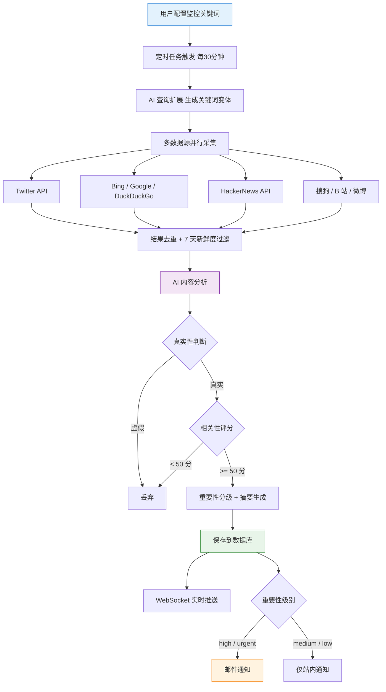
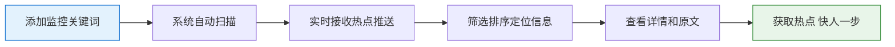
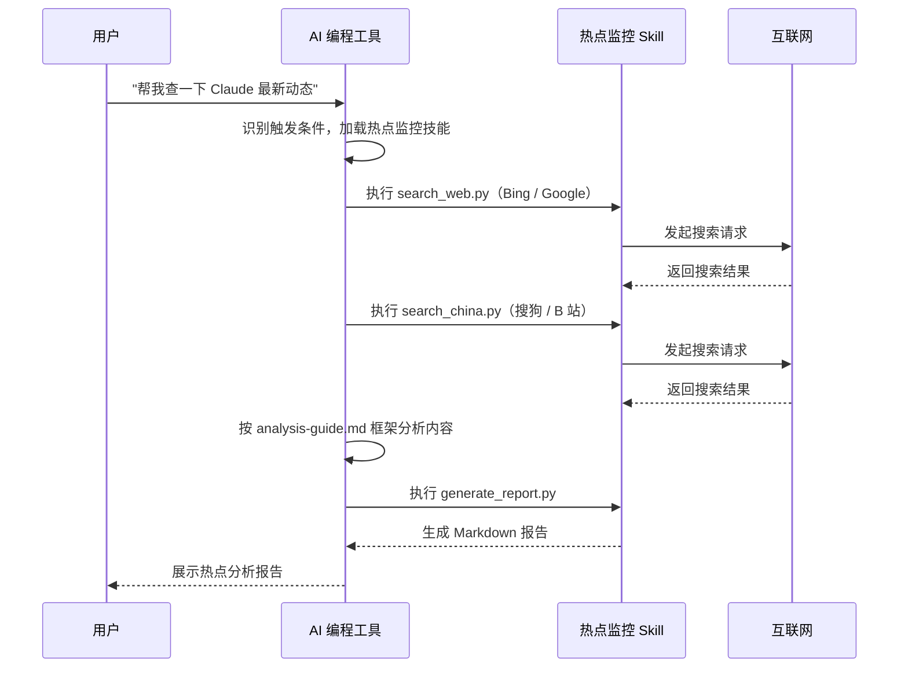

# AI 大模型 06 - AI 热点监控工具实战（多源采集 + AI 分析与实时推送）

> 一套以 AI 编程实战为核心的《AI 热点监控工具》：用户配置关键词后，系统每 30 分钟自动从 8+ 信息源并行采集内容，用 AI 完成真实性判断、相关性评分与重要性分级，再通过 WebSocket 实时推送和邮件通知，并可将监控能力封装为 Agent Skills 供多种 AI 编程工具复用。

## 一、项目概述

基于 Express 5 + React 19 + OpenRouter + Socket.io 开发的 AI 热点监控工具：输入要监控的关键词，系统自动从 Twitter、Bing、HackerNews、搜狗、B 站等 **8+** 个信息源聚合抓取内容，利用 AI 进行真假识别和相关性分析，并通过 WebSocket 实时推送和邮件通知。此外，热点监控能力被封装为 **Agent Skills 技能包**，让其他 AI 编程工具也能复用。

项目代码 100% 开源：https://github.com/liyupi/yupi-hot-monitor

相关学习路线可参考 [[AI 大模型 01 - 应用开发学习路线]]、[[AI Agent 01 - 应用开发学习路线]]、[[RAG 01 - 学习路线]] 与 [[AI 大模型 05 - AI 编程助手实战（CodeGeeX）]]。

## 二、核心业务流程

### 2.1 热点监控主流程

用户配置关键词 → 定时任务触发 → AI 查询扩展 → 多源抓取 → 去重过滤 → AI 分析 → 入库 → 实时推送/邮件通知。

### 2.2 Web 端使用流程

用户使用网页来监控热点。

### 2.3 Agent Skills 使用流程

安装热点监控 Skills 后，可直接在 AI 编程工具中通过自然语言触发热点搜索和分析。

## 三、功能梳理

涵盖关键词管理、热点采集与分析、信息展示与筛选、实时通知、全网搜索、Agent Skills 六大模块。

### 3.1 关键词管理

- 添加 / 删除监控关键词
- 激活 / 暂停单个关键词
- AI 自动扩展查询变体（Query Expansion）
- B 站账号智能检测

### 3.2 热点采集与分析

- 8+ 数据源并行采集（Twitter、Bing、搜狗、B 站、微博、HackerNews 等）
- AI 内容真实性验证（过滤标题党和虚假内容）
- AI 相关性评分（0-100 分）
- AI 重要性分级（urgent / high / medium / low）
- AI 智能摘要生成
- AI 相关性分析理由

### 3.3 信息展示与筛选

- 热点雷达仪表盘（实时统计数据）
- 5 种排序方式（最新发现 / 最新发布 / 重要程度 / 相关性 / 热度综合）
- 多维度筛选（来源 / 重要性 / 关键词 / 时间范围）
- 分页加载
- 展开 / 折叠相关性分析详情
- 一键跳转原文

### 3.4 通知系统

- WebSocket 实时推送
- 邮件通知（仅 high / urgent 级别）
- 站内通知管理（已读 / 未读）

### 3.5 全网搜索

- 全网关键词搜索
- 多数据源聚合搜索结果

### 3.6 Agent Skills

- 完全自包含的 AI 技能包
- 支持 Cursor、VSCode Copilot、Claude Code 等多工具
- Python 采集脚本 + 分析框架
- 无需后端服务，开箱即用

## 四、技术选型

以 Node.js 全栈 + TypeScript 为核心，前后端分离。

### 4.1 后端

- Express 5，Node.js Web 框架，原生支持 async/await
- TypeScript，类型安全开发
- Prisma ORM，类型安全的数据库访问
- SQLite，轻量级嵌入式数据库
- Socket.io，WebSocket 实时通信
- node-cron，定时任务调度
- Nodemailer，邮件发送

### 4.2 前端

- React 19，前端 UI 框架
- Vite 7，前端构建工具
- Tailwind CSS 4，原子化 CSS 框架
- Framer Motion，React 动画库
- Aceternity UI 风格组件，科技感视觉动效
- Socket.io-client，WebSocket 客户端
- Lucide React，图标库

### 4.3 数据采集

- Axios + Cheerio，网页爬虫（Bing / Google / DuckDuckGo / 搜狗）
- TwitterAPI.io，Twitter 高级搜索
- HackerNews Algolia API，技术社区热门内容
- B 站公开 API，视频搜索和账号检测

### 4.4 AI 相关

- OpenRouter API，统一接入 AI 大模型（DeepSeek、Claude、GPT 等）
- AI 内容审核，真假识别 + 相关性分析 + 重要性分级 + 摘要生成
- Query Expansion，AI 驱动的查询扩展

### 4.5 AI 编程工具

- VSCode + GitHub Copilot，主力 AI 编程 IDE
- MCP 插件：Firecrawl（网页抓取）、Context7（最新技术文档）
- Agent Skills：UI UX Pro Max（前端美化）、Skill Creator（技能开发）

## 五、架构设计

采用前后端分离架构：前端使用 React + Vite，后端使用 Express + Prisma，通过 REST API 和 WebSocket 通信。定时任务引擎驱动多数据源采集和 AI 分析；Agent Skills 作为独立模块，可在多种 AI 编程工具中复用。

## 六、参考资源

- 项目开源仓库：https://github.com/liyupi/yupi-hot-monitor
- 开源 AI 知识库（汇总热门 AI 大模型与工具、使用指南、提示词技巧等）：https://github.com/liyupi/ai-guide

> 来源：鱼皮·编程导航 / codefather
