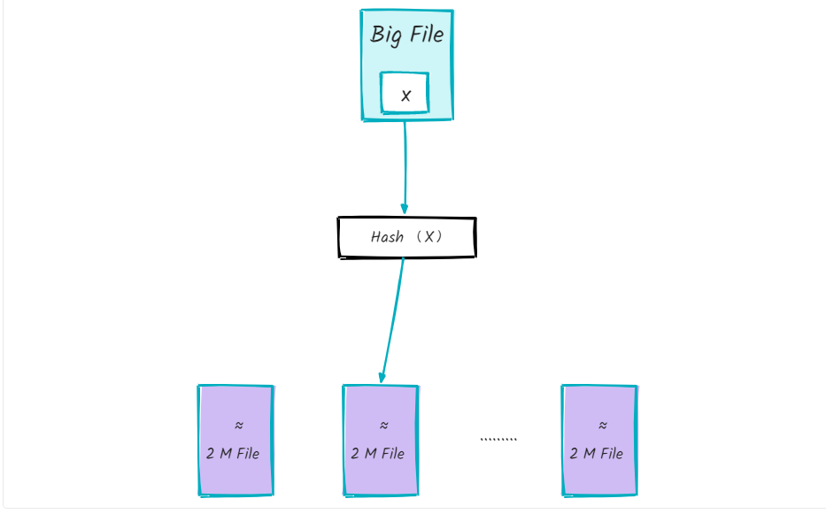

# 算法与数据结构 02 - 海量数据TopK问题

> 海量数据场景经典面试题：1G 文件、内存仅 10M，求出现频率最高的 100 个词。两种主流解法——分治（hash 取余 + HashMap 统计 + 小顶堆）与多路归并排序，核心思想都是「分而治之 + 堆」。

## 题目描述

- 1G 大小的文件，每行一个词，每个词不超过 16 bytes
- 内存限制 10M，要求返回出现频率最高的 100 个词

## 解法 1：分治



思路：大文件无法一次性读入内存 → 拆分成小文件分别统计 → 小顶堆汇总 Top100。

1. **hash 取余分文件**：遍历大文件，对每个词 x 执行 `hash(x) % 500`，将结果为 i 的词写入文件 f(i)。遍历结束后得到 500 个小文件，每个约 2M。
2. **单文件内统计**：用 HashMap 统计每个小文件中各词出现频率，取各文件频率最高的 100 个词。

```java
BufferedReader br = new BufferedReader(new FileReader(fin));
String line = null;
while ((line = br.readLine()) != null) {
    if (map.containsKey(line)) {
        map.put(line, map.get(line) + 1);
    } else {
        map.put(line, 1);
    }
}
br.close();
```

3. **小顶堆汇总**：遍历第一个文件，用其 Top100 词构建小顶堆（不足 100 个则继续读下一个文件补齐）；继续遍历其余小文件，若某词出现次数大于堆顶词，替换堆顶并重新调整堆。遍历完所有小文件后，堆中即为全局频率最高的 100 个词。

**总结**：分治（hash 取余）→ HashMap 统计单文件词频 → 小顶堆求全局 Top100。

**局限**：若大文件中某个词频率过高（甚至整个文件是同一个词），hash 后仍可能导致某小文件超过 10M，解法 1 不适用。

## 解法 2：多路归并排序

思路：先对大文件排序（相同词必然相邻），再顺序扫描计数 + 小顶堆取 Top100。

1. **多路归并对大文件排序**：
   - 文件按顺序切分为不超过 2M 的小文件（共 500 个）
   - 用 10M 内存分别对 500 个小文件内部排序
   - 用大小为 500 的堆对 500 个有序小文件做多路归并，结果写回一个大文件
2. **多路归并细节**：初始化大小为 500 的最小堆，堆节点存放每个有序小文件的输入流；按各文件下一行数据排序，单词小的输入流在堆顶；取出堆顶流写入最终排序文件，若该流还有数据则重新入堆，否则关闭流；循环至所有流耗尽。
3. **顺序扫描 + 小顶堆**：初始化 100 节点小顶堆；顺序读排序后的大文件并计数；当遍历到的词与上一个词不同时，若上一个词的频率大于堆顶频率则入堆（替换堆顶），否则跳过。最终堆中即为 Top100 单词。

## 小结

- **解法 1（分治）**：思路直观，但存在词频过高导致小文件超限的缺陷
- **解法 2（多路归并）**：更严谨，词频过高或文件全是同一单词时依然适用

> 来源：鱼皮·编程导航 / codefather
