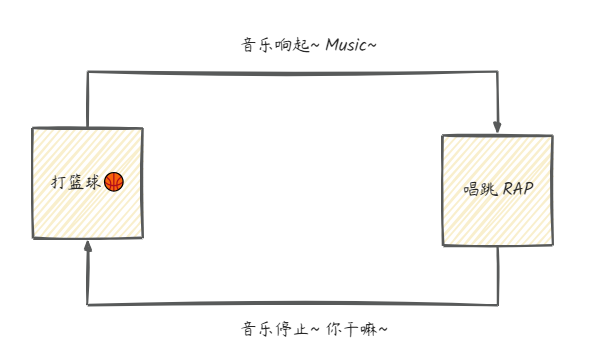

# 概念 - 状态机概念与实践

> 一句话摘要：状态机是描述对象"状态 + 事件驱动转移"的数学模型，可用 if-else、switch-case、状态转移表或 Spring 状态机实现；状态越多、转移越复杂，越应该用声明式的 Spring 状态机。

## 什么是状态机

状态机（State Machine）是一种抽象的数学模型，描述对象或系统在特定时间点可能处于的各种状态以及状态之间的转换规则，用于模拟对象在不同条件下的行为和状态变化。它不是指一台实际机器，而是一张"状态转换图"。

## 状态机的四要素

- **状态（State）**：对象或系统当前所处的状态，例如开、关、就绪等。
- **事件（Event）**：触发状态转换的动作或条件，例如按钮点击、消息到达等。
- **转移（Transition）**：定义从一个状态到另一个状态的转换规则，通常与特定事件相关联。
- **动作（Action）**：在状态转换过程中执行的操作或行为，例如更新状态、记录日志等。

## 自动门示例：状态转换图

以自动门的运行规则为例，可以抽象出下面的状态转换图：关门状态收到"开门"事件进入开门状态，反之亦然，直观展示了状态、事件与转移的关系。



## 简单实现方式

在 C、C++、Java、Python 等语言中，状态机可以用 switch-case、if-else、状态转移表等方式实现。以下示例控制"打篮球时播放音乐"的行为：打篮球（basketball）→ 播放音乐，唱跳 Rap（sing_rap）→ 停止音乐。

### if-else 实现

```java
public class BasketballMusicStateMachineUsingIfElse {
    private boolean isPlayingMusic;

    public BasketballMusicStateMachineUsingIfElse() {
        this.isPlayingMusic = false; // 初始状态为音乐未播放
    }

    public void playMusic() {
        if (!isPlayingMusic) {
            System.out.println("Music starts playing...");
            isPlayingMusic = true;
        }
    }

    public void stopMusic() {
        if (isPlayingMusic) {
            System.out.println("Music stops playing...");
            isPlayingMusic = false;
        }
    }

    public void performActivity(String activity) {
        if ("basketball".equals(activity)) {
            System.out.println("Music~");
            playMusic(); // 打篮球时播放音乐
        } else if ("sing_rap".equals(activity)) {
            System.out.println("哎哟你干嘛!");
            stopMusic(); // 唱跳Rap时停止音乐
        } else {
            System.out.println("Invalid activity!");
        }
    }
}
```

测试序列：依次执行 `performActivity("basketball")`、`performActivity("sing_rap")`、`performActivity("basketball")`，音乐先播放、再停止、后重新播放。

### switch-case 实现

```java
public class BasketballMusicStateMachineUsingSwitchCase {
    private boolean isPlayingMusic;

    public BasketballMusicStateMachineUsingSwitchCase() {
        this.isPlayingMusic = false; // 初始状态为音乐未播放
    }

    public void playMusic() {
        if (!isPlayingMusic) {
            System.out.println("Music starts playing...");
            isPlayingMusic = true;
        }
    }

    public void stopMusic() {
        if (isPlayingMusic) {
            System.out.println("Music stops playing...");
            isPlayingMusic = false;
        }
    }

    public void performActivity(String activity) {
        switch (activity) {
            case "basketball":
                System.out.println("Music ~");
                playMusic(); // 打篮球时播放音乐
                break;
            case "sing_rap":
                System.out.println("哎哟 你干嘛 ~");
                stopMusic(); // 唱跳Rap时停止音乐
                break;
            default:
                System.out.println("Invalid activity!");
        }
    }
}
```

### 两种方式的对比

- **if-else**：适合分支少、逻辑简单的场景，写法直观。
- **switch-case**：适合按单个条件（如事件类型）多分支分派的场景，结构比 if-else 更清晰。
- 共同局限：状态与转移逻辑散落在业务代码中，状态一多、转移一复杂，代码就会变得难以维护——这时应使用更优雅的 **Spring 状态机**。

## Spring 状态机实现

Spring 状态机（Spring Statemachine）把状态、事件、转移以声明式配置集中管理，代码结构清晰、易扩展。以"打篮球音乐播放器"为例：空闲（IDLE）→ 打篮球（PLAYING_BB）→ 唱跳（SINGING）三个状态，通过两个事件（START_BB_MUSIC / STOP_BB_MUSIC）驱动转移。

### 1）引入依赖

```xml
<dependency>
    <groupId>org.springframework.statemachine</groupId>
    <artifactId>spring-statemachine-core</artifactId>
    <version>2.0.1.RELEASE</version>
</dependency>
```

### 2）定义状态和事件的枚举

```java
public enum States {
    IDLE,       // 空闲状态
    PLAYING_BB, // 打篮球状态
    SINGING     // 唱跳Rap状态
}

public enum Event {
    START_BB_MUSIC, // 开始播放篮球音乐事件
    STOP_BB_MUSIC   // 停止篮球音乐事件
}
```

### 3）配置状态机

```java
@Configuration
@EnableStateMachine
public class BasketballMusicStateMachineConfig extends EnumStateMachineConfigurerAdapter<States, Event> {

    @Autowired
    private BasketballMusicStateMachineEventListener eventListener;

    @Override
    public void configure(StateMachineConfigurationConfigurer<States, Event> config) throws Exception {
        config
            .withConfiguration()
            .autoStartup(true)
            .listener(eventListener); // 设置状态机事件监听器
    }

    @Override
    public void configure(StateMachineStateConfigurer<States, Event> states) throws Exception {
        states
            .withStates()
            .initial(States.IDLE)
            .states(EnumSet.allOf(States.class));
    }

    @Override
    public void configure(StateMachineTransitionConfigurer<States, Event> transitions) throws Exception {
        transitions
            .withExternal()
            .source(States.IDLE).target(States.PLAYING_BB).event(Event.START_BB_MUSIC)
            .and()
            .withExternal()
            .source(States.PLAYING_BB).target(States.SINGING).event(Event.STOP_BB_MUSIC)
            .and()
            .withExternal()
            .source(States.SINGING).target(States.PLAYING_BB).event(Event.START_BB_MUSIC);
    }
}
```

### 4）定义状态机事件监听器

```java
@Component
public class BasketballMusicStateMachineEventListener extends StateMachineListenerAdapter<States, Event> {

    @Override
    public void stateChanged(State<States, Event> from, State<States, Event> to) {
        if (from.getId() == States.IDLE && to.getId() == States.PLAYING_BB) {
            System.out.println("开始打篮球，music 起");
        } else if (from.getId() == States.PLAYING_BB && to.getId() == States.SINGING) {
            System.out.println("唱跳，你干嘛");
        } else if (from.getId() == States.SINGING && to.getId() == States.PLAYING_BB) {
            System.out.println("继续打篮球，music 继续");
        }
    }
}
```

### 5）编写单元测试

```java
@SpringBootTest
class ChatApplicationTests {
    @Resource
    private StateMachine<States, Event> stateMachine;

    @Test
    void contextLoads() {
        stateMachine.sendEvent(Event.START_BB_MUSIC); // 开始打球，music 起
        stateMachine.sendEvent(Event.STOP_BB_MUSIC);  // 开始唱跳，你干嘛
        stateMachine.sendEvent(Event.START_BB_MUSIC); // 继续打球，music 继续
    }
}
```

运行测试后控制台依次输出「开始打篮球，music 起」「唱跳，你干嘛」「继续打篮球，music 继续」，说明事件正确驱动了状态转移，监听器在状态变化时执行了相应动作。整个状态机的转移关系如下：


## 小结

- 状态机四要素：**状态、事件、转移、动作**，本质是一张状态转换图。
- if-else / switch-case：适合简单场景，但状态与转移逻辑与业务代码耦合。
- Spring 状态机：声明式配置状态与转移，事件驱动执行，配合监听器解耦动作逻辑，适合订单、审批、工作流等状态多、转移复杂的业务场景。
