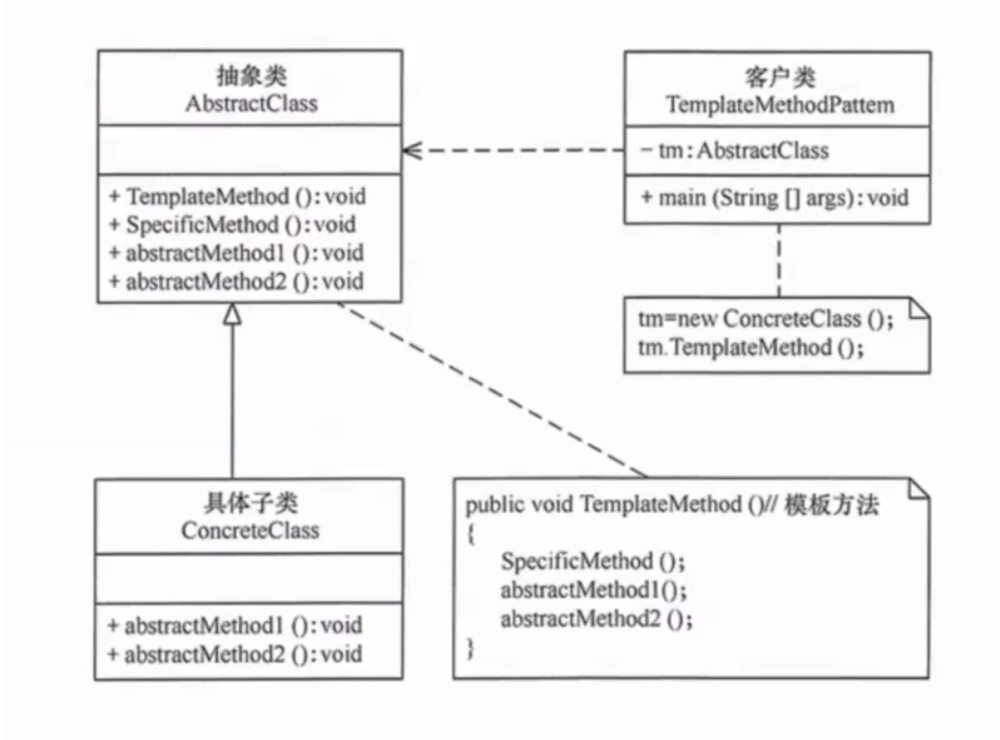
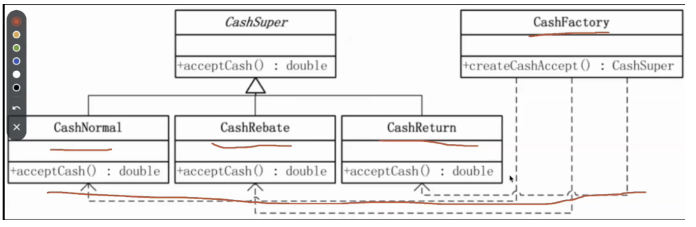
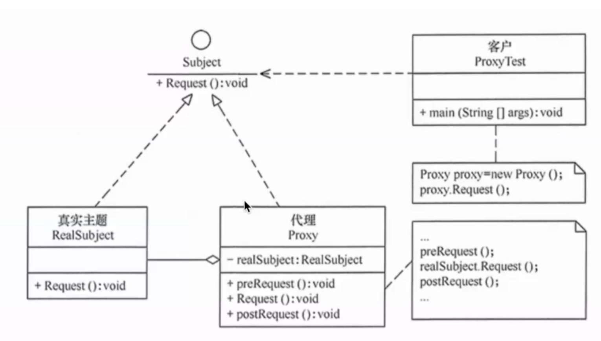
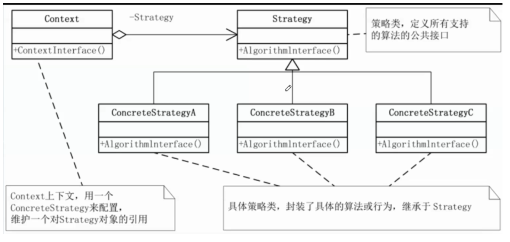
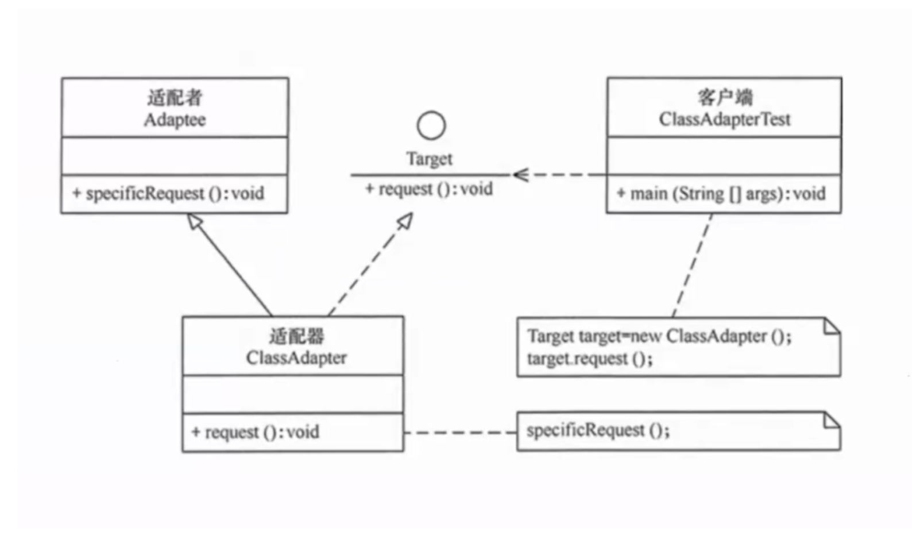

# 概念 - 设计模式实战案例（OJ判题与聚合搜索）

> 一句话摘要：以编程导航 [OJ 判题系统](https://yuyuanweb.feishu.cn/wiki/LhjxwgFjwiovTVk9w2vcJoj4nid) 与 [聚合搜索平台](https://yuyuanweb.feishu.cn/wiki/RigVw1gAdiXIfLkj6ktclEDQn7e) 两个真实项目为例，实战讲解六大设计模式：OJ 项目用**模板方法、工厂、代理、策略**模式解耦代码沙箱与判题逻辑，聚合搜索项目用**适配器、注册器**模式统一多数据源调用，使代码更简洁、可读、易扩展。

## 核心要点

| 设计模式 | 类型 | 项目场景 | 核心作用 |
|---|---|---|---|
| 模板方法模式 | 行为型 | OJ：代码沙箱开发 | 抽取"执行代码"公共骨架，子类实现语言差异细节 |
| 工厂模式 | 创建型 | OJ：代码沙箱对象生成 | 按条件（type）创建不同的代码沙箱子类对象 |
| 代理模式 | 结构型 | OJ：代码沙箱方法调用 | 在原方法执行前后附加日志等操作，不侵入原对象 |
| 策略模式 | 行为型 | OJ：多语言代码判题 | 按代码语言环境动态切换判题算法，消除 if-else |
| 适配器模式 | 结构型 | 聚合搜索：多数据源接口调用 | 统一不同数据源接口的方法名与参数格式 |
| 注册器模式 | 基础常见模式 | 聚合搜索：搜索子类统一调取 | 将各子类实例注册到注册器，统一调取 |

> 注：注册器模式不属于 GoF 23 种经典设计模式，而是一种基础常见模式。

---

### 1. 模板方法模式：代码沙箱的开发（OJ 判题系统）

（定义引自菜鸟教程）模板方法模式（Template Pattern）中，一个抽象类公开定义了执行它的方法的方式/模板，子类可以按需重写方法实现，但调用以抽象类中定义的方式进行。属于**行为型模式**。

- **意图**：定义一个操作中算法的骨架，将一些步骤延迟到子类。子类可以不改变算法结构，即可重定义该算法的某些特定步骤。
- **主要解决**：一些方法通用，却在每一个子类都重新写了这一方法。
- **优点**：① 封装不变部分，扩展可变部分；② 提取公共代码，便于维护；③ 行为由父类控制，子类实现。
- **缺点**：每一个不同的实现都需要一个子类，导致类的个数增加，使系统更加庞大。
- **使用场景**：① 有多个子类共有的方法，且逻辑相同；② 重要的、复杂的方法，可考虑作为模板方法。

**核心角色**：抽象类（定义模板方法与公共逻辑）、具体子类（实现抽象方法，可自行添加额外方法）。



**项目应用**：代码沙箱针对不同代码语言的执行逻辑都是相同的，仅具体实现方法存在差异。因此提取"执行代码"共有的逻辑和方法封装至模板类，再创建不同语言的"执行代码子类"，由客户端调用并处理对应语言，得到执行结果。子类除使用父类已有方法外，还可实现抽象方法或自行添加方法——例如 Java 需要编译代码，就添加"编译代码"方法；Python 无需编译，则不添加。

```java
// 模板类：封装"执行代码"公共逻辑，定义算法骨架
public abstract class CodeSandboxTemplate {
    public ExecuteCodeResponse executeCode(ExecuteCodeRequest request) {
        saveCode(request);                  // 公共逻辑：保存代码
        String output = runCode(request);   // 抽象方法：语言差异由子类实现
        return collectResult(output);       // 公共逻辑：收集执行结果
    }
    protected abstract String runCode(ExecuteCodeRequest request);
}

// Java 子类：需先编译再运行
public class JavaCodeSandbox extends CodeSandboxTemplate {
    protected String runCode(ExecuteCodeRequest request) {
        compileCode(request);   // Java 专属：编译
        return executeJava(request);
    }
}
```

---

### 2. 工厂模式：代码沙箱对象的生成（OJ 判题系统）

（定义引自菜鸟教程）工厂模式（Factory Pattern）是 Java 中最常用的设计模式之一，属于**创建型模式**，提供了一种创建对象的最佳方式：无需指定要创建的具体类即可创建对象；在创建对象时提供封装机制，将实际创建对象的代码与使用代码分离。

- **意图**：定义一个创建对象的接口，让其子类自己决定实例化哪一个工厂类，使创建过程延迟到子类进行。
- **何时使用**：明确地计划在不同条件下创建不同实例时。
- **优点**：① 调用者想创建对象只需知道其名称；② 扩展性高，增加产品只需扩展一个工厂类；③ 屏蔽产品的具体实现，调用者只关心产品的接口。
- **缺点**：每增加一个产品都需要增加一个具体类和对象实现工厂，使系统中类的个数成倍增加，增加系统复杂度与具体类的依赖。
- **注意事项**：复杂对象适合使用工厂模式；简单对象（尤其只需 new 即可创建的对象）无需使用工厂模式，否则引入工厂类反而增加系统复杂度。

**核心角色**：

- **抽象产品**：定义产品的共同接口或抽象类，规定产品对象的共同方法。
- **具体产品**：实现抽象产品接口，定义具体产品的特定行为和属性。
- **抽象工厂**：声明创建产品的抽象方法，可有多个方法创建不同类型产品。
- **具体工厂**：实现抽象工厂接口，负责实际创建具体产品对象。



**项目应用**：OJ 判题时需调用"代码沙箱"服务，而代码沙箱种类通常不止一种（远程第三方代码沙箱、本地代码沙箱、其他厂商代码沙箱等）。首先将其交由不同子类处理（实现同一代码沙箱接口），然后**针对不同条件创建不同的子类沙箱对象**。创建代码沙箱工厂类，根据选择的条件生成相应子类对象；使用时只需指定对应的"代码沙箱 type"即可得到对应对象。

```java
public interface CodeSandbox {
    ExecuteCodeResponse executeCode(ExecuteCodeRequest request);
}

// 具体产品：不同种类的代码沙箱
public class RemoteCodeSandbox implements CodeSandbox { ... }
public class LocalCodeSandbox  implements CodeSandbox { ... }

// 具体工厂：根据 type 创建不同沙箱
public class CodeSandboxFactory {
    public static CodeSandbox newInstance(String type) {
        switch (type) {
            case "remote": return new RemoteCodeSandbox();
            case "local":  return new LocalCodeSandbox();
            default: throw new RuntimeException("未知沙箱类型");
        }
    }
}

// 使用：只需指定 type
CodeSandbox sandbox = CodeSandboxFactory.newInstance(sandboxType);
```

---

### 3. 代理模式：代码沙箱对象方法的调用（OJ 判题系统）

（定义引自菜鸟教程）代理模式（Proxy Pattern）中，一个类代表另一个类的功能，属于**结构型模式**。创建具有现有对象的对象，以便向外界提供功能接口。

- **意图**：为其他对象提供一种代理，以控制对这个对象的访问。
- **主要解决**：直接访问对象时带来的问题——如要访问的对象在远程机器上；或对象创建开销很大、某些操作需要安全控制、需要进程外访问等，直接访问会给使用者或系统结构带来麻烦，可在访问时加上一个访问层。
- **如何解决**：增加中间层，实现与被代理类组合。
- **优点**：① 职责清晰；② 高扩展性；③ 智能化。
- **缺点**：① 客户端与真实主题之间增加代理对象，某些类型的代理可能使请求处理速度变慢；② 实现代理需要额外工作，有些代理实现非常复杂。

**核心角色**：

- **抽象主题（Subject）**：定义真实主题和代理主题的共同接口，任何使用真实主题的地方都可使用代理主题。
- **真实主题（Real Subject）**：实现抽象主题接口，是代理对象所代表的真实对象。
- **代理（Proxy）**：实现抽象主题接口，持有真实主题的引用，在真实主题基础上提供额外功能（延迟加载、权限控制、日志记录等）。
- **客户端（Client）**：使用抽象主题接口操作真实主题或代理主题，不需要知道具体是哪一个实现类。



**项目应用**：承接工厂模式，得到"代码沙箱子类对象"后调用其"执行代码"方法。希望在执行原方法的同时添加额外操作（如打印方法日志）且不影响原方法，则创建代理类代理原代码沙箱子类对象，再用代理类调用"执行代码（新）"方法。

```java
// 代理类：实现同一接口并持有真实对象引用
public class CodeSandboxProxy implements CodeSandbox {
    private final CodeSandbox codeSandbox;

    public CodeSandboxProxy(CodeSandbox codeSandbox) {
        this.codeSandbox = codeSandbox;
    }

    @Override
    public ExecuteCodeResponse executeCode(ExecuteCodeRequest request) {
        log("开始执行代码");                          // 附加操作
        ExecuteCodeResponse response = codeSandbox.executeCode(request);
        log("执行结束，结果：" + response);            // 附加操作
        return response;
    }
}

// 使用：用代理包装真实沙箱对象
CodeSandbox sandbox = new CodeSandboxProxy(CodeSandboxFactory.newInstance(type));
```

---

### 4. 策略模式：多语言代码的判题（OJ 判题系统）

（定义引自菜鸟教程）策略模式（Strategy Pattern）中，一个类的行为或其算法可以在运行时更改，属于**行为型模式**。它定义了一系列算法/策略，并将每个算法封装在独立的类中，使它们可以互相替换；运行时根据需要选择不同算法，而不需要修改客户端代码。创建表示各种策略的对象和一个行为随策略对象改变的 context 对象，策略对象改变 context 对象的执行算法。

- **意图**：定义一系列的算法，把它们一个个封装起来，并且使它们可相互替换。
- **主要解决**：在有多种算法相似的情况下，使用 if...else 所带来的复杂和难以维护。
- **何时使用**：一个系统有许多类，而区分它们的只是它们直接的行为。
- **如何解决**：将这些算法封装成一个一个的类，任意地替换。
- **关键代码**：实现同一个接口。
- **优点**：① 算法可以自由切换；② 避免使用多重条件判断；③ 扩展性良好。
- **缺点**：① 策略类会增多；② 所有策略类都需要对外暴露。
- **使用场景**：① 系统里许多类的区别仅在于行为，可让对象动态选择行为；② 系统需要动态地在几种算法中选择一种；③ 对象有很多行为，不用恰当模式就只好用多重条件选择语句实现。

**核心角色**：

- **环境（Context）**：维护对策略对象的引用，将客户端请求委派给具体策略对象执行；可通过依赖注入、简单工厂等方式获取具体策略对象。
- **抽象策略（Abstract Strategy）**：定义策略对象的公共接口或抽象类，规定具体策略类必须实现的方法。
- **具体策略（Concrete Strategy）**：实现抽象策略定义的接口，包含具体的算法实现。

策略模式通过将算法与使用算法的代码解耦，提供动态选择不同算法的方法；客户端不需要知道具体算法细节，只需通过环境类使用所选择的策略。



**项目应用**：OJ 系统中不同语言代码的题目判题，方法相同但具体实现策略不同，因此用策略模式根据代码语言"环境"选择不同算法策略。步骤：① 创建不同语言的策略子类（实现统一抽象判题接口）；② 创建"上下文对象"统一"环境"类的参数；③ 创建"环境"类实现动态切换策略。

```java
// 抽象策略：统一判题接口
public interface JudgeStrategy {
    JudgeResult doJudge(JudgeContext context);
}
// 具体策略：按语言分别实现
public class JavaJudgeStrategy   implements JudgeStrategy { ... }
public class PythonJudgeStrategy implements JudgeStrategy { ... }

// 上下文对象：统一环境参数
public class JudgeContext {
    private String language;   // 代码语言
    private String code;
    private List<String> inputList;
    // getter / setter ...
}

// 环境类：动态切换策略
public class JudgeManager {
    private JudgeStrategy strategy;
    public void setStrategy(JudgeStrategy strategy) { this.strategy = strategy; }
    public JudgeResult doJudge(JudgeContext context) { return strategy.doJudge(context); }
}

// 使用：根据代码语言设置对应判题策略
JudgeManager manager = new JudgeManager();
manager.setStrategy("java".equals(language) ? new JavaJudgeStrategy() : new PythonJudgeStrategy());
```

---

### 5. 适配器模式：多数据源搜索接口调用（聚合搜索项目）

（定义引自菜鸟教程）适配器模式（Adapter Pattern）作为两个不兼容接口之间的桥梁，属于**结构型模式**，结合了两个独立接口的功能。该模式涉及一个单一的类，负责加入独立的或不兼容的接口功能。真实例子：读卡器是内存卡和笔记本之间的适配器——内存卡插入读卡器，读卡器插入笔记本，即可通过笔记本读取内存卡。

- **优点**：① 可以让任何两个没有关联的类一起运行；② 提高类的复用；③ 增加类的透明度；④ 灵活性好。
- **缺点**：① 过多使用适配器会让系统非常零乱、不易整体把握（如明明调用的是 A 接口，内部却被适配成 B 接口的实现，系统出现太多这种情况无异于灾难），非必要可不使用，直接对系统进行重构；② Java 至多继承一个类，所以至多只能适配一个适配者类，且目标类必须是抽象类。
- **使用场景**：有动机地修改一个正常运行的系统的接口时，应考虑使用适配器模式。
- **注意事项**：适配器不是在详细设计时添加的，而是用来解决正在服役的项目的问题。



**项目应用**：聚合搜索需从不同数据源检索数据，需调用不同数据源接口的方法，而这些方法的参数存在差异，无法直接方便地统一调用，只能使用分支结构写复杂逻辑。引入适配器模式：将分支结构代码从客户端调用方拆分，移至抽象适配器接口的各个子类中，统一适配器类的参数，从而方便客户端便捷、统一地使用。步骤：① 创建适配器接口，制定统一规范（统一方法名和参数格式）；② 实现不同数据源的实现子类（实现适配器接口）；③ 客户端通过适配器接口统一获取不同数据源的查询结果。

```java
// 适配器接口：统一方法名与参数格式
public interface SearchAdapter {
    List<SearchResult> search(String searchText);
}

// 具体适配器：不同数据源各自实现
public class PictureSearchAdapter implements SearchAdapter { ... }
public class PostSearchAdapter    implements SearchAdapter { ... }
public class UserSearchAdapter    implements SearchAdapter { ... }

// 客户端：通过适配器接口统一调用
List<SearchResult> pictures = new PictureSearchAdapter().search("关键词");
```

---

### 6. 注册器模式：搜索接口子类对象的统一调取（聚合搜索项目）

（定义引自 ChatGPT）注册器模式是一种基础常见的设计模式，主要意思是把多个类的实例注册到一个注册器类中去，需要哪个类，由这个注册器类统一调取。

- **优点**：① 提供统一的注册和查找机制，使系统更加灵活、易于维护和扩展；② 可以动态地向注册器中注册和移除对象，实现松耦合。
- **缺点**：① 可能导致注册器对象过于庞大，难以维护和理解；② 对象的生命周期由注册器管理，可能导致内存泄漏或对象过早被销毁的问题。

**项目应用**：实现简单。在聚合搜索项目中，将"适配器接口"的各个子类加入同一注册器，便于统一调取，从而减少客户端调用方法的代码量。

```java
// 注册器：统一注册与查找
public class SearchAdapterRegistry {
    private static final Map<String, SearchAdapter> REGISTRY = new HashMap<>();

    public static void register(String type, SearchAdapter adapter) {
        REGISTRY.put(type, adapter);
    }
    public static SearchAdapter get(String type) {
        return REGISTRY.get(type);
    }
}

// 注册各数据源适配器
SearchAdapterRegistry.register("picture", new PictureSearchAdapter());
SearchAdapterRegistry.register("post",    new PostSearchAdapter());

// 客户端：按类型统一调取
SearchAdapter adapter = SearchAdapterRegistry.get("picture");
List<SearchResult> results = adapter.search("关键词");
```

---

> 来源：鱼皮·编程导航 / codefather
