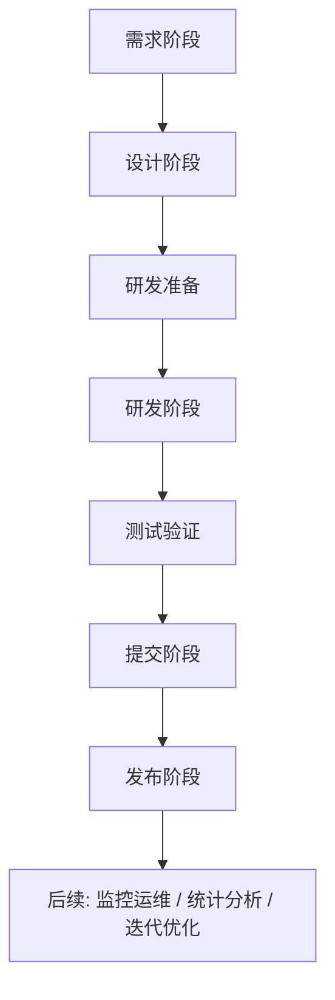

# 概念 19 - 大厂项目研发流程

> 大厂做项目不是「拿到需求就写代码」，而是由需求→设计→研发准备→研发→测试→提交→发布→后续运维多个阶段组成的团队协作流程，每阶段都有明确的产出物、评审环节与协作对象，且阶段间存在交叉（如技术选型在设计阶段就应开始考虑）。

## 核心要点

### 流程总览（思维导图还原）

> 注意：各阶段并非严格从上到下串行，阶段间可能存在交叉，比如**技术选型其实在设计阶段就应该考虑**（参见 [[概念 16 - 技术选型方法论]]）。

### 需求阶段
- **需求产生**：产品、老板、用户反馈（功能不好用、性能差等）汇聚成需求。
- **需求评审**：老板、产品、测试、开发一起开会，评估需求**是否合理、要不要做**。
- **需求分析**：开发从实现角度分析「这个需求怎么做」，提出改动低、实现快的方案；需求不合理或实现不了要当场提出。
- **排期**：把大需求拆解为功能 A、功能 B 等小任务，逐个安排计划完成日期（如：本周做 A、下周二测 B、下周四上线）。

### 设计阶段（想好怎么写比写代码更重要，参见 [[概念 17 - 先设计再编码（详细设计）]]）
- **架构设计**：从整体到局部，设计系统层次结构、各层间交互的接口和通讯方式、每层的重要模块、模块的物理部署方式。
- **概要设计**：基于 PRD（产品需求文档）整理系统功能模块及每个模块内的子模块；是架构设计的细化——架构=楼有几层、管道怎么接、地基怎么打；概要=每户内部怎么划分客厅/卫生间。很多情况下概要设计与架构设计合并在一个文档，划分并不明确。
- **详细设计**：具体分析每个功能如何实现：用到的算法、需注重的细节。
- **方案对齐**：与前端、后端等开发同学一起评审设计文档，讨论出统一方案后分工开发。
- **测试用例设计**：QA 提前设计测试用例（如点击「登录」未传任何数据 → 期望结果是警告用户输入用户名密码）；用例需其他同学（尤其更熟悉代码的开发）一起评审补充，让问题尽量暴露在测试阶段而不是线上。

### 研发准备
- **技术预研**：对项目中需要或可能需要用到的技术进行调研（新技术层出不穷）。
- **技术选型**：对比候选技术优劣，考量因素：
  - 技术本身：性能、易用性、稳定性、主流程度和生态、文档详细度；
  - 团队：成员对技术的熟悉度、掌控度（有无精通该技术的人）；
  - 业务：是否适应业务量级（单机 or 微服务）、业务读写特性（读多、写多 or 分析多）。
  - 关键项目写选型文档后与同事、Leader 讨论确认。
- **资源申请**：企业有集中管理分配资源的平台，填预算、等领导审批、下发资源（如云数据库）；**千万不能私自用自己的或买外部服务器部署项目，不安全**。
- **环境准备**：按申请机器的版本搭建一模一样的本地开发环境和测试环境。
- **项目初始化**：用**脚手架**自动生成最小可运行的初始化 Demo，不从零手敲重复代码。
- **依赖安装**：用包管理工具（前端 yarn、Java Maven/Gradle 等）自动安装依赖，Demo 即可运行。

### 研发阶段
- **本地开发**：配置热更新工具，代码更新时自动重新编译打包，不用手动重启；企业开发用版本控制（如 Git），开发前先创建自己的分支。
- **远程开发**：像编辑本地文件一样直接修改服务器上的代码（每人有开发机，VSCode 等装远程开发插件），省去反复部署调试。
- **代码优化**：注重时空复杂度；重复代码抽象成函数或使用设计模式。
- **单元测试**：开发也要写小粒度测试为代码负责——为每个数据库读写函数和业务逻辑函数编写单元测试（Java 用 JUnit，可用 Jacoco 生成覆盖度报告）；每次修改关键代码后都执行一遍，防止意外错误。
- **开发联调**：代码打包构建后发布到测试服务器，和前端同学联调（请求接口、验证系统功能是否可用）。

### 测试验证（至关重要的最后一道防线，目的是找 Bug）
- **集成测试**：比单元测试粒度大，把多个模块/代码单元放在一起验证集成和调用关系——单个函数正常，组合顺序调用可能出问题。
- **系统测试**：粒度更大，测试对象是整个系统，不仅包括软件，还可能覆盖硬件。
- **产品体验**：产品验证功能是否符合预期、是否易用，大多会提出修改建议，开发需再修改。
- **验收测试**：最终把功能给用户体验——老板/用户说没问题，才是真的没问题。

### 提交阶段
- **代码提交**：本地 git commit；大项目一般用提交检测插件，防止提交错误代码。
- **代码推送**：推送到远程同名分支；大厂有推送检测工具，检测错误、圈复杂度、代码规范等。
- **合并请求**：发起分支合并请求（MR），把分支代码合并到主干分支。
- **代码审查（CR）**：不能直接合并，须通过审查：
  - **人审**：上级和其他项目负责人阅读评论代码，没问题 Approve，否则打回修改；
  - **机审**：机器自动检测代码是否符合规范、能否成功自动化构建，能发现人工难以发现的问题（如加号要换行、文件行末要加空行），注意编码习惯即可适应。

### 发布阶段
- **打包构建**：传统方式=登录正式服务器拉代码、装依赖、打包，用 Nginx/Tomcat/Docker 运行，重复工作多、效率低；大厂用自动化构建（Jenkins、CI/CD 工具），代码合并主干后由机器打包为最终部署包。
- **预发布**：先在预发布环境部署，观察能否正常运行，防止上线出问题。
- **正式发布**：大项目部署在多台机器，通过可视化发布平台点选机器（一般**先灰度**选一小部分机器，再全量发布），一键发布，管理员审批后交给机器自动部署。

### 后续（上线并非高枕无忧，仍会时不时出现预期外的小 Bug）
- **监控运维**：定期查看监控面板，观察项目运行情况、机器负载。
- **统计分析**：代码中加日志，用 ELK 等日志收集可视化平台分析，感知用户行为（如统计 SQL 查询耗时，对重复率高的慢 SQL 针对性优化）。
- **事件反馈**：公司内部有事件反馈平台，产品等内部同学收到 Bug 后发布事件（详细描述出现时间、状况、详情），便于开发集中分析处理。
- **文档沉淀**：每次上线新功能/项目，记录背景、设计方案、开发过程和坑点，便于后续同学了解项目，利人利己。
- **迭代优化**：一期做完做二期，还要抽时间优化历史代码——一个需求的结束往往是下一个需求的开始。

> 来源：鱼皮·编程导航 / codefather
