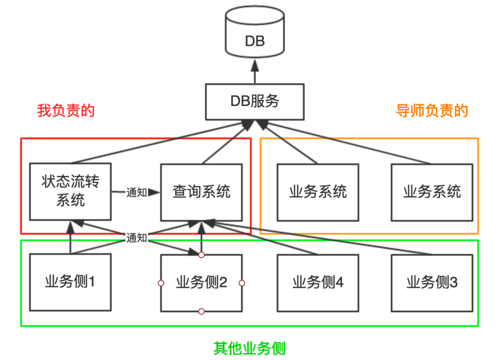

# 概念 27 - 高并发系统设计实战

> 作者在腾讯实习期间与导师二人用一周紧急上线一套百万级高并发系统（状态流转系统 + 查询系统），本文复盘其设计思路、技术选型与 13 个线上问题的完整排查过程，是「先写方案、再写代码、上线前充分评估风险」的高并发系统实战范本。

## 项目背景

> 背景：年前完成一期后项目效果显著，年后加急开发二期，目标一周上线。业务逻辑复杂、工期紧、人手缺、对接方多，与导师二人 007 爆肝完成。

系统模型如下（本文剥离业务，仅保留关键系统模型）：

- **状态流转系统**：按逻辑修改数据库中某条数据的状态字段，修改成功后依据状态向其他业务侧发送通知
- **查询系统**：从数据库查询数据，包含最基础的鉴权、查询等功能，是高**扇入**服务（被各业务侧调用）

### 系统难点

1. **高并发**：聚合各业务侧请求量，评估产生百万量级高并发请求
2. **兼容性**：如何设计一套 API 满足各业务侧需求且易于理解
3. **对接复杂**：需同时与多个业务侧的同学沟通讨论接口
4. 状态流转系统业务逻辑复杂；系统间存在交互（互相发通知和调用），对**时延、容错性、一致性**要求很高

### 总体原则

- 写代码前**先编写可行的技术方案**：考虑各种场景、评估风险、工作量估时、记录问题，既梳理思路也提供说服力。复杂系统中，方案设计 : 实际编码 ≈ **8 : 2**（二八定理）
- 设计遵循 **"贴合业务"**：没有最好的架构，只有最适合业务的架构，**切忌过度设计**
- 考虑项目紧急程度和人力成本，**先保证可用，再追求极致**

## 设计思路与技术选型

### 1. 高并发：缓存 + 负载均衡

负载均衡本质是「加机器」，但目标是**尽可能利用每台机器的资源抗住最大并发**（省机器、节约成本）：

| 层次 | 选型 |
| --- | --- |
| 编程框架 | 轻量级 Restful 框架 Jersey + 轻量级依赖注入库 Guice |
| Web 服务器 | 高性能轻量级 NIO 服务器 Grizzly |
| 缓存 | 腾讯自研海量分布式存储系统 CKV+（支持 Redis 协议，有数据监控平台） |
| 数据库 | 分库分表（公司自研基础设施） |
| 负载均衡 | Nginx + L5 负载均衡（百万并发需增加十余台机器） |
| 文件下载 | CDN 及预热（支持高效文件下载服务） |

其中**缓存是抗住高并发流量的关键**，须重点设计。

#### 缓存方案

1. **数据结构（Key）设计**：按业务设计，保证 key 之间不冲突、便于查找。用「请求参数 + 接口唯一 id」拼接 key；分页查询接口可复用全量查询接口的缓存
2. **缓存降级**：找不到对应 key 或 redis 连接失败时，直接查库
3. **缓存更新**：数据库修改时删除对应缓存。因存在非必填请求参数，缓存 key 可能是模糊值（如参数 a、b，key 可能为 "a" 也可能为 "ab"）：
   - 请求字段固定（全部必填）的接口：直接拼接唯一 key 删除
   - 请求字段不固定（存在非必填）的接口：用 redis **scan 命令范围扫描**（不要用 keys 命令！）或循环拼接出所有可能的 key 依次删除
4. **缓存穿透**：无论查询结果列表是否为空都写入缓存；但业务会返回多种错误码时不建议这样做（复杂度高、成本大）

### 2. 兼容性：API 设计

接口需兼容多个业务侧，请求/响应参数要尽可能灵活，**切忌一定要和所有业务侧对齐**（一个字段设计不当可能导致满盘皆输）。三个技巧：

1. 提供**可访问链接的接口文档**（如腾讯文档/公司知识库），供调用方即时查阅
2. 请求参数不能过多且要易于理解，不能为强制兼容设置过于复杂的参数，必要时可**针对某一业务侧定制接口**
3. 响应参数尽量多（多不是滥）：每次增加返回字段都要改代码，适当冗余的字段可避免此问题

### 3. 消息通知：消息队列解耦

状态流转时需通知其他业务侧、并让查询系统立即更新缓存，对消息**实时性要求很高**。两种方案对比：

| 方案 | 优点 | 缺点 |
| --- | --- | --- |
| 各系统提供回调接口 | 保证实时性 | 系统间紧耦合，不利于扩展 |
| 消息队列 | 应用解耦、异步消息 | — |

最终选**消息队列**方案，采用腾讯自研 TubeMQ（万亿级分布式消息中间件，已开源 Apache 孵化），原因：

1. 通知数据之后可能存在其他消费方，消息队列利于扩展、对代码侵入性小
2. 消息队列可持久化消息
3. TubeMQ 支持消费方负载均衡，性能高
4. 容量大，可存放万亿数量级消息
5. 公司自研组件，便于形成统一规范

> 技术选型时不仅要关注当前业务需求，也要有一定的前沿视角。

### 4. 风险评估

选用中间件/框架前要尽可能多了解并评估风险（利用公司内部知识库或搜索）。例如评估 TubeMQ 时从**消息可靠性、消息顺序性、消息重复、监控告警**等角度分析，发现的风险：消费方消费状态改变消息失败时缓存未被及时更新，导致**数据库与缓存数据不一致**。从生产方和消费方两个角度设计可靠性方案：

#### 生产方消息可靠性

1. TubeMQ 保证消息一定送达，发送失败时自动重发
2. 发送结束触发回调，在回调中判断消息发送及确认状态，将发送失败的消息放入队列，**下次发送优先从队列里取**

#### 消费方消息可靠性和数据一致性

1. 消费失败时**最多重试三次**
2. 重试后仍失败则记录日志，确保消息不丢失
3. 通过**定时任务读取日志**，尝试再次消费失败消息，并进行告警

## 开发过程小技巧

1. 同时开发多个项目时，每个项目一个独立 Git 分支，**合并时分批合并**，便于他人阅读提交记录
2. 给每个请求做打点数据上报（请求量、请求时间、失败请求数），便于监控统计
3. **多记录日志**，详细清晰的日志可快速定位故障

## 线上问题排查实战（13 个）

很多问题本地开发时察觉不到，在测试及线上环境才会暴露。以下按「现象 → 排查思路 → 根因 → 解决方案」整理 13 个真实问题。

### 1. 事务提交时报错

- **现象**：执行事务提交时抛出异常
- **排查思路**：检查事务调用链
- **根因**：事务中调用的函数里也开启了事务，**事务套事务，破坏了隔离性**
- **解决方案**：修改代码，保证事务隔离性

### 2. 依赖包存在，项目启动却报错

- **现象**：依赖包明明存在，项目启动仍报错
- **排查思路**：检查类加载来源
- **根因**：存在**多版本 jar 包**，Java 代码使用反射机制动态生成类时，不知道使用哪个 jar 包里的类
- **解决方案**：删掉多余版本的 jar 包

### 3. 缓存未即时更新

- **现象**：数据库修改后缓存没有及时更新
- **排查思路**：分析缓存更新链路耗时
- **根因**：实际缓存 key 数量达**千万级**，更新缓存时用 scan 命令扫描效率过低，耗时长达 20 多秒
- **解决方案**：不再使用 scan 命令，改为**在业务代码中拼凑出所有可能的 keys 依次删除**

### 4. 缓存仍未即时更新

- **现象**：改了方案后缓存仍未满足业务预期
- **排查思路**：核对业务一致性要求
- **根因**：某业务侧要求**强一致性**，缓存和数据库状态必须完全一致；而缓存即使毫秒级更新，也无法做到实时一致
- **解决方案**：为该业务侧**定制一个不查缓存、直接查数据库的接口**，保证查到的数据一定是最新值

### 5. 请求卡死

- **现象**：服务运行一段时间后，所有请求都被阻塞
- **排查思路**：使用 `jstack` 打印线程信息，分析 thread_dump 文件
- **根因**：缓存类库 **Jedis 未手动释放连接**，连接数耗尽，新请求线程不断等待 Jedis 连接释放导致卡死
- **解决方案**：补充释放 Jedis 连接的代码

### 6. 磁盘 IO 占用超过 99%

- **现象**：线上分析日志时突然告警，磁盘 IO 刷爆
- **排查思路**：检查刚执行过的 IO 密集型操作
- **根因**：误用 `cat` 命令查看未分割的原始日志文件，日志文件太大（几十 GB），直接刷爆磁盘 IO
- **解决方案**：改用 `less`、`tail`、`head` 等命令代替 `cat`，并删除已备份的大日志文件

### 7. 进程闪退

- **现象**：服务进程无故消失
- **排查思路**：JVM 进程闪退通常有错误日志，但翻遍日志未找到，排查陷入绝境；只能祈祷问题不再复现
- **根因**：后来经询问，是**有人手动 kill 掉了该进程**（非程序问题）
- **解决方案**：无代码修复（未再复现）；后续优化中通过进程监控 + 自动重启兜底（见「后续优化」）

### 8. 消息通知发送成功，却没有预期的数据更新效果

- **现象**：线上消息通知发送成功，但数据没更新
- **排查思路**：**先看消息是否被消费，再看对消息的处理是否正确**——查看线上日志发现消息并未被消费；但查看监控界面，发现消息被**测试环境的机器**消费了
- **根因**：测试环境和线上环境属于**同一个消费组**。消息到达时同一个消费组内只有一个消费者能成功消费，被测试环境机器消费掉，导致线上数据没更新
- **解决方案**：上线前夜来不及申请新消费组，先下掉测试环境服务；第二天申请好消费组后**按环境区分消费组**，每个消费组独立消费消息，避免消息竞争

### 9. 流量太大，撑不住

- **现象**：线上流量超过预期，服务扛不住
- **排查思路**：评估机器资源与并发度
- **根因**：机器不够
- **解决方案**：紧急新申请 10 台机器，完成初始化配置并部署，增大并发度

小技巧：多台机器做相同操作的两个快捷做法：

1. 利用 SSH 连接工具自带的**并行操作功能**，自动给所有机器键入命令（如 XShell）
2. 配置好一台机器后，用 `rsync` 命令**同步配置**至其他机器

### 10. 上线前一天被告知接口设计有问题

- **现象**：上线前夜才发现接口设计与业务侧预期不符
- **排查思路**：复盘接口对齐过程——部分同事业务繁忙，核对接口设计方案时没注意，忙完后反复追问
- **根因**：**沟通出现严重问题**，接口方案未在方案阶段真正对齐
- **解决方案**：紧急电话会议、拉群核对方案

### 11. 线上出 bug

- **现象**：线上环境出现 bug，必须紧急响应
- **排查思路**：按「截图/问题 → 请求 → 复现 → 数据 → 数据源 → 数据处理」路径排查（详见下文），三分钟成功修复
- **根因**：**测试环境和线上环境未必完全一致**，测试环境未必能测出所有问题
- **解决方案**：紧急定位修复；验证时使用**预发布环境**（数据用线上数据，但独立服务器，保证不影响线上）

**排错路径详解**（修复 bug 的核心技巧）：

1. 通常发现问题的是运维、用户或测试，他们会抛出问题或截图 → 快速定位问题对应的功能（请求/接口），让描述者尽可能多提供信息（请求参数、问题时间等）
2. 问题时间较久、看日志监控不易排查时，询问**是否可以造一个可复现的 case**，只需观察最新日志即可，方便排错
3. 定位到请求后，分析请求及响应中哪些数据异常（定位关键数据），再定位**数据来源**（数据库还是缓存），观察响应数据与真实数据源是否一致
4. 不一致则可能是业务逻辑中对数据的处理出了问题，进一步分析

> 高效沟通建议：描述问题尽量**用数据说话**，给出截图的同时提供完整的数据、请求等信息，有助他人分析。

### 12. 线上出现部分错误数据

- **现象**：线上部分数据错误（可预见的问题），邮件告警报告了错误数据信息，且错误数据量不大
- **排查思路**：依据告警中的错误信息定位数据
- **根因**：业务逻辑 bug 导致部分数据写入错误
- **解决方案**：修复导致错误数据的 bug 后，**编写程序循环所有错误信息并生成请求代码，手动执行请求刷新线上不同步数据**

> 建议：设计时尽可能考虑到风险，按问题严重程度做**分级报警策略**（短信 > 邮件 > 通讯软件）。

### 13. 线上机器 OOM

- **现象**：上线三天后发现部分线上机器堆内存溢出（OOM），服务不可用
- **排查思路**：排查所用中间件的版本与已知问题
- **根因**：使用的**第三方中间件当前版本存在 bug**
- **解决方案**：更换/升级到正确版本。教训：使用组件前要充分调研和风险评估，**选择正确的版本**

## 血泪教训

1. 有问题**尽可能在测试环境解决**，否则线上出问题对心脏很不友好
2. **不要盲目乐观**，以为上线就没问题；要多验证、保持警惕
3. 使用第三方依赖时**严格核对依赖版本号**，确保稳定版本；老版本或版本不一致可能导致严重 bug

### 上线后改 bug 的完整流程（hapy 流程）

例如发现 DB 服务的 bug 后，只需改 DB 服务一行代码，**然而还要做**：

1. 修改 DB 服务的一行代码
2. 跑单元测试
3. DB 服务打成依赖包
4. 修改「状态流转系统」「查询系统」对 DB 服务的依赖包（改版本号 / 更新本地缓存拉取最新包）
5. 重新发布两个系统至测试环境
6. 可能还要交给测试同学回归测试
7. 测试通过，再次提交代码，发起 CR（代码审查）
8. 找同事或 Leader 读代码，通过 CR
9. 合并分支
10. 发布至线上环境，**每发一台机器验证一次（滚动部署）**
11. **再次发现新 bug**（循环）

> 在等待 CR、回归测试等步骤存在空余等待时间，可趁机做其他工作、记录工作内容和问题。

## 总结

### 项目各阶段耗时占比

| 阶段 | 占比 |
| --- | --- |
| 理解需求 | 5% |
| 开发 | 15% |
| 沟通确认问题 | 30% |
| 测试及验证 | 30% |
| 上线及验证 | 20% |

> 修复 bug 贯穿后面几个流程，约占**总时间的 60%**。

### 项目过程存在的问题

1. 前期未参与需求评审，了解信息较少
2. 上线前一天晚上还在临时对齐接口——这是沟通方案阶段应确认好的
3. 约 80% 时间花在沟通、查询数据、提供数据及验证上
4. 自己没测试完就串测，导致同一个 bug 被多方发现、反复被 @，改 bug 效率低下
5. 对自研中间件不熟悉，花费时间成本较高
6. 全局观不够，不能提前预见可能的问题
7. 对中间件调研不够，最初未核对依赖版本号导致线上机器 OOM

### 做得好的地方（可借鉴）

1. 与测试同学配合紧密、互相体谅，测试效率较高
2. 为查询系统编写详细接口文档，上传至公司知识库供实时查阅
3. 最快 3 分钟紧急修复线上 bug；最快 30 分钟从接受需求到上线
4. 发现中间件问题时即时与对接方沟通，设计出对其无影响的低成本解决方案
5. 编写脚本高效修复部分错误数据

## 后续优化

### 1. 引入配置中心

- **现状**：两个系统有部分相同配置，用复制粘贴同步——简单但易漏改（改了一个忘了另一个）
- **方案**：引入配置中心集中管理多系统配置，支持手动修改、多环境、灰度、配置版本回退等功能
- **选型**：阿里 Nacos 或携程 Apollo（提供界面管理配置）

### 2. 进程闪退监控与自动重启

无法保证进程不闪退，但可**实时监控并自动重启闪退进程**：

1. 使用工具：`supervisor` 或 `monit`，管理进程并支持闪退重启
2. 编写 shell 脚本 + 定时任务，周期性观察进程状态并重启；定时任务很多时，建议**接入分布式任务调度平台**（可视化管理和方便控制调度）

### 3. 消息队列可靠性保障

1. **消息重传机制**：设计重传队列，再次发送时优先取重传队列中的消息；但要避免队列无限重传，**给每条消息设置重传次数阈值**
2. **邮件告警**：消息重传次数超过阈值时直接发送邮件告警，不再将该消息入队

---

相关阅读：[[DevOps 09 - 本地运行正常上线出 Bug 的原因与预防]]（上线排错原因分类清单）、[[后端系统设计 01 - 学习路线]]

> 来源：鱼皮·编程导航 / codefather
