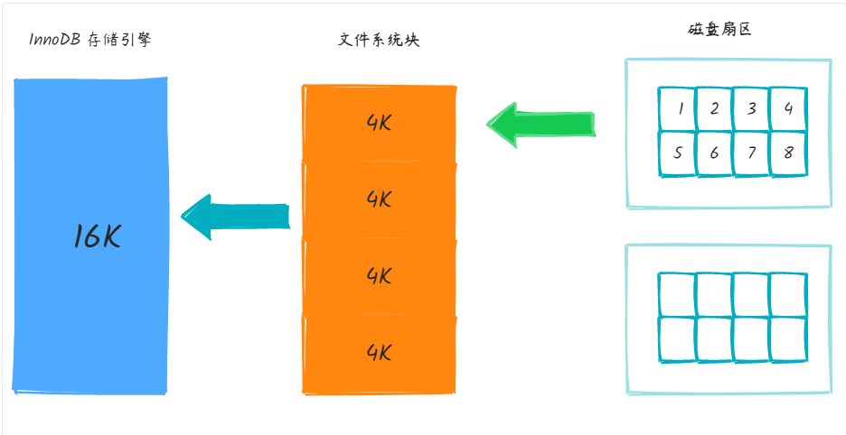
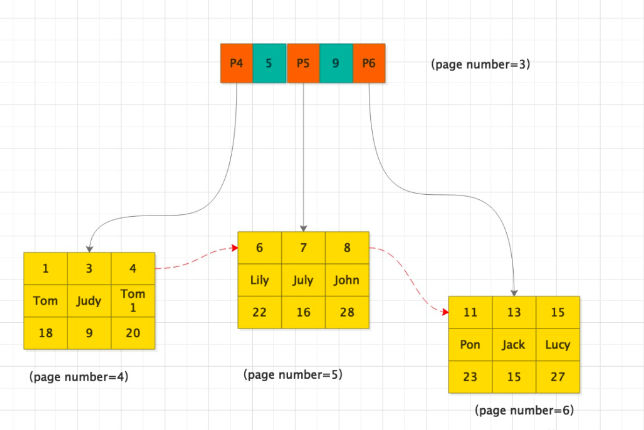
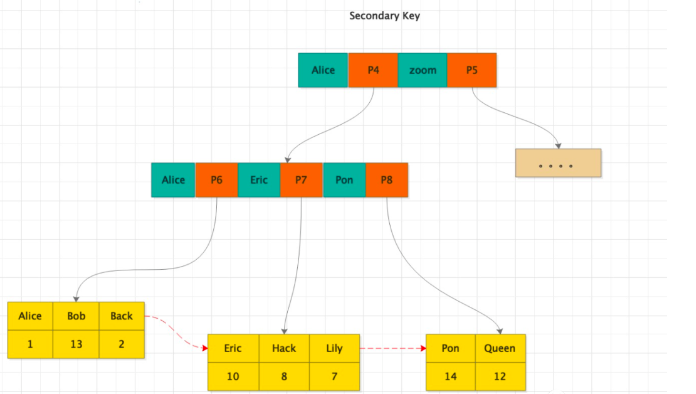
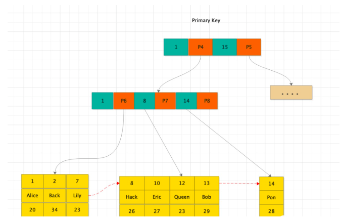

# MySQL 03 - 索引原理与B+Tree

> 原文：[https://xyf1111.github.io/mysql-interview-03/](https://xyf1111.github.io/mysql-interview-03/)

## MySQL索引


### MySQL目前主要有以下几种索引类型


1. 普通索引


最基本的索引，没有任何限制，有以下几种创建方式：


- 直接创建索引


```mysql
CREATE INDEX index_name ON table(column(length))
```

- 修改表结构的方式添加索引


```mysql
ALTER TABLE table_name ADD INDEX index_name ON (column(length))
```

- 创建表的时候同时创建索引


```mysql
CREATE TABLE `table` (
    `id` int(11) NOT NULL AUTO_INCREMENT,
    `title` char(255) CHARACTER NOT NULL,
    `content` TEXT CHARACTER NULL,
    `time` int(10) NULL DEFAULT NULL,
    PRIMARY KEY (`id`),
    INDEX index (title(length))
)
```

- 删除索引


```mysql
DROP INDEX index_name ON table
```

1. 唯一索引
与前面的普通索引类似。不同的是，索引列的值必须唯一，但允许有空值。如果是组合索引，则列值的组合必须唯一，有以下几种创建方式


- 创建唯一索引


```mysql
CREATE UNIQUE INDEX index_name ON table(column(length))
```

- 修改表结构


```fallback
ALTER TABLE table_name ADD UNIQUE index_name ON table(column(length))
```

- 创建表的时候直接指定


```mysql
CREATE TABLE `table` (
    `id` int(11) NOT NULL AUTO_INCREMENT,
    `title` char(255) CHATACTER NOT NULL,
    `content` text CHARACTER NULL,
    `time` int(10) NULL DEFAULT NULL,
    UNIQUE indexName (title(length))
)
```

1. 主键索引
是一种特殊的唯一索引，一个表只能有一个主键，不允许有空值，一般建表的时候同时创建主键索引


```mysql
CREATE TABLE `table` (
    `id` int(10) NOT NULL AUTO_INCREMENT,
    `title` char(255) NOT NULL,
    PRIMARY KEY (`id`)
)
```

1. 组合索引
多个字段上创建索引，只有在查询条件中使用了创建索引时的第一个字段，索引才会被使用，使用组合索引遵循最左前缀集合


```mysql
ALTER TABLE `table` ADD INDEX city_name_age(city, name, age)
```

1. 全文索引
主要用来查找文本中的关键字，而不是直接与索引中的值进行比较。fulltext（全文索引）跟其他索引大不相同，它更像是一个搜索引擎，而不是简单的where语句的参数匹配。fulltext索引配合match against操作使用，而不是一般的where+like。它可以在create table，alter table，create index使用。不过目前只用char，varchar，text列上可以创建全文索引。值得一提的是，在数据量比较大的时候，先将数据放入一个没有全文索引的表中，然后再用CREATE index创建fulltext（全文索引），要比先为一张表建立fulltext全文索引然后再将数据写入快得多。


- 创建表的时候添加全文索引


```mysql
CREATE TABLE `table` (
    `id` int(11) NOT NULL AUTO_INCREMENT,
    `title` char(255) CHARACTER NOT NULL,
    `content` text CHARACTER NULL,
    `time` int(10) NULL DEFAULT NULL,
    PRIMARY KEY (`id`),
    FULLTEXT (content)
)
```

- 修改表结构添加全文索引


```mysql
ALTER TABLE table ADD FULLTEXT index_content(content)
```

- 直接创建索引


```mysql
CREATE FULLTEXT INDEX index_content ON table(content)
```

### 缺点


1. 虽然索引大大提高了查询速度，同时会降低表的更新速度，如对表进行delete，update，insert。因为更新表时，不仅要保存数据，还要保存一下索引文件。
2. 建立索引会建立占用磁盘空间的索引文件。一般这个问题不太严重，但如果在一个大表上创建多种组合索引，索引文件会增长很快。


索引只是提高效率的一个因素，如果有大数据量的表，就需要花时间研究建立优秀索引，或优化查询语句。


### 注意事项


1. 索引不会包含有null值的列。只要列中包含null值都将不会被包含在索引中，复合索引中只要有一列含有null值，那么这一列对于索引就是无效的。所以在设计数据库的时候尽量不要让字段的默认值为null。
2. 使用短索引
对串列进行索引，如果可能就指定一个前缀长度。例如：一个char(255)的列，如果在前10个或20个字符内，多数值是唯一的，那么就不需要对整列进行索引。短索引不仅可以提高查询速度还可以节省磁盘空间和I/O操作。
3. 索引列排序
查询只用一个索引，因此如果where已经使用了索引，那么order by就不会在使用索引。因此数据库默认排序符合可以符合要求的情况下不要使用排序操作。尽量不要包含多个列的排序，如果需要最好给这些列创建复合索引。
4. like语句操作
一般情况下不推荐使用like，如果非使用不可，如何使用也是一个问题，like“%aaa%”不会使用索引而like“aaa%”可以使用索引。
5. 不要在列上进行运算
这将导致索引失效而进行全表扫描，例如


```mysql
SELECT * FROM table_name WHERE YEAR(column_name) < 2017
```

1. 不使用not in和<>操作


### mysql索引类型normal，unique，fulltext的区别是什么


- normal：表示普通索引
- unique：表示唯一的，不允许出现重复的索引，如果该字段信息不会出现重复。例如使用身份证号作为索引，可以设置为unique
- fulltext：表示全文搜索的索引，fulltext用于搜索很长一片文章的时候，效果最好。如果就一两行字，使用普通的index也可以。


总结，索引的类别由建立索引的字段内容特性来决定，通常normal最常见。


### 实际操作中，应选取表中哪些字段作为索引


建立索引上有7大原则：


1. 选择唯一性索引
2. 为经常需要排序、分组和联合操作的字段建立索引
3. 为常作为查询条件的字段建立索引
4. 限制索引数目
5. 尽量使用数据量小的索引
6. 尽量使用前缀来索引
7. 删除不再使用或很少使用的索引


### 聚集索引和非聚集索引区别


1. 聚集索引一个表只有一个，非聚集索引一个表可以有多个
2. 聚集索引存储记录在物理上是连续存在的，而非聚集索引在逻辑上是连续的，物理存储并不连续

## B+Tree 存储容量计算

### 存储层次

数据持久化到磁盘的层次关系（MySQL InnoDB）：

| 层次 | 说明 | 大小 |
|------|------|------|
| 扇区 (sector) | 磁盘最小读写单元 | 512 字节 (0.5 KB) |
| 文件系统块 (block) | 由 8 个扇区构成 | 4 KB |
| InnoDB 页 (page) | 由 4 个文件系统块构成 | 16 KB |



可通过以下 SQL 确认 InnoDB 页大小：

```sql
SHOW VARIABLES LIKE 'innodb_page_size';
-- 结果：16384 Byte = 16 KB
```

### B+Tree 如何提高查询效率

B+Tree 是 InnoDB 的默认索引结构，叶子节点存放实际数据，非叶子节点存放键值+指针，形成有序的多层索引。



**数据查找流程：**
1. 根据索引找到对应根页（每张表的根页位置在表空间文件中固定）
2. 通过二分查找定位到下一层页的指针
3. 逐层下降直至叶子节点，找到目标记录

> 一次页加载即一次磁盘 IO，树的深度直接影响查询性能。千万级表与几十万级表若树高均为 3，查询效率相差不大。

### B+Tree 高度与容量计算

**假设条件：**
- 主键 ID 为 `BIGINT` 类型（8 字节），指针大小 6 字节，合计 14 字节
- 单页大小 16,384 字节
- 单行数据约 1 KB

**计算结果：**

| 树高度 | 非叶子节点指针数/页 | 行数/叶子页 | 可存储总行数 |
|--------|-------------------|------------|------------|
| 高度 2 | 16384 ÷ 14 = 1170 | 16 | 1170 × 16 = **18,720** |
| 高度 3 | 1170 × 1170 | 16 | 1170 × 1170 × 16 = **21,902,400** |

即**千万级数据仅需 3 层 B+Tree**，按主键 id 索引查询只需约 3 次 IO。

### 按实际表计算

通过以下命令查看表行平均大小：

```sql
SHOW TABLE STATUS LIKE 'your_table_name'\G
```

示例（行平均 2730 字节）：
- 单个叶子节点记录数：16,384 ÷ 2730 ≈ 5
- 高度 3 可存：1170 × 1170 × 5 ≈ **684 万条**

### 二级索引查询开销

走二级索引完整路径：二级索引 B+Tree → 聚簇索引 B+Tree




若二级索引和聚簇索引各 3 层，最多花费 **3 + 3 = 6 次 IO**。

> 聚簇索引默认为主键；无主键时 InnoDB 会选择唯一非空索引或隐式创建。这也是推荐使用整型自增主键的原因。