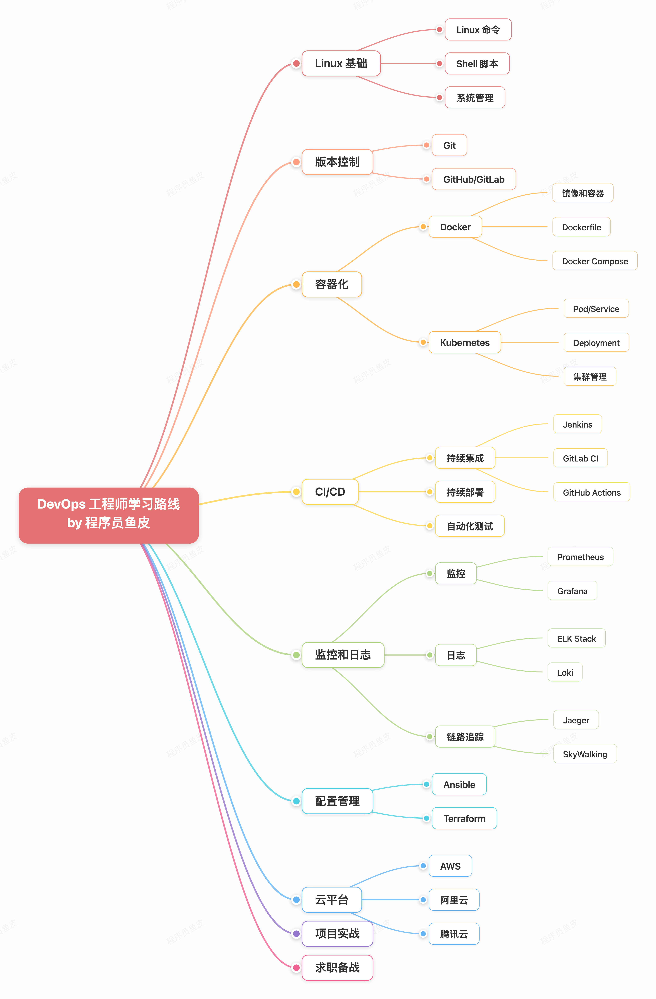

# DevOps 学习路线

> DevOps 学习路线：从零基础到 DevOps 工程师的完整学习路径。涵盖 Linux、Git、CI/CD、容器化、配置管理、监控等核心技能。

## 整体学习建议

1. **Linux 是基础** — DevOps 大部分工作在 Linux 环境中进行，需熟练掌握命令和系统管理
2. **自动化是核心** — 学习各种自动化工具（CI/CD、配置管理、监控），减少手动操作
3. **全栈视角** — 了解开发、测试、运维全流程，既要懂代码也要懂系统
4. **结合实践** — 搭建自己的 CI/CD 流水线，部署应用到云平台
5. **AI 辅助** — 用 AI 工具辅助编写脚本和配置文件

### 就业方向

| 岗位 | 说明 |
|------|------|
| DevOps 工程师 | CI/CD 和自动化运维 |
| 运维开发工程师 | 开发运维工具和平台 |
| SRE 工程师 | 系统可靠性工程 |
| 云原生工程师 | 云原生平台建设 |
| DevOps 架构师 | DevOps 流程和架构设计 |

### 学习前提

- Linux 基础：熟练使用 Linux 命令（**必学**）
- 编程基础：至少会 Python 或 Go（**必学**）
- 网络基础：理解 TCP/IP、HTTP 等协议（建议）
- 开发或运维经验（建议）

## 阶段 1：Linux 系统管理（10-25 天）

| 分类 | 内容 |
|------|------|
| **Linux 基础** | 常用命令、文件系统和权限管理、用户和组管理、进程管理 |
| **Shell 脚本** | 基础语法、自动化脚本编写、定时任务(Cron) |
| **系统服务** | Systemd、服务管理、日志查看(journalctl) |

### 资源
- [Linux 服务器学习路线](https://www.codefather.cn/course/1789189862986850306/section/1990755996393320449)
- [Shell 脚本学习路线](https://www.codefather.cn/course/1789189862986850306/section/1990756051800076290)

## 阶段 2：Git 版本控制（3-12 天）

| 分类 | 内容 |
|------|------|
| **Git 基础** | 安装配置、常用命令(add/commit/push/pull)、分支管理、合并冲突解决 |
| **Git 工作流** | Git Flow、GitHub Flow、GitLab Flow |
| **平台** | GitHub、GitLab、Gitee |

## 阶段 3：CI/CD 持续集成（5-20 天）

| 工具 | 说明 |
|------|------|
| **Jenkins**（必学） | 安装配置、Pipeline 流水线、插件系统 |
| **GitLab CI**（推荐） | `.gitlab-ci.yml` 配置、Runner 使用、Pipeline 流水线 |
| **GitHub Actions**（推荐） | Workflow 配置、Actions 市场、自托管 Runner |
| **其他** | Travis CI、CircleCI（可不学） |

### 建议
三大主流工具：Jenkins（老牌，功能强大配置复杂）、GitLab CI 和 GitHub Actions（现代，配置简单）。建议优先学习 GitHub Actions 或 GitLab CI。

### 资源
- ⭐ [GitHub Actions 官方文档](https://docs.github.com/zh/actions/get-started/quickstart)
- [GitLab CI 官方文档](https://docs.gitlab.com/ee/ci/)
- [CI/CD 持续集成学习路线](https://www.codefather.cn/course/1789189862986850306/section/1990755091384152066)

## 阶段 4：容器和编排（10-30 天）

| 技术 | 内容 |
|------|------|
| **Docker**（必学） | 使用、Dockerfile 编写、Docker Compose |
| **Kubernetes**（必学） | 核心概念、应用部署、服务暴露、配置和存储 |
| **Helm**（建议） | Helm Chart、应用打包和部署 |

### 资源
- [Docker 容器化学习路线](https://www.codefather.cn/course/1789189862986850306/section/1990754953097949186)
- [Kubernetes 学习路线](https://www.codefather.cn/course/1789189862986850306/section/1990754993086443521)

## 阶段 5：配置管理和自动化（7-15 天）

| 工具 | 说明 |
|------|------|
| **Ansible**（推荐） | 使用、Playbook 编写、Inventory 管理、模块使用 |
| **Terraform**（建议） | 基础设施即代码(IaC)、云资源管理 |

### Ansible vs Terraform 分工
- Ansible：配置管理和应用部署
- Terraform：基础设施管理（虚拟机、网络、存储）

## 阶段 6：监控和日志（7-20 天）

| 分类 | 工具 |
|------|------|
| **监控（必学）** | Prometheus（指标采集）、Grafana（可视化）、AlertManager（告警） |
| **日志（必学）** | ELK（Elasticsearch + Logstash + Kibana）|
| **APM（建议）** | SkyWalking、Zipkin（可不学）|

## 阶段 7：项目实战（20-60 天）

### 项目推荐

- 搭建 CI/CD 流水线
- 自动化部署系统
- 监控告警系统
- 日志分析平台

### 开源项目
- ⭐ [DevOps Tools Collection](https://github.com/techiescamp/devops-tools) — 2025 年最佳 DevOps 工具精选
- [AWS DevOps Projects](https://github.com/AWS-Devops-Projects) — AWS DevOps 实战项目集合

### 资源
- [DevOps 实战教程](https://www.bilibili.com/video/BV1rx4y1D7wR/)（300 集）
- [华为 DevOps 教程](https://www.bilibili.com/video/BV1PC4y137oh/)（6 小时精讲）

## 求职备战

### 经典面试题

**DevOps 基础：**
1. 什么是 DevOps？有什么优势？
2. DevOps 和传统模式有什么区别？
3. CI/CD 是什么？

**Linux 和脚本：**
1. 常用 Linux 命令？
2. 如何编写 Shell 脚本？
3. 如何排查 Linux 系统问题？

**CI/CD：**
1. Jenkins 和 GitLab CI 有什么区别？
2. 如何搭建 CI/CD 流水线？
3. 如何实现自动化部署？

**容器和编排：**
1. Docker 和虚拟机有什么区别？
2. Kubernetes 核心概念？
3. 如何部署应用到 Kubernetes？

**监控：**
1. 如何监控应用和系统？
2. Prometheus 工作原理？
3. 如何处理告警？

> 来源：鱼皮·编程导航 / codefather
