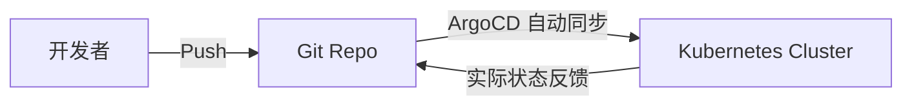

# CI CD 03 - GitOps与ArgoCD

## GitOps 理念

**Git 仓库是唯一事实来源**，集群状态与 Git 仓库中声明的配置保持一致。



### GitOps 核心原则

1. **声明式配置** — 所有基础设施和应用的配置都在 Git 中声明
2. **不可变制品** — 每个部署基于版本化的不可变制品（Docker 镜像）
3. **自动同步** — 工具自动将集群状态与配置对齐
4. **持续协调** — 检测到配置偏离自动纠正

## ArgoCD

### 安装

```bash
kubectl create namespace argocd
kubectl apply -n argocd -f https://raw.githubusercontent.com/argoproj/argo-cd/stable/manifests/install.yaml
```

### 创建 Application

```yaml
apiVersion: argoproj.io/v1alpha1
kind: Application
metadata:
  name: my-app
  namespace: argocd
spec:
  project: default
  source:
    repoURL: https://github.com/user/my-app-config.git
    targetRevision: HEAD
    path: k8s/overlays/production
  destination:
    server: https://kubernetes.default.svc
    namespace: production
  syncPolicy:
    automated:
      prune: true
      selfHeal: true
```

### 常用命令

```bash
# 登录 ArgoCD
argocd login <argocd-server>

# 查看应用
argocd app list
argocd app get my-app

# 手动同步
argocd app sync my-app

# 查看差异
argocd app diff my-app
```

## CI/CD vs GitOps 分工

| 阶段 | 工具 | 职责 |
|------|------|------|
| CI（持续集成） | GitHub Actions / Jenkins | 代码检查、测试、构建镜像 |
| CD（持续部署） | ArgoCD / Flux | 将 Git 中的配置同步到集群 |

> GitHub Actions 负责"构建推镜像"，ArgoCD 负责"拉同步部署"— 这是现代 K8s 部署的标准实践。
