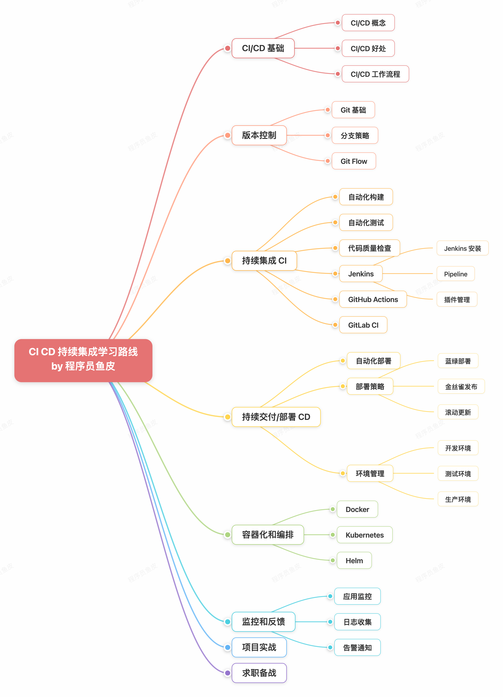

# CI CD 04 - 学习路线与系统指南

> CI/CD 学习路线概述：从入门到实战的完整学习路径，涵盖 GitHub Actions、GitLab CI、Jenkins 三大工具。



## 整体学习建议

1. **理解理念先于工具** — CI/CD 不仅是工具链，更是自动化文化与实践。理解 CI/CD 如何提高交付效率和质量是起点。
2. **从简到繁** — 先搭建最简单的流水线（提交后自动测试），再逐步增加复杂度（多环境部署、监控告警）。
3. **优先学习 GitHub Actions 和 GitLab CI** — 代表现代 CI/CD 方向，配置简单、功能强大。Jenkins 作为了解（部分企业仍在使用）。
4. **结合实践** — 为自己的项目搭建 CI/CD 流水线，体验自动化便利。
5. **利用 Serverless 部署平台** — 微信云托管、阿里云 Serverless 内置 CI/CD 能力，提交代码后自动构建部署，无需自建流水线。
6. **AI 辅助** — 用 AI 工具辅助编写配置文件、调试流水线。

## 阶段 1：CI/CD 基础（3-12 天）

### 知识点

| 分类 | 内容 | 必学 |
|------|------|:----:|
| **核心概念** | 持续集成(CI)、持续交付(CD)、持续部署 | ✅ |
| **组成部分** | 代码仓库(Git)、构建工具(Maven/Gradle/npm)、测试工具、部署工具 | ✅ |
| **最佳实践** | 频繁集成、自动化测试、快速反馈、小步快跑 | ✅ |

### 学习重点

- CI/CD 核心在于自动化：每次代码提交触发构建 → 测试 → 部署
- 测试失败流水线中断，阻止问题代码进入生产
- CI = 自动构建与测试；CD = 自动部署到测试环境；持续部署 = 自动部署到生产

## 阶段 2：GitHub Actions（7-20 天）

GitHub 内置 CI/CD 工具，直接在仓库中配置自动化工作流。

### 知识点

| 分类 | 内容 |
|------|------|
| **基础（必学）** | Workflow 概念、`.github/workflows` 目录、YAML 配置、Events/Jobs/Steps |
| **Actions 市场（必学）** | 使用第三方 Actions、常用 Actions（checkout、setup-node、upload-artifact）|
| **高级特性（建议）** | Matrix 策略、缓存(Cache)、Secrets、环境(Environments) |
| **自托管 Runner（建议）** | 自托管配置、与 GitHub 托管 Runner 区别 |

### 核心结构

```
Workflow → Job(s) → Step(s) → 命令或 Action
```

### 学习资源
- [GitHub Actions 官方文档](https://docs.github.com/zh/actions/get-started/quickstart)
- [GitHub Actions 持续集成文档](https://docs.github.com/zh/actions/get-started/continuous-integration)
- [GitHub Actions 持续部署文档](https://docs.github.com/zh/actions/get-started/continuous-deployment)

## 阶段 3：GitLab CI/CD（5-15 天）

GitLab 内置持续集成工具，通过 `.gitlab-ci.yml` 配置。

### 知识点

| 分类 | 内容 |
|------|------|
| **基础（必学）** | `.gitlab-ci.yml` 配置、Pipeline/Stage/Job、GitLab Runner |
| **常用配置（必学）** | script/before_script/after_script、variables、cache/artifacts、only/except |
| **Runner（必学）** | Shared Runner、Specific Runner、安装和注册 |

### 核心结构

```
Pipeline → Stage(s) → Job(s) → Runner 执行
```

### 学习资源
- [GitLab CI 官方文档](https://docs.gitlab.com/topics/build_your_application/)
- [GitLab CI vs GitHub Actions 对比](https://www.bytebase.com/blog/gitlab-ci-vs-github-actions/)

## 阶段 4：Jenkins（10-15 天，了解为主）

经典开源 CI/CD 工具，插件生态丰富，适合复杂企业级流程。

### 知识点

| 分类 | 内容 |
|------|------|
| **基础（必学）** | 安装配置、Pipeline 流水线、Jenkinsfile |
| **插件系统（建议）** | 常用插件、安装配置 |
| **高级特性（建议）** | 参数化构建、多分支流水线 |

### 学习重点

- Jenkins Pipeline 用 Groovy 脚本定义，Jenkinsfile 可版本化管理
- 插件生态丰富但管理复杂

### 学习资源
- [Jenkins 官方文档](https://www.jenkins.io/doc/)
- [DevOps Jenkins 教程](https://www.udemy.com/course/devops-jenkinscicd/)

## 阶段 5：项目实战（10-30 天）

### 项目推荐

| 场景 | 项目 |
|------|------|
| **传统部署** | 前端项目 CI/CD（构建、测试、部署到 CDN）|
| | 后端项目 CI/CD（构建、测试、部署到服务器）|
| | Docker 镜像 CI/CD（构建镜像、推送到仓库）|
| | Kubernetes 应用 CI/CD（部署到 K8s）|
| **Serverless 部署** | 微信云托管、阿里云 Serverless、腾讯云 Serverless |

## 求职备战

### 经典面试题

1. 什么是 CI/CD？有什么优势？
2. GitHub Actions、GitLab CI、Jenkins 有什么区别？
3. 如何搭建 CI/CD 流水线？
4. 如何在 CI/CD 中集成自动化测试？
5. 如何优化 CI/CD 流水线的性能？

> 来源：鱼皮·编程导航 / codefather
