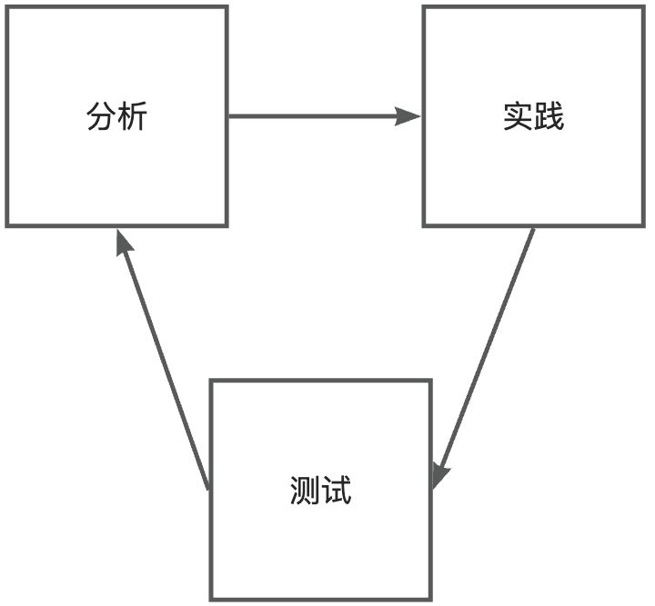
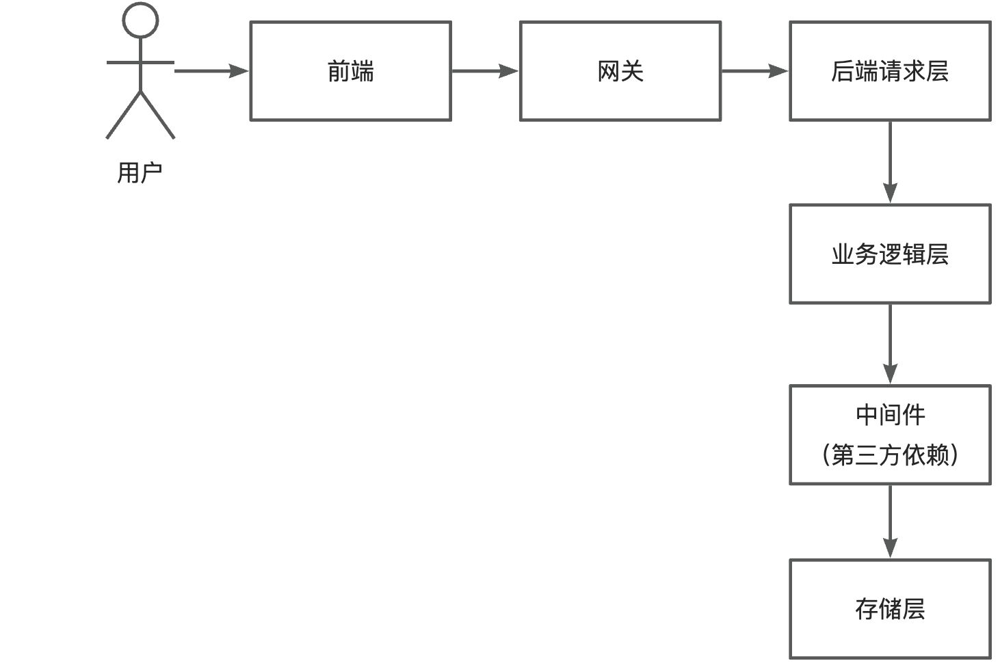
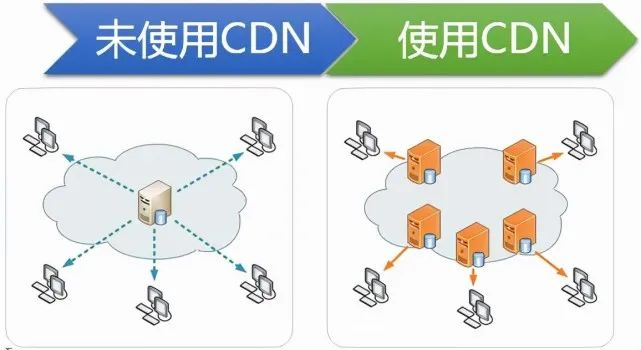

# 性能优化 01 - 通用方法论

性能优化是指通过**持续**的分析、实践和测试，确保系统稳定高效运行，从而满足用户诉求。其闭环流程如下：

## 性能优化分类

性能优化可分为两大类：

### 1）通用优化

经典的、对绝大多数情况都适用的优化策略，如增大服务器并发请求处理数、使用缓存减少数据库查询、负载均衡分摊请求、同步转异步等。

### 2）对症下药

结合具体业务特性和系统现状，先通过性能监控工具、压力测试等手段分析出性能瓶颈，再针对性地选取策略。例如数据库慢查询（单次查询超过 1 秒），根据查询条件给对应字段增加索引即可提高性能。

实际开发中这两类策略通常并用。系统设计和开发阶段应本能地引入性能优化手段，降低后续出问题的概率。性能优化是持续的过程，随着需求、用户和系统用量增长，原本符合要求的系统也会出现新问题。

对于复杂、高可用性要求的项目，可提前通过压力测试模拟大用户量场景，预先做好优化。

## 通用性能优化手段

以请求的完整生命周期为主线，依次介绍各节点的优化方法。

### 1）前端优化

- **离线缓存**：利用浏览器缓存机制，已请求的资源无需重复请求，提高页面加载速度。
- **请求合并**：页面请求过多时，将多个小请求合并成一个大请求，减少网络开销。
- **懒加载**：延迟加载页面图片等元素，提高首屏加载速度。

### 2）网关优化

- **负载均衡**：根据路由算法将请求转发到对应的后端系统，实现多服务器分摊请求，增大并发量。
- **缓存**：缓存后端返回的数据，下次前端请求时直接从网关获取，减少后端调用。

### 3）后端请求层

- **服务器优化**：根据业务特性选择性能更高的服务器并调整参数，如 Nginx、Undertow 等。
- **微服务**：将大型服务拆分为小型服务，通过微服务网关转发，增大各服务的并发处理能力。

### 4）业务逻辑层

- **异步化**：将同步业务逻辑改为异步，尽早响应，提高并发处理能力。
- **多线程**：将复杂操作拆分成多个任务，通过多线程并发执行，提高处理效率。

### 5）中间件（第三方依赖）

- **缓存**：将数据库查询结果缓存到性能更高的服务（如基于内存的 Redis 或本地缓存），减少数据库压力，提高查询性能。
- **队列**：使用消息队列对系统解耦或将操作异步化，实现流量的削峰填谷。

### 6）存储层

- **分库分表**：数据量极大时，对数据库进行垂直或水平切分，提高并发处理能力。
- **数据清理**：定期清理无用或过期数据，减少存储压力，必要时进行备份转储。

## 实战案例：CDN + HTTP/2 网站加速

> 案例：静态资源站首屏加载从 5s 优化到 1.5s（CDN 5s→3s，HTTP/2 3s→1.5s），几分钟配置完成。

### CDN（内容分发网络）

**原理：** 将源服务器文件分发到多个地域的网络节点，用户访问时从最近的节点获取；节点无缓存时自动从源站拉取（回源）。

**解决单服务器部署的 3 个缺点：**
- 单服务器压力过大
- 单点故障（服务器宕机全站无法访问）
- 离服务器越远的用户访问越慢

**配置要点（以云厂商 CDN 为例）：**
- **CDN 域名**：二级域名 + `cdn`/`static` 前缀，如 `cdn.example.com`
- **回源地址 + 回源 HOST**：CDN 无缓存时从回源地址拉取源文件；回源 HOST 用于告诉源站请求方身份、返回正确资源
- **访问控制（防盗链）**：只允许自己域名的网页请求文件，防止文件被其他网站盗用刷流量
- **IP 访问频率限制**：防单个 IP 攻击、限制流量（DDoS 防不住但聊胜于无）
- **缓存时间**：不变化的静态文件缓存设长；动态页面不要缓存，否则用户看到的都是旧内容
- **文件随机后缀**：更新静态文件时生成随机后缀，防止 CDN 缓存未刷新导致用户看不到最新页面（现代前端框架 + 打包工具如 UMI + Webpack 会自动生成）

**成本与选型：** 按流量计费。前期用户少、或用户都在服务器同机房时没必要上 CDN。

**衍生能力：**
- **DCDN**：全站加速，通过路由优化加速动态内容，可给实时性要求高的接口加速
- **SCDN**：安全加速，给 CDN 加一层防护，应对 DDoS、CC 攻击

### HTTP/2

在云厂商 CDN/加速配置页直接开启 HTTP/2 开关即可显著降低延迟（协议原理见 [[网络 08 - HTTP2与HTTP3及WebSocket]]）。

## 优化原则

并非每种方法都要用、每种方法都有用。做性能优化时需注意：

- **权衡性价比**：根据实际情况，评估优化收益与系统改动风险。
- **避免盲目引入新技术**：例如本地用 Elasticsearch 优化了查询，但公司没有采购成本，就脱离了实际。
- **从低成本开始**：先采用最简单、改动最小的优化手段。
- **做好充分测试**：避免好心优化反引入新的 Bug。

> 来源：鱼皮·编程导航 / codefather
