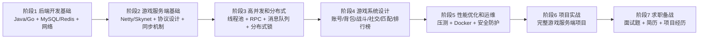

# 游戏 - 游戏服务端开发学习路线

> 游戏服务端开发负责游戏核心逻辑、玩家数据与网络通信，与普通 Web 后端相比需处理大量实时交互，对性能和延迟要求极高。本篇路线从零基础到精通，涵盖后端基础、游戏服务端基础、高并发分布式、游戏系统设计、性能优化与运维、项目实战、求职备战 7 个阶段。

## 开篇介绍

从 MMO 大型多人在线游戏到 MOBA 战术竞技，从卡牌游戏到 SLG 策略游戏，几乎所有网络游戏都需要强大的服务端支撑。游戏行业发展迅速，服务端人才需求旺盛，有经验的工程师年薪可达 30-80 万。

游戏服务端与普通 Web 服务端的最大区别：需要处理大量实时交互，对性能和延迟要求极高，并且需要处理复杂的游戏状态同步。该领域技术通用性强，掌握了高并发、分布式、实时通信等技术后，可迁移到直播、IoT 等领域，再回头做后端业务开发就很简单。

### 就业方向

1. **游戏服务端工程师** — 负责游戏服务端的开发和维护，包括游戏逻辑实现、网络通信、数据库设计等
2. **游戏架构师** — 负责游戏服务端的架构设计，制定技术方案，解决技术难题
3. **游戏运维工程师** — 负责游戏服务器的部署、监控、优化和故障处理
4. **游戏技术专家** — 深入研究网络同步、AI、物理模拟等游戏服务端核心技术
5. **服务端架构师** — 将游戏服务端经验应用于电商、直播等其他高并发系统

### 学习路线图

## 阶段 1：后端开发基础（30-40 天，仅供参考）

完全零基础建议先系统地学习 Java 或 Go 语言，能独立开发后端应用；已有后端经验可快速过一遍，重点复习多线程和网络编程。

### 学习目标

掌握编程语言、数据库、网络通信等后端开发基础知识，为游戏服务端开发打下基础。

### 知识点

**编程语言基础【必学】**
- Java 语言基础（主流选择）：基础语法、面向对象、集合框架、多线程、网络编程
- 或 Go 语言基础（新兴选择）：基础语法、并发编程（Goroutine、Channel）、网络编程

**数据库基础【必学】**
- SQL 语法
- MySQL：表设计、索引、事务、查询优化
- Redis 缓存：数据类型、常用命令、持久化、主从复制

**网络基础【必学】**
- TCP/IP 协议
- Socket 编程
- HTTP 协议
- WebSocket 协议

### 学习建议

1. 至少掌握一门后端语言。Java 是游戏服务端主流选择，应用最广泛、生态成熟、框架丰富；Go 并发性能优秀、开发效率高，在新项目中应用渐多。建议优先学 Java，有余力再了解 Go。
2. 数据库是游戏服务端核心组件，用于存储玩家数据、游戏配置。MySQL 是最常用关系型数据库，必须熟练掌握；Redis 是内存数据库，常用于缓存、排行榜、Session 管理等场景，也是必学内容。
3. 深入理解 TCP/IP 协议并掌握 Socket 编程。游戏服务端一般用 TCP 通信，少数用 UDP（如 FPS 游戏）。要理解 TCP 三次握手、四次挥手、流量控制、拥塞控制等机制。

## 阶段 2：游戏服务端基础（30-50 天，仅供参考）

### 学习目标

掌握游戏服务端的基本概念和核心技术，理解游戏服务端与普通后端的区别。

### 知识点

**游戏服务端概念【必学】**
- 游戏服务端架构
- 客户端-服务器模型
- 游戏服务端的特点
- 游戏服务端和 Web 服务端的区别

**网络框架【必学】**
- Netty（Java）：Netty 架构、Channel 和 EventLoop、ByteBuf、编解码器（Codec）、心跳机制
- 或 Skynet（Lua + C）：Actor 模型、服务（Service）、消息传递

**协议设计【必学】**
- 协议格式（二进制、文本）
- Protobuf
- 协议加密
- 协议压缩

**游戏逻辑【必学】**
- 帧同步 vs 状态同步
- 游戏循环（Game Loop）
- 定时器系统
- 事件系统

**消息处理【必学】**
- 消息队列
- 请求-响应模式
- 推送模式
- 消息路由

### 学习建议

1. Web 服务端一般无状态，处理 HTTP 请求后连接关闭；游戏服务端有状态，需维护长连接、处理大量实时消息。理解这种差异才能更好地设计游戏服务端。
2. Netty 是 Java 游戏服务端最常用的网络框架，几乎是行业标准，基于事件驱动和异步非阻塞模型，性能优秀。必须深入学习其架构，包括 Channel、EventLoop、Handler、Pipeline 等核心概念。
3. Skynet 是云风开发的轻量级游戏服务器框架（Lua + C，Actor 模型），国内特别是中小型公司有一定应用。学习曲线较陡，但理解 Actor 模型对理解分布式系统很有帮助。
4. 游戏协议一般用二进制格式，比 JSON 等文本格式更省带宽、解析更快。Protobuf 是最常用的二进制协议框架，必须掌握，并理解协议的版本管理、向前/向后兼容。
5. 帧同步适合格斗、RTS 等一致性要求高的游戏；状态同步适合 MMO、MOBA 等玩家较多的游戏。要理解两者的原理、优缺点和适用场景。

## 阶段 3：高并发和分布式（30-45 天，仅供参考）

高并发和分布式是游戏服务端的核心挑战，需要掌握负载均衡、分布式缓存、分布式锁等技术。

### 学习目标

掌握高并发和分布式系统的设计和实现，能够设计可扩展的游戏服务端架构。

### 知识点

**高并发技术【必学】**
- 多线程和线程池
- 异步编程
- 无锁编程
- 并发容器
- 性能调优

**分布式系统【必学】**
- 分布式架构
- 负载均衡
- 服务发现
- RPC 框架
- 分布式缓存

**消息队列【必学】**
- RabbitMQ
- Kafka
- 消息队列的应用场景

**数据一致性【建议学】**
- CAP 理论
- 分布式事务
- 最终一致性
- 分布式锁

**微服务架构【建议学】**
- 微服务概念
- 服务拆分
- API 网关
- 服务治理

### 学习建议

1. 游戏服务器需同时处理成千上万的玩家请求，要掌握多线程、异步编程、无锁编程等技术，理解线程安全、死锁、竞态条件等问题。
2. 单台服务器性能有限，需通过分布式架构实现水平扩展。理解负载均衡、服务发现、RPC 通信等基本概念，掌握一个 RPC 框架（如 Dubbo、gRPC）。
3. 消息队列用于异步处理、削峰填谷、服务解耦，如玩家充值后的道具发放、日志收集、数据统计等场景。
4. 理解 CAP 理论，知道不同场景下如何权衡一致性和可用性；掌握分布式锁、分布式事务等技术以保证玩家数据一致性。
5. 微服务通过拆分游戏功能提高可维护性和可扩展性，但需配套服务治理、监控、链路追踪等设施。

### 学习资源

- [开源的游戏服务器框架（Skynet、Pomelo 等）](https://cloud.tencent.com/developer/article/1828305)：腾讯云开发者社区文章

## 阶段 4：游戏系统设计（20-40 天，仅供参考）

游戏系统设计是游戏服务端开发的核心工作。不同类型的游戏系统不同，但账号、背包、社交等系统是通用的，要理解这些系统的设计思路和实现方法。

### 学习目标

掌握游戏常见系统的设计和实现，理解游戏业务逻辑的特点。

### 知识点

**账号系统【必学】**
- 注册登录、账号安全、多渠道登录、Session 管理

**背包系统【必学】**
- 物品管理、背包容量、物品堆叠、物品使用

**战斗系统【必学】**
- 战斗流程、技能系统、伤害计算、Buff 系统、战斗日志

**社交系统【建议学】**
- 好友系统、聊天系统、公会/战队系统、邮件系统

**匹配系统【建议学】**
- 匹配算法、ELO 评分、房间管理、匹配队列

**排行榜系统【建议学】**
- 排行榜设计、Redis Sorted Set、定时刷新、奖励发放

### 学习重点

1. 背包系统看似简单但细节多：物品堆叠规则、背包容量限制、物品使用的原子性等，是很好的学习案例。
2. 战斗系统是核心玩法也是最复杂的系统之一：需处理技能释放、伤害计算、Buff 效果、战斗日志，理解状态机、技能队列、伤害公式等设计原则。
3. 匹配系统在 MOBA、FPS 等对战游戏中非常重要：匹配算法需考虑玩家实力、等待时间、匹配质量等因素，理解 ELO 评分原理。
4. 排行榜系统非常常见：Redis Sorted Set 是理想数据结构，支持高效排序和范围查询，要理解刷新策略、奖励发放等问题。

### 经典面试题

1. 如何设计一个背包系统？需要考虑哪些问题？
2. 如何实现一个战斗系统？如何设计技能系统？
3. 如何设计一个匹配系统？匹配算法有哪些？
4. 如何实现一个高性能的排行榜系统？
5. 如何防止游戏外挂和作弊？

### 学习资源

- [MMO 游戏服务器的思考](https://hlog.cc/archives/103/)：架构设计
- [中文游戏服务器资源大全](https://github.com/hstcscolor/awesome-gameserver-cn)：综合资源

## 阶段 5：性能优化和运维（15-30 天，仅供参考）

### 学习目标

掌握游戏服务端的性能优化方法和运维技能，保证游戏服务器的稳定运行。

### 知识点

**性能优化【必学】**
- 性能分析工具
- CPU 优化
- 内存优化
- 网络优化
- 数据库优化
- 热点数据处理

**服务器运维【必学】**
- Linux 服务器
- Docker 容器化
- 日志管理
- 监控告警
- 故障排查

**安全防护【必学】**
- DDoS 防护
- 数据加密
- 防外挂
- 防刷

**压力测试【建议学】**
- 压测工具
- 压测方案
- 性能基准
- 瓶颈分析

### 学习建议

1. 性能优化是永恒主题：学会使用性能分析工具（如 JProfiler、pprof）定位瓶颈，常见优化方法包括减少锁竞争、使用对象池、优化数据结构、减少网络传输等。
2. 熟悉 Linux 服务器常用命令，掌握 Docker 容器化部署，建立监控告警体系，及时发现和处理故障。
3. 安全防护很重要：DDoS 攻击会导致服务器瘫痪，外挂和刷会破坏游戏平衡，要学习限流、验证码、数据校验、反作弊算法等方法。
4. 上线前需充分压测：掌握压测工具（如 JMeter、Gatling），设计合理的压测方案，确保服务器能承受预期负载。

## 阶段 6：项目实战（40-60 天，仅供参考）

### 学习目标

通过完整的项目实践综合运用所学知识，积累游戏服务端开发经验。

### 学习建议

1. 开发一个完整的游戏服务端项目，可选卡牌游戏、回合制游戏等简单类型，应包含账号系统、战斗系统、背包系统、社交系统等完整功能。
2. 选择合适的技术栈：Java 建议 Spring Boot + Netty + MySQL + Redis；Go 可用 Gin + MySQL + Redis。
3. 关注代码质量和架构设计：建议分层架构，将网络层、逻辑层、数据层分离；用工厂模式、策略模式等设计模式提高可维护性。
4. 进行性能测试和优化：用压测工具测试并发能力，用分析工具定位瓶颈并针对性优化，目标支持至少 1000 个并发用户。
5. 部署到云服务器（如阿里云、腾讯云），配置域名和 HTTPS，搭建监控系统，积累运维经验并作为作品展示。

### 项目推荐

- 卡牌游戏服务端
- 回合制战斗游戏服务端
- MOBA 游戏匹配服务器
- MMO 游戏服务端（简化版）
- 小游戏服务端（如消消乐）

**优质开源项目**
- [Unity Multiplayer Samples](https://github.com/Unity-Technologies/com.unity.multiplayer.samples.coop)：Unity 官方多人游戏示例项目
- [Awesome Game Networking](https://github.com/rumaniel/Awesome-Game-Networking)：游戏网络编程资源大全
- [Multiplayer Networking Resources](https://github.com/0xFA11/MultiplayerNetworkingResources)：多人游戏网络编程资源集合

### 学习资源

- [百万在线大型游戏服务端开发](https://www.scribd.com/document/900473741)：Skynet 实战
- [游戏服务端开发经验](https://zhuanlan.zhihu.com/p/1946162872196507206)：技术分享

## 阶段 7：求职备战（面试前 1 个月突击）

### 学习目标

熟练掌握游戏服务端常见面试题，准备好简历和项目经历，顺利通过面试。

### 学习建议

1. 简历上一定要有游戏服务端项目经历，最好是完整项目、能在线访问更好。提前准备常见系统设计题方案，如"怎么设计一个匹配系统？怎么实现帧同步？"。
2. 认真准备简历，突出项目亮点和量化成果。
3. 多刷面试题：游戏服务端面试题主要包括网络编程、高并发、分布式系统、游戏逻辑设计等方向。
4. 不同公司开发的游戏类型不同，面试前了解目标公司的游戏类型、技术栈，针对性准备更有效。

### 经典面试题

**网络编程**
1. TCP 和 UDP 有什么区别？游戏中如何选择？
2. 如何处理粘包和拆包问题？
3. Netty 的架构是怎样的？EventLoop 的工作原理是什么？
4. 如何实现心跳机制？为什么需要心跳？
5. 如何优化网络性能？

**高并发**
1. 如何设计一个高并发的游戏服务器？
2. 如何处理并发请求？如何保证线程安全？
3. 什么是无锁编程？如何实现？
4. 如何优化服务器性能？常见的性能瓶颈有哪些？
5. 如何进行压力测试？

**分布式系统**
1. 游戏服务端如何实现水平扩展？
2. 如何实现跨服通信？
3. 分布式锁有哪些实现方式？各有什么优缺点？
4. 如何保证分布式系统的数据一致性？
5. 如何设计一个分布式的匹配系统？

**游戏逻辑**
1. 帧同步和状态同步有什么区别？各适用于什么游戏？
2. 如何设计一个背包系统？需要考虑哪些问题？
3. 如何实现一个战斗系统？如何处理技能和 Buff？
4. 如何设计一个排行榜系统？
5. 如何防止游戏外挂和作弊？

**项目经验**
1. 你做过哪些游戏服务端项目？详细说说。
2. 项目中遇到过什么技术难点？如何解决的？
3. 如何设计游戏服务端的架构？
4. 如何进行性能优化？优化效果如何？
5. 如何处理线上故障？

## 更多资源

### 游戏服务端资源

- [中文游戏服务器资源大全](https://github.com/hstcscolor/awesome-gameserver-cn)：综合资源
- [Skynet GitHub](https://github.com/cloudwu/skynet)：云风的 Skynet 框架
- [Netty 官方文档](https://netty.io/)：Netty 官方网站

### 技术博客

- [腾讯游戏学堂](https://gameinstitute.qq.com/)：腾讯游戏技术分享

## 总结

游戏服务端开发从网络通信到高并发处理，从分布式架构到游戏逻辑设计，技术体系完整且深入。

学习路径：先打好后端开发基础（编程语言、数据库、网络通信），再深入学习游戏服务端核心技术（网络框架、协议设计、消息处理），掌握高并发和分布式系统的设计实现，理解常见游戏系统（背包、战斗、匹配）的设计思路，最后通过完整项目实践积累经验。

技术栈选择：Java + Netty 是主流选择，应用最广泛，适合大型游戏项目，建议优先学习；Go + 原生网络库是新兴选择，开发效率高，适合中小型游戏项目；Skynet（Lua + C）在国内有一定应用，适合快速开发。
