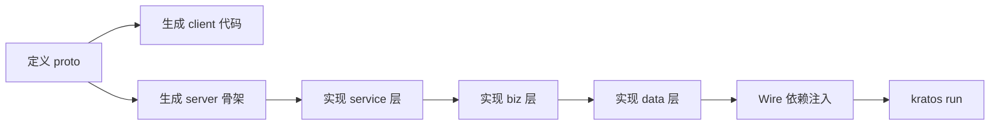

# Go 进阶 15 - Kratos微服务框架

> 本文提炼自 codefather 实战笔记，完整原文见「知识碎片/定义API并生成代码（ Go 微服务框架 Kratos ）」

Kratos 是 go-kratos/kratos 出品的 Go 微服务框架，核心设计理念是：**先定义 API（Proto），再生成代码**，统一 gRPC 和 HTTP 双协议入口。

---

## 核心工作流



---

## 一、项目初始化

```shell
# 脚手架创建项目
kratos new study
```

目录结构由 Kratos 模板自动生成，包含 `api/`、`internal/`、`cmd/` 等标准分层。

---

## 二、定义 Proto 接口

### 2.1 添加 proto 模板

```shell
kratos proto add api/study/v1/todo.proto
```

### 2.2 关键设计：双协议绑定

Kratos 在 proto 中用 `google.api.http` option 实现 **一个 RPC 同时支持 gRPC 和 HTTP REST**：

```protobuf
import "google/api/annotations.proto";

service Todo {
  rpc CreateTodo (CreateTodoRequest) returns (CreateTodoReply) {
    option (google.api.http) = {
      post: "/v1/todo/create",
      body: "*"
    };
  };
  rpc UpdateTodo (UpdateTodoRequest) returns (UpdateTodoReply) {
    option (google.api.http) = {
      post: "/v1/todo/update/{id}",
      body: "*"
    };
  };
  rpc DeleteTodo (DeleteTodoRequest) returns (DeleteTodoReply) {
    option (google.api.http) = {
      post: "/v1/todo/delete/{id}",
      body: "*"
    };
  };
  rpc GetTodo (GetTodoRequest) returns (GetTodoReply) {
    option (google.api.http) = {
      get: "/v1/todo/get/{id}",
    };
  };
  rpc ListTodo (ListTodoRequest) returns (ListTodoReply) {
    option (google.api.http) = {
      get: "/v1/todo/list",
    };
  };
}

message todo {
  int64 id = 1;
  string title = 2;
  bool status = 3;
}

message CreateTodoRequest { string title = 1; }
message CreateTodoReply {
  int64 id = 1;
  string title = 2;
  bool status = 3;
}
message UpdateTodoRequest {
  int64 id = 1;
  string title = 2;
  bool status = 3;
}
message UpdateTodoReply {}
message DeleteTodoRequest { int64 id = 1; }
message DeleteTodoReply {}
message GetTodoRequest { int64 id = 1; }
message GetTodoReply   { todo todo = 1; }
message ListTodoRequest {}
message ListTodoReply  { repeated todo data = 1; }
```

### 2.3 设计决策说明

| 决策 | 说明 |
|------|------|
| POST 用于写操作、GET 用于读操作 | 符合 REST 语义 |
| 路径参数 `{id}` | Kratos 自动解析路径参数到请求 message 对应字段 |
| `body: "*"` | 请求体所有字段映射到 message |
| protobuf + http annotation | 一份定义同时产出 gRPC 和 HTTP 两种入口 |

---

## 三、代码生成

```shell
# 生成客户端代码（Go 结构体 + 序列化）
kratos proto client api/study/v1/todo.proto

# 生成服务端骨架代码（放到 internal/service 目录）
kratos proto server api/study/v1/todo.proto -t internal/service
```

生成的 `internal/service/todo.go` 提供了接口骨架，只需填充业务逻辑。

---

## 四、Kratos 分层架构

Kratos 的核心分层设计是 **service → biz → data**，依赖方向从上到下：

```
┌──────────────────┐
│   service 层     │  ← RPC 入口，参数校验，调用 biz
├──────────────────┤
│   biz 层         │  ← 业务逻辑，定义 Usecase + Repo 接口
├──────────────────┤
│   data 层        │  ← 数据访问，实现 Repo 接口（DB/Redis/内存）
└──────────────────┘
```

### 4.1 service 层 — 入口与校验

```go
type TodoService struct {
    pb.UnimplementedTodoServer
    uc *biz.TodoUsecase
}

func NewTodoService(uc *biz.TodoUsecase) *TodoService {
    return &TodoService{uc: uc}
}

// CreateTodo：参数校验 → 调用 biz → 返回响应
func (s *TodoService) CreateTodo(ctx context.Context, req *pb.CreateTodoRequest) (*pb.CreateTodoReply, error) {
    if len(req.GetTitle()) == 0 {
        return nil, fmt.Errorf("无效的title")
    }
    data, err := s.uc.CreateTodo(ctx, &biz.Todo{Title: req.Title})
    if err != nil {
        return nil, err
    }
    return &pb.CreateTodoReply{
        Id: data.ID, Title: data.Title, Status: data.Status,
    }, nil
}
```

### 4.2 biz 层 — 业务逻辑 + Repo 接口抽象

```go
type Todo struct {
    ID     int64
    Title  string
    Status bool
}

// TodoRepo：biz 层对 data 层提出的接口要求（依赖倒置）
type TodoRepo interface {
    Save(ctx context.Context, t *Todo) (*Todo, error)
    Update(ctx context.Context, t *Todo) error
    Delete(ctx context.Context, id int64) error
    FindByID(ctx context.Context, id int64) (*Todo, error)
    ListAll(ctx context.Context) ([]*Todo, error)
}

type TodoUsecase struct {
    repo TodoRepo
    log  *log.Helper
}

func NewTodoUsecase(repo TodoRepo, logger log.Logger) *TodoUsecase {
    return &TodoUsecase{repo: repo, log: log.NewHelper(logger)}
}

func (uc *TodoUsecase) CreateTodo(ctx context.Context, t *Todo) (*Todo, error) {
    uc.log.WithContext(ctx).Infof("CreateTodo: %v", t)
    return uc.repo.Save(ctx, t)  // 委托给 data 层
}
```

### 4.3 data 层 — 实现 Repo 接口

```go
type todoRepo struct {
    data *Data
    log  *log.Helper
}

func NewtodoRepo(data *Data, logger log.Logger) biz.TodoRepo {
    return &todoRepo{data: data, log: log.NewHelper(logger)}
}

func (r *todoRepo) Save(ctx context.Context, t *biz.Todo) (*biz.Todo, error) {
    // 实际数据库操作（此处先返回占位，跑通流程后再接入真实 DB）
    return t, nil
}
// Update、Delete、FindByID、ListAll 类似实现...
```

### 4.4 server 层 — 注册服务

```go
// grpc.go
func NewGRPCServer(c *conf.Server, todo *service.TodoService, logger log.Logger) *grpc.Server {
    srv := grpc.NewServer(
        grpc.Middleware(recovery.Recovery()),
    )
    v1.RegisterTodoServer(srv, todo)
    return srv
}
// http.go 类似，注册 http 路由
```

---

## 五、依赖注入 (Wire)

### 5.1 ProviderSet 配置

修改各层的 `ProviderSet`：

```go
// data.go
var ProviderSet = wire.NewSet(NewData, NewtodoRepo)

// biz.go
var ProviderSet = wire.NewSet(NewTodoUsecase)

// service.go
var ProviderSet = wire.NewSet(NewTodoService)
```

### 5.2 生成注入代码

```shell
cd cmd/study && wire
```

执行后自动生成 `wire_gen.go`，将所有依赖串联起来。

---

## 六、启动项目

```shell
kratos run
```

项目启动成功即证明整个 **proto → code gen → 分层实现 → wire 注入** 链路已跑通。

---

## 总结

| 步骤 | 命令 / 动作 | 产出 |
|------|-------------|------|
| 创建项目 | `kratos new <name>` | 标准项目骨架 |
| 定义 API | `kratos proto add` + 编辑 proto | proto 文件（含 http annotation） |
| 生成代码 | `kratos proto client` + `kratos proto server` | client 结构体 + server 骨架 |
| 分层实现 | 手动实现 service / biz / data | 业务代码 |
| 依赖注入 | `wire` | wire_gen.go |
| 运行 | `kratos run` | 服务启动 |

Kratos 的核心设计哲学：**API 先行、接口隔离（依赖倒置）、分层清晰、自动注入**，适合从单体演进到微服务的 Go 项目。
