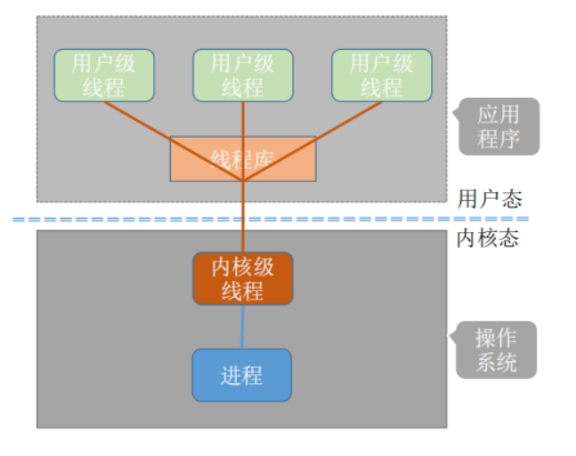

# Java 15 - 线程基础

## 线程与进程

| 概念 | 说明 |
|------|------|
| **进程** | 程序的一次执行，独立的内存空间；操作系统资源分配的最小单位 |
| **线程** | 进程内的执行单元，共享进程内存与系统资源；CPU 调度的最小单位 |

Java 默认线程：`main` 主线程 + GC 垃圾回收线程。运行 Java 程序即启动一个 JVM 进程，进程内所有代码以线程方式运行。

### 为什么需要线程

- 程序速度受三大因素制约：**CPU（计算能力）、内存（临时存储）、IO（持久化速度）**，三者速度差异巨大：`CPU > 内存 >> IO`，IO 是最主要瓶颈。
- 早期单核 CPU 通过「多进程分时复用」实现同时运行多个程序：操作系统给每个进程分配一段 CPU 使用权（**时间片**），用完即切换下一个进程（毫秒级，用户无感知）。
- 进程占用时间片时若需进行耗时 IO 操作，会让出 CPU 给其他进程，待 IO 完成后再重新获取时间片，以提高 CPU 利用率。
- 进程切换开销大（每个进程有独立内存空间、不共享数据），为提升并发性能与 CPU 利用率，进程内部诞生了**线程**：线程共享进程的内存空间与系统资源，切换与通信成本更低。

### 进程与线程的区别

- **调度粒度**：线程是 CPU 调度的最小单位，进程是操作系统分配资源的最小单位；线程的划分尺度小于进程。
- **开销**：创建/终止进程需分配独立内存空间与系统资源，开销较大；创建/终止线程共享进程资源，开销较小。
- **调度方式**：操作系统为进程分配时间片；线程作为进程内执行单元由进程来调度。
- **并行能力**：多核处理器下多线程可实现真正并行执行，进一步提高系统性能。
- **主线程与进程相互依存**：每个进程有且只有一个主线程；主线程结束，进程也随之结束。
- **地址空间**：每个进程拥有独立的地址空间，互不共享；进程内多个线程共享同一地址空间，堆内存、文件、套接字等资源归进程管理，进程内线程可共享使用，进程占用的内存和资源在其退出或被杀死时归还操作系统。
- **安全性**：多进程默认不共享地址空间与资源，开发较麻烦、共享数据效率低，但安全性较好——某个进程出问题时其他进程一般不受影响；多线程共享资源、效率高，但一个线程执行非法操作可能导致整个进程退出。
- **Linux 视角**：Linux 并不严格区分进程与线程，二者都用 `task_struct` 表示；线程可看作共享原进程内存空间的"新进程"，只是一个抽象叫法。

### 用户级线程与内核级线程

操作系统分为**用户态**与**内核态**：用户态是用户程序可见、可运行的空间；内核态由操作系统内核使用，可执行特权指令。线程按组织方式分为两类：

- **用户级线程**：从用户视角可见的线程，由用户程序（如线程库）在用户空间组织实现，切换在用户空间即可完成，无需切换到内核态，切换开销小、效率高；本质上是在用户空间抽象出的状态机。
- **内核级线程**：线程的创建、调度、切换等工作全部由操作系统内核负责；但每次切换都要在用户态与内核态之间来回走，系统开销大。

**用户级线程的优点**：

1. 管理开销小：创建、销毁不需要系统调用，也不占用内核内存；
2. 切换成本低：由用户空间程序自己维护，不需要通过操作系统调度。

**用户级线程的缺点**：

1. 由用户程序管理，进行 I/O 时无法利用内核的优势，需要频繁进行用户态到内核态的切换；
2. 无法利用多核优势：操作系统调度的是线程所属的进程，同一进程内无论有多少用户级线程，同一时刻只能并发执行一个，无法并行，用不上多核 CPU；
3. 操作系统感知不到用户线程，无法优化其调度；用户线程阻塞时，操作系统也无法快速切换它。

在支持内核级线程的系统中，按用户级线程与内核级线程的映射关系可分为三种**多线程模型**：

- **一对一**：一个内核级线程对应一个用户级线程；
- **一对多**：一个内核级线程对应多个用户级线程；
- **多对多**：多个内核级线程对应多个用户级线程。

具体采用哪种策略取决于使用的系统调用。例如 pthread 线程库可以创建 n 个用户级线程，底层其实由一个（或少数）内核线程负责调度。一对多模型示意：



### 协程

**为什么需要协程**：操作系统基本都是分时系统，给每个进程/线程分配时间片，时间片用完即打断当前执行、让出 CPU 给其他线程，这会带来并发安全问题（可加锁解决）。但同一进程内的多个线程本可以相互配合协作，分时抢占式调度容易打破这种协作平衡——一个线程还没执行完就被抢占，可能导致意想不到的执行紊乱。因此出现**非抢占式多任务**：一个线程事情没做完时，其他线程先等待，等它做完自动交出 CPU 控制权。这种协作式执行流就是**协程**——每次执行中协程间的具体执行顺序可能千变万化，但执行权切换只发生在用户明确放弃执行权之后，比如执行 `yield` 语句主动让出 CPU。

**协程与线程的区别**：

1. 协程的开销比线程更小；
2. 协程适合非抢占式多任务场景（协作式，大家一起办好一件事）；而线程在操作系统的分时抢占机制下，容易出现执行紊乱；
3. 线程可以实现并行，协程不能并行——协程与用户级线程类似，因此也拥有其优点：创建、销毁不需要系统调用，不占用内核内存，开销小；由用户空间程序自己维护，不需要操作系统调度。

注意：Go 的 **goroutine** 其实不算操作系统的协程，它是 Go 自己实现的、便于并发编程的并发原语。

> 状态机视角：进程与线程的本质都是状态机抽象，操作系统则是"调度状态机的状态机"。

## 创建线程的三种方式

### 方式一：继承 Thread

```java
class MyThread extends Thread {
    @Override
    public void run() {
        System.out.println("线程运行中");
    }
}

new MyThread().start();
```

### 方式二：实现 Runnable（推荐）

```java
class MyTask implements Runnable {
    @Override
    public void run() {
        System.out.println("任务执行中");
    }
}

new Thread(new MyTask()).start();

// Lambda 简写
new Thread(() -> System.out.println("任务")).start();
```

### 方式三：实现 Callable + FutureTask（可获取返回值）

```java
class MyCall implements Callable<Integer> {
    @Override
    public Integer call() throws Exception {
        return 42;
    }
}

FutureTask<Integer> task = new FutureTask<>(new MyCall());
new Thread(task).start();
Integer result = task.get();  // 阻塞获取结果
```

## 线程生命周期

```
新建 (New) → 就绪 (Runnable) → 运行 (Running) → 死亡 (Terminated)
                ↑                    ↓
             阻塞 (Blocked / Waiting / Timed_Waiting)
```

| 状态 | 说明 |
|------|------|
| **NEW** | 新建，未调用 start() |
| **RUNNABLE** | 就绪 + 运行中 |
| **BLOCKED** | 等待锁 |
| **WAITING** | 无限期等待（wait/join/park） |
| **TIMED_WAITING** | 限期等待（sleep/wait(time)/join(time)） |
| **TERMINATED** | 执行完毕 |

## 常用方法

| 方法 | 说明 |
|------|------|
| `start()` | 启动线程 |
| `sleep(ms)` | 当前线程休眠（不释放锁） |
| `join()` | 等待线程结束 |
| `yield()` | 让出 CPU 时间片 |
| `interrupt()` | 中断线程 |
| `isAlive()` | 线程是否存活 |

## 线程优先级

范围 1~10，默认 5（`Thread.NORM_PRIORITY`），仅作**建议**，具体由 OS 决定。
