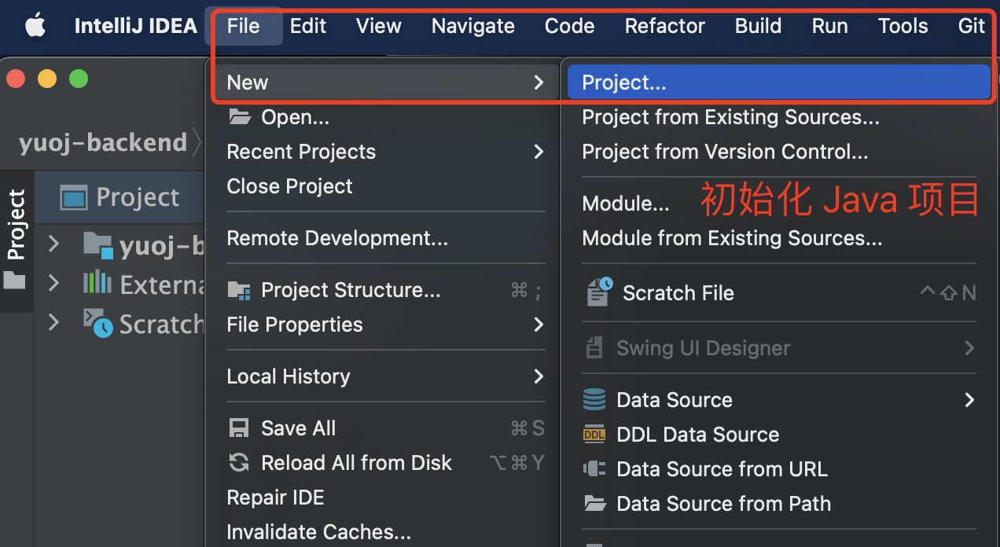
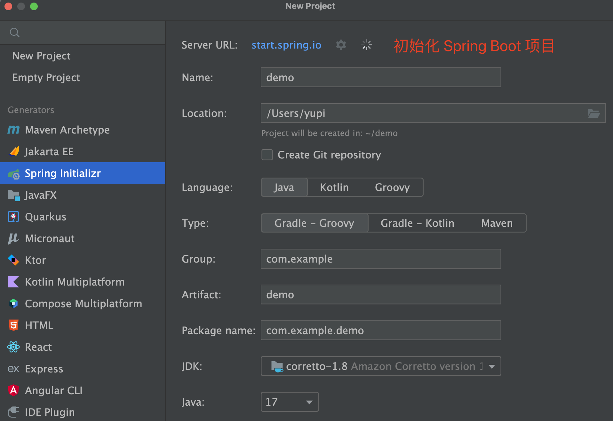
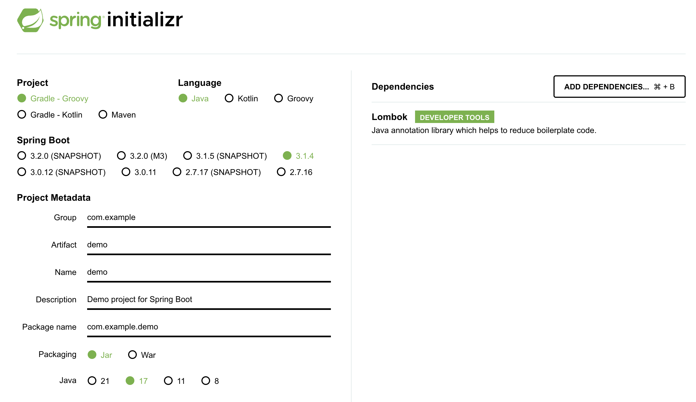

# Java 工具 - 项目初始化方法

> 四种快速初始化 Java 项目的方式：开发工具、项目管理工具、模板生成器、开源项目模板。

## 1. 使用开发工具（IDEA）

JetBrains IDEA 是最常用的 Java IDE，支持可视化创建项目：

- **内置 JDK 管理**：可直接在 IDEA 中安装指定版本 JDK
- **Spring Initializr 集成**：File → New → Project → Spring Initializr，选择模板和依赖



选择 Spring Initializr 模板，填写项目信息：



支持可视化选择依赖，无需手动编写 pom.xml 基础依赖。

> Maven 中心仓库：http://mvnrepository.com/

## 2. 项目管理工具

### Maven

```shell
mvn archetype:generate \
    -DgroupId=com.example \
    -DartifactId=my-spring-boot-app \
    -DarchetypeArtifactId=maven-archetype-quickstart \
    -DinteractiveMode=false
```

| 参数 | 说明 |
|------|------|
| `-DgroupId` | 项目组 ID |
| `-DartifactId` | 项目 Artifact ID |
| `-DarchetypeArtifactId` | 项目模板 |
| `-DinteractiveMode=false` | 禁用交互模式 |

### Gradle

```shell
gradle init
```

按提示选择项目类型和语言即可。

## 3. 项目模板生成器

### Spring Initializr

**地址**：https://start.spring.io/

可视化选择配置，快速生成 Spring Boot 项目初始代码：



IDEA 已内置此功能，通常无需单独使用网站。

### 阿里云微服务脚手架

**地址**：https://start.aliyun.com/

推荐用于 Spring Cloud Alibaba 项目，可保证组件版本一致性。

> **补充**：Spring Boot 官方已停止维护 2.x、全力维护 3.x（最低要求 JDK 17），所以 IDEA 内置的 Spring Initializr 不再提供 Java 8 选项（只剩 17+），网页版同样如此。存量项目或习惯用 Java 8 时，把 IDEA 中 Initializr 的 **Server URL** 改为阿里云脚手架镜像 `https://start.aliyun.com/` 即可。

### JHipster

**地址**：https://www.jhipster.tech/cn/

Java 项目生成器，功能强大，模板和选项丰富：

```shell
jhipster
```

按命令行提示选择配置即可。

### Yeoman

**地址**：https://yeoman.io/generators/

主要用于前端项目，但也可编写自定义 Generator 生成 Java 代码。它的生成器市场已收录 **9000 多套项目模板**，前端、后端、全栈都有；不过 Yeoman 仓库（GitHub 近万 star）里并没有工具本身的代码，模板都分散在各 `generator-xxx` 包中，相当于把 GitHub 当流量入口。

前端脚手架方向的定位见 [[工具 12 - 前端学习路线]]「脚手架」条目（Yeoman【可不学】——快速生成项目目录模板）。

```shell
# 全局安装 yeoman（需要 Node.js 环境）
npm install -g yo

# 交互式菜单：可直接在菜单里安装生成器，或输入要安装的生成器包名
yo

# 也可在官网搜索生成器后自行安装，包名记得加 generator 前缀
# 例：搜索 Chrome 插件项目生成器得插件名 chrome-extension
npm install -g generator-chrome-extension

# 新建一个空目录，用 yo 执行生成器（生成后自动安装依赖，直接运行即可）
mkdir test-chrome
cd test-chrome
yo chrome-extension

# 部分生成器自带生成单个文件的能力
# 例：angular 生成器一行命令生成新控制器
yo angular:controller NewController
```

## 4. 开源项目模板

直接使用 GitHub 上的开源项目作为基础：

- **Jeecg Boot**：https://github.com/jeecgboot/jeecg-boot — 大而全的管理系统
- **若依**：https://github.com/yangzongzhuan/RuoYi — 流行的快速开发框架

> 开源项目功能完善，适合企业快速开发；学习用途推荐自定义开发，避免功能定制困难。

## 最佳实践

建议在学习和开发过程中持续沉淀 **自己的万用项目模板**，将常用功能（用户登录、权限、CRUD 等）封装为可复用模块，后续新项目可直接使用。

> 来源：鱼皮·编程导航 / codefather
