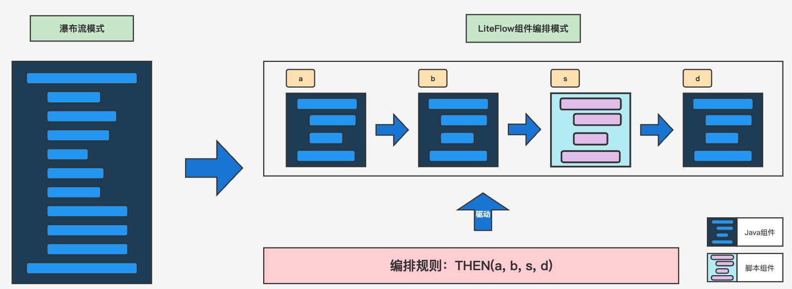
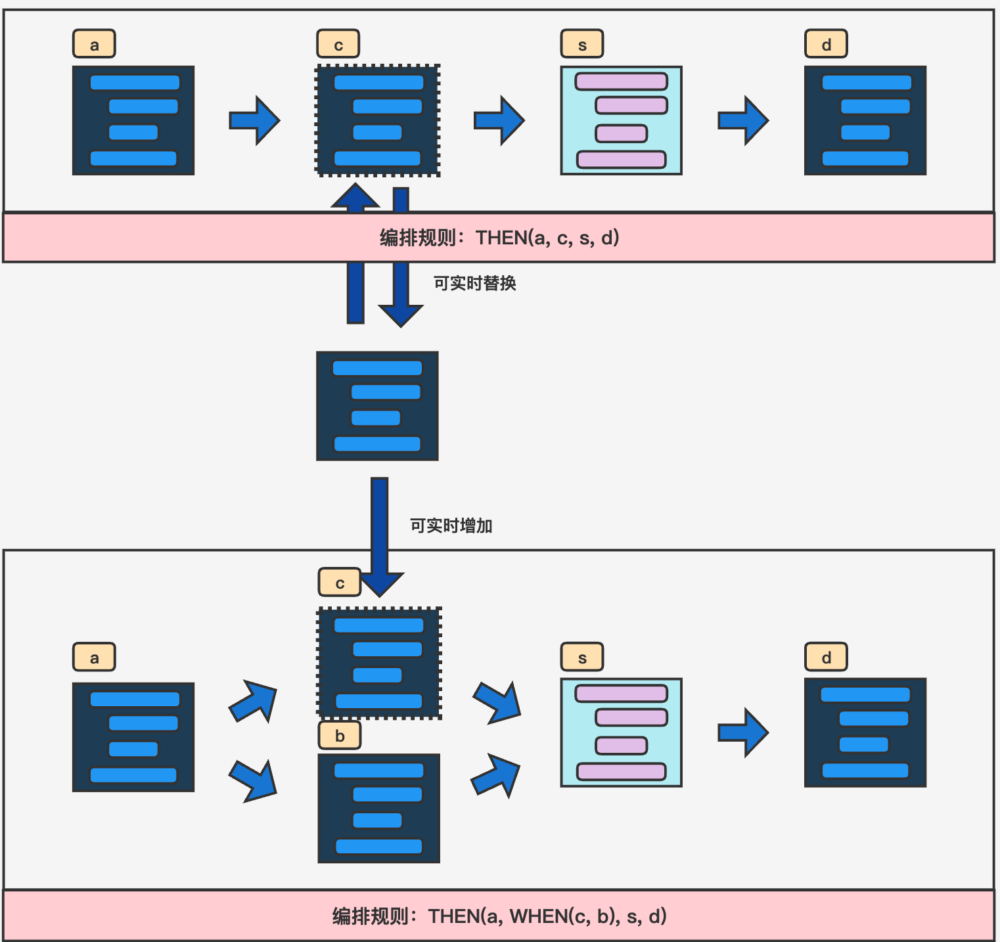

# Java 工具 04 - LiteFlow 编排式编程

> LiteFlow 是一个 Java 编排式编程框架，将瀑布式代码转化为组件化结构，支持灵活编排、热替换和多语言脚本。

## 背景

核心业务系统代码通常复杂冗长，传统编码模式难以快速定位问题和扩展。即便拆分为多个方法，耦合度仍然较高，一小段改动可能影响整个模块。

**典型场景：** 查询前需依次经过 A→B→C→D 校验。如果流程变成 B→A→C→D 或 B→D→A→C，传统编码需要大量修改。LiteFlow 通过组件化编排解决这类问题。

## 核心优势



1. **瀑布式代码 → 组件化结构**：组件间解耦，可任意编排
2. **脚本定义流程**：语法简单，修改流程只需改配置无需改代码
3. **组件热更替**：运行时替换某个组件，不影响其他组件
4. **多语言脚本支持**：可用脚本实现任意逻辑

## 设计原则：工作台模式

LiteFlow 基于工作台模式（Workbench Pattern）：

> N 个工人按照一定顺序围着一张工作台，各自生产零件，最终组装成机器。每个工人只需完成自己的工作，无需了解其他工人的内容。工人从工作台取资源，生产结果放回工作台。

**映射到 LiteFlow：**

| 工作台概念 | LiteFlow 对应 |
|-----------|---------------|
| 工人 | 组件 (Component) |
| 座位顺序 | 流程配置 (Chain) |
| 工作台 | 上下文 (Context) |
| 资源/零件 | 参数 |
| 最终机器 | 业务结果 |

**优点：** 组件解耦、可复用、可实时调整流程（替换/插入/移除组件）。



## Spring Boot 整合

### 引入依赖

```xml
<dependency>
    <groupId>com.yomahub</groupId>
    <artifactId>liteflow-spring-boot-starter</artifactId>
    <version>${project.parent.version}</version>
</dependency>
```

### 编写组件

以模拟下单业务为例，三个组件节点：

**① 初始化库存：**

```java
@LiteflowCmpDefine
@LiteflowComponent
public class InitProductsFlow {
    @LiteflowMethod(LiteFlowMethodEnum.PROCESS)
    public void business(NodeComponent component) throws Exception{
        ExtractorResultContext contextBean = component.getContextBean(ExtractorResultContext.class);
        Product product = new Product();
        product.setId(1L);
        product.setName("可乐");
        product.setNumber(100);
        contextBean.setProduct(product);
    }
}
```

**② 生成订单：**

```java
@LiteflowCmpDefine
@LiteflowComponent
public class CreateOrderFlow {
    @LiteflowMethod(LiteFlowMethodEnum.PROCESS)
    public void business(NodeComponent component) throws Exception{
        ExtractorResultContext contextBean = component.getContextBean(ExtractorResultContext.class);
        Order order = new Order();
        order.setId(110L);
        order.setProductId(1L);
        order.setGoodName("可乐");
        order.setPrice(new BigDecimal(3));
        contextBean.setOrder(order);
    }
}
```

**③ 更新库存：**

```java
@LiteflowCmpDefine
@LiteflowComponent
public class SubProductsFlow {
    @LiteflowMethod(LiteFlowMethodEnum.PROCESS)
    public void business(NodeComponent component) throws Exception{
        ExtractorResultContext contextBean = component.getContextBean(ExtractorResultContext.class);
        Product product = contextBean.getProduct();
        product.setNumber(product.getNumber() - 1);
        contextBean.setProduct(product);
    }
}
```

### 编排节点

```xml
<?xml version="1.0" encoding="UTF-8"?>
<flow>
    <chain name="TFlow" desc="下单流程">
        <pre value="initProductsFlow"/>
        <then value="createOrderFlow"/>
        <finally value="subProductsFlow"/>
    </chain>
</flow>
```

**流程节点标签说明：**

| 标签 | 含义 |
|------|------|
| `pre` | 前置节点 |
| `then` | 顺序执行节点 |
| `when` | 并行执行节点 |
| `finally` | 最终节点 |

### 配置文件

```yaml
liteflow:
  rule-source: config/flow.xml
  enable: true
```

## 流程测试

```java
@Resource
private FlowExecutor flowExecutor;

@Test
void contextLoads() throws Exception {
    ExtractorResultContext context = new ExtractorResultContext();
    flowExecutor.execute2Resp("TFlow", context, ExtractorResultContext.class);
}
```

## 灵活变更

如果需求变为「先减库存再生成订单」，只需修改编排规则：

```xml
<flow>
    <chain name="TFlow" desc="下单流程">
        <pre value="initProductsFlow"/>
        <then value="subProductsFlow"/>
        <finally value="createOrderFlow"/>
    </chain>
</flow>
```

无需改动任何 Java 代码。

## 高级配置

```properties
# 规则文件路径
liteflow.rule-source=config/flow.xml
# slot 数量（默认 1024）
liteflow.slot-size=2048
# 异步线程最长等待时间（秒，默认 15）
liteflow.when-max-wait-second=20
# 开启监控日志
liteflow.monitor.enable-log=true
liteflow.monitor.queue-limit=300
liteflow.monitor.delay=10000
liteflow.monitor.period=10000
# 主执行器线程数（默认 64）
liteflow.main-executor-works=64
```

## 执行方法

### 同步执行（返回 LiteflowResponse）

```java
// 无参
LiteflowResponse response = flowExecutor.execute2Resp("chain1");
// 传入参数
LiteflowResponse response = flowExecutor.execute2Resp("chain1", param);
// 传入参数 + 多上下文
LiteflowResponse response = flowExecutor.execute2Resp("chain1", param, 
    OrderContext.class, UserContext.class);
```

### 异步执行（返回 Future）

```java
Future<LiteflowResponse> future = flowExecutor.execute2Future("chain1", param, 
    OrderContext.class, UserContext.class);
```

## 获取上下文

```java
LiteflowResponse response = flowExecutor.execute2Resp("chain1", param, CustomContext.class);
CustomContext context = response.getContextBean(CustomContext.class);

// 多上下文
OrderContext orderContext = response.getContextBean(OrderContext.class);
UserContext userContext = response.getContextBean(UserContext.class);
```

> 来源：鱼皮·编程导航 / codefather
