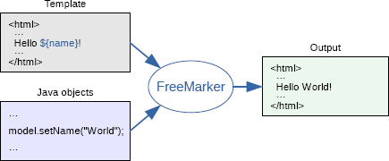

# FreeMarker 模板引擎

## 代码生成器的核心原理

代码生成器的核心功能是根据用户输入的选项参数生成不同的代码文件。最经典的方法是：提前编写 **模板文件**，并将用户输入的 **参数** 替换到模板文件中，从而生成完整代码。

例如，用户输入参数 `作者 = 鱼皮`，模板文件为：

```java
-----------
我是 ${作者}
-----------
```

将参数注入到模板中，得到生成的完整代码：

```java
-----------
我是 鱼皮
-----------
```

想要使用同一套模板生成其他代码，只需改变参数的值，无需修改模板文件。

如果自己实现模板引擎，需要定义模板语法（如 `{{ 参数 }}`），再通过正则或字符串匹配进行替换，还要处理循环等复杂场景，过于繁琐。因此建议直接使用现有的 **模板引擎** 技术。

## 什么是模板引擎？为什么需要它？

模板引擎是一种用于生成动态内容的类库（或框架），通过将预定义的模板与特定数据合并来生成最终输出。

使用模板引擎的主要优点：

- **现成的模板语法和解析能力**：只需按规范编写模板（如 `${参数}`），模板引擎自动完成参数注入和文件生成，无需自行编写解析逻辑。
- **数据与模板分离**：后端专注业务逻辑提供数据，前端专注编写模板，系统更易于维护。
- **安全特性**：部分模板引擎具备防 XSS 等安全能力。

常见的模板引擎：Java 的 **Thymeleaf**、**FreeMarker**、Velocity，前端的 Mustache 等。

## FreeMarker 模板引擎入门

FreeMarker 是 Apache 的开源模板引擎，入门简单、灵活可扩展。不绑定 Spring、Servlet 或第三方依赖，任何 Java 项目均可使用。

官方文档：https://freemarker.apache.org/docs/index.html

### 模板引擎的作用

FreeMarker 模板引擎接受 **模板** 和 **Java 对象**（数据模型），对它们进行处理，输出完整的内容。



### 模板

FreeMarker 使用自己的模板编写规则（FTL — FreeMarker Template Language），模板文件通常以 `.ftl` 为后缀，如 `myweb.html.ftl`。

模板文件由 4 个核心部分组成：

1. **文本**：固定的内容，按原样输出。
2. **插值**：使用 `${...}` 语法占位，计算和替换后输出。
3. **FTL 指令**：类似 HTML 标签，通过 `<#xxx ... >` 实现特殊功能，如 `<#list elements as element>` 实现循环输出。
4. **注释**：使用 `<#-- ... -->` 语法，注释内容不输出。

模板文件示例：

```html
<!DOCTYPE html>
<html>
  <head>
    <title>鱼皮官网</title>
  </head>
  <body>
    <h1>欢迎来到鱼皮官网</h1>
    <ul>
      <#-- 循环渲染导航条 -->
      <#list menuItems as item>
        <li><a href="${item.url}">${item.label}</a></li>
      </#list>
    </ul>
    <#-- 底部版权信息（注释部分，不会被输出）-->
      <footer>
        ${currentYear} 鱼皮官网. All rights reserved.
      </footer>
  </body>
</html>
```

### 数据模型

为模板准备的所有数据统称为 **数据模型**。在 FreeMarker 中数据模型一般是树形结构，可以是 Java 对象或 HashMap。

为上述模板准备的数据模型示例：

```json
{
  "currentYear": 2023,
  "menuItems": [
    {
      "url": "https://codefather.cn",
      "label": "编程导航"
    },
    {
      "url": "https://laoyujianli.com",
      "label": "老鱼简历"
    }
  ]
}
```

### Demo 实战

#### 1. 引入依赖

创建 Maven 项目，在 `pom.xml` 中引入 FreeMarker：

```xml
<dependency>
    <groupId>org.freemarker</groupId>
    <artifactId>freemarker</artifactId>
    <version>2.3.32</version>
</dependency>
```

Spring Boot 项目可直接引入 starter：

```xml
<dependency>
    <groupId>org.springframework.boot</groupId>
    <artifactId>spring-boot-starter-freemarker</artifactId>
</dependency>
```

#### 2. 创建配置对象

创建 FreeMarker 全局配置对象，指定模板文件路径和字符集：

```java
// new 出 Configuration 对象，参数为 FreeMarker 版本号
Configuration configuration = new Configuration(Configuration.VERSION_2_3_32);

// 指定模板文件所在的路径
configuration.setDirectoryForTemplateLoading(new File("src/main/resources/templates"));

// 设置模板文件使用的字符集
configuration.setDefaultEncoding("utf-8");
```

#### 3. 准备模板并加载

将模板代码保存为 `myweb.html.ftl`，存放在指定目录。通过 `Template` 对象加载模板：

```java
// 创建模板对象，加载指定模板
Template template = configuration.getTemplate("myweb.html.ftl");
```

#### 4. 创建数据模型

使用 HashMap 灵活构造数据模型：

```java
Map<String, Object> dataModel = new HashMap<>();
dataModel.put("currentYear", 2023);
List<Map<String, Object>> menuItems = new ArrayList<>();
Map<String, Object> menuItem1 = new HashMap<>();
menuItem1.put("url", "https://codefather.cn");
menuItem1.put("label", "编程导航");
Map<String, Object> menuItem2 = new HashMap<>();
menuItem2.put("url", "https://laoyujianli.com");
menuItem2.put("label", "老鱼简历");
menuItems.add(menuItem1);
menuItems.add(menuItem2);
dataModel.put("menuItems", menuItems);
```

#### 5. 指定生成的文件

使用 `FileWriter` 指定输出文件路径：

```java
Writer out = new FileWriter("myweb.html");
```

#### 6. 生成文件

调用 `template.process()` 生成文件：

```java
template.process(dataModel, out);

// 生成文件后关闭
out.close();
```

#### 7. 完整代码

```java
public static void main(String[] args) throws IOException, TemplateException {
    // new 出 Configuration 对象，参数为 FreeMarker 版本号
    Configuration configuration = new Configuration(Configuration.VERSION_2_3_32);

    // 指定模板文件所在的路径
    configuration.setDirectoryForTemplateLoading(new File("src/main/resources/templates"));

    // 设置模板文件使用的字符集
    configuration.setDefaultEncoding("utf-8");

    // 创建模板对象，加载指定模板
    Template template = configuration.getTemplate("myweb.html.ftl");

    // 创建数据模型
    Map<String, Object> dataModel = new HashMap<>();
    dataModel.put("currentYear", 2023);
    List<Map<String, Object>> menuItems = new ArrayList<>();
    Map<String, Object> menuItem1 = new HashMap<>();
    menuItem1.put("url", "https://codefather.cn");
    menuItem1.put("label", "编程导航");
    Map<String, Object> menuItem2 = new HashMap<>();
    menuItem2.put("url", "https://laoyujianli.com");
    menuItem2.put("label", "老鱼简历");
    menuItems.add(menuItem1);
    menuItems.add(menuItem2);
    dataModel.put("menuItems", menuItems);

    // 生成
    Writer out = new FileWriter("myweb.html");
    template.process(dataModel, out);

    // 生成文件后关闭
    out.close();
}
```

### 常用语法

FreeMarker 的语法特性非常多，以下仅列出常用且易用的部分。需要时再对照官方文档查漏补缺。

#### 1. 插值

基本语法 `${xxx}`，支持传递表达式，但建议在创建数据模型时就计算好要展示的值，而非在模板中写表达式。

```java
表达式：${100 + money}
```

#### 2. 分支和判空

分支表达式（if...else）：

```java
<#if user == "鱼皮">
  我是鱼皮
<#else>
  我是猪皮
</#if>
```

判空：

```java
<#if user??>
  存在用户
<#else>
  用户不存在
</#if>
```

#### 3. 默认值

FreeMarker 对空值校验严格，空值会导致模板生成中断。使用 `!` 语法设置默认值：

```java
${user!"用户为空"}
```

若 `user` 为空，则输出"用户为空"。

#### 4. 循环

使用 `<#list items as item>` 遍历序列类型参数：

```java
<#list user as users>
  ${user}
</#list>
```

`users` 是列表，`user` 是遍历时临时存储的变量，依次输出每个元素的值。

#### 5. 宏定义

宏（macro）是预定义的模板片段，支持传入变量来复用，类似于前端组件复用的思想。

定义宏：

```java
<#macro card userName>     
---------    
${userName}
---------
</#macro>
```

使用宏（`@` 语法）：

```java
<@card userName="鱼皮"/>
<@card userName="二黑"/>
```

输出结果：

```java
---------    
鱼皮
---------
---------    
二黑
---------
```

宏标签支持嵌套内容，复杂场景参考官方文档：[自定义指令](http://freemarker.foofun.cn/dgui_misc_userdefdir.html)

#### 6. 内建函数

通过 `?` 调用内建函数，类似调用 Java 对象的方法：

```java
// 字符串转大写
${userName?upper_case}

// 输出序列长度
${myList?size}

// 循环中输出元素下标
<#list user as users>
  ${user?index}
</#list>
```

内建函数种类丰富，建议查阅官方文档：[内建函数大全](http://freemarker.foofun.cn/ref_builtins.html)

#### 7. 其他特性

- **命名空间**：相当于 Java 中的包，用于隔离代码、宏和变量。

掌握上述常用语法后，基本能够开发大多数模板文件。更多内容请查阅 FreeMarker 官方文档。

## FreeMarker 在 Spring Boot Web 视图中的使用（补充）

### Spring Boot Web 视图整合

FreeMarker 适合作为 Web 项目中的视图层组件，是生成文本的工具。ftl 文件本质也是 html 格式；注意 **freemarker 区分大小写**。

依赖 `spring-boot-starter-freemarker`（见上文「Demo 实战」的依赖引入），再在配置文件中指定视图位置和后缀：

```properties
# 新方式（推荐）
spring.freemarker.template-loader-path=classpath:/templates
spring.freemarker.suffix=.ftl

# 旧方式（已废弃）
#spring.mvc.view.prefix=/templates
#spring.mvc.view.suffix=.ftl
```

编写 controller 及 ftl 文件，模板存放在 `classpath:/templates` 目录下。

### 字符串的使用

```html
<#--定义变量-->
<#assign info1 = 'how are you?'>
<#--字符串的拼接-->
<p>Hello ${info + info1}</p>
<#--字符串的内嵌函数-->
<p>${info1?substring(0,3)}</p><#--左闭右开-->
<p>${info1?length}</p>
```

### 条件判断

```html
<#assign num = 666>
<#if num == 666>
    <p>666</p>
<#elseif num == 888>
    <p>888</p>
<#else>
    <p>000</p>
</#if>

<#switch num>
    <#case 666>
        <p>666</p>
        <#break>
    <#case 888>
        <p>888</p>
        <#break>
    <#default>
        <p>000</p>
</#switch>
```

### 列表操作

```html
<#assign myList = [1,3,5,7,10,9]>
<#-- 排序输出 -->
<#list myList?sort as item>
    ${item}
</#list>
<#-- 数字范围遍历 -->
<#list 1..3 as item>
    ${item}
</#list>
<#-- item_index 获取索引 -->
<#list 1..3 as item>
    ${item_index}, ${item}<br>
</#list>
<#-- item_has_next 判断是否有下一项 -->
<#list 1..3 as item>
    <#if item_has_next>
        ${item}
    </#if>
</#list>
```

### 判断变量是否为空

默认值写法 `${str!"default"}`，与上文「默认值」小节一致，不再展开。

### 引入其它文件的值

在一个 html 中引入另一个 html 中的变量的值，不仅能读取，还能修改：

```html
<#import 'other.ftl' as otherFtl>
${otherFtl.name} <br>
<#--不仅可以读取到它的值，还能修改它的值-->
<#assign name = 'welcome ftl is here' in otherFtl>
${otherFtl.name}
```

> 来源：鱼皮·编程导航 / codefather
