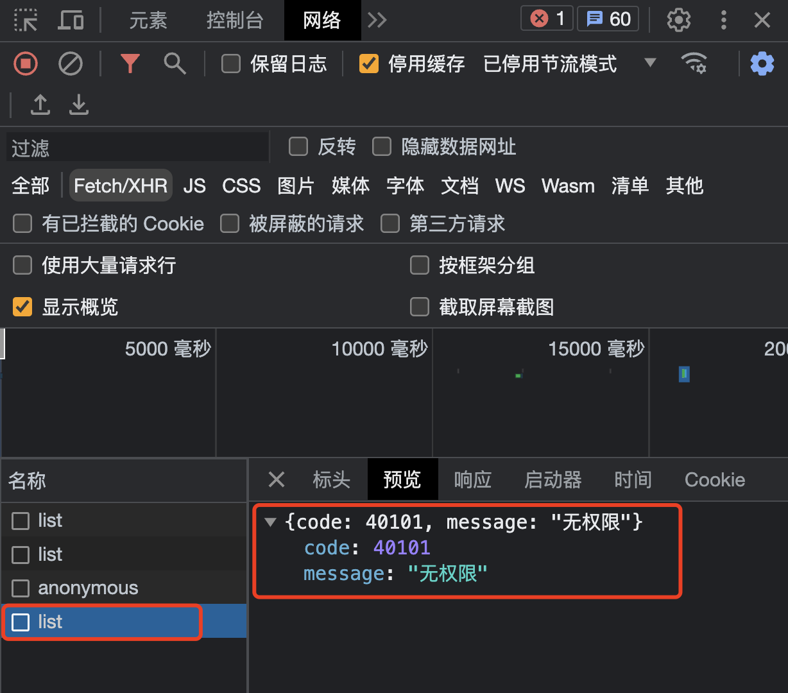
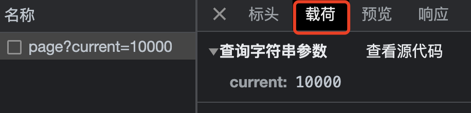
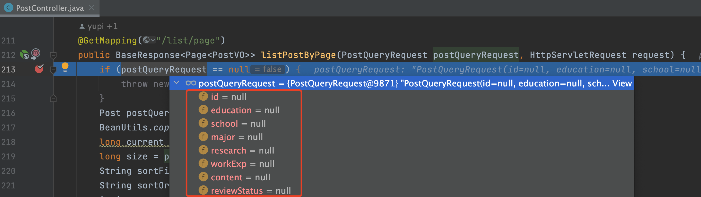
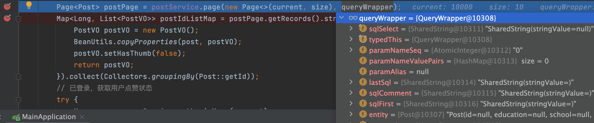
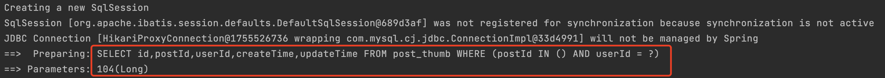

# 错误排查 01 - 数据查询为空或错误

> 数据查询为空或错误是后端开发中最常见的 Bug 之一，表现为前端展示不出数据或后端查询列表为空。按以下 4 个步骤系统排查。

## 1. 定位问题边界

确认是前端还是后端的锅。从请求源头——浏览器端排查：

1. 按 F12 打开浏览器控制台 → **网络 (Network)** 标签
2. 刷新页面或重新触发请求
3. 选中请求 → **预览 (Preview)**，查看后端返回结果



**场景判断：**

- **后端正常返回数据 → 前端问题**：检查页面渲染逻辑，用 `debugger` 或 `console.log` 输出调试信息，确认是否取错了数据结构
- **后端未返回数据 → 前端先确认请求参数**：检查传递的参数是否正确（如分页参数太大导致查不到数据）



## 2. 后端验证请求参数

开启 Debug 模式，从接收请求参数开始逐行分析：

1. 查看请求参数对象，确认前端是否按要求传递参数



2. 确认参数无误后，继续逐行 Debug 直到执行数据库查询

## 3. 后端验证数据库查询

Debug 到数据库查询时，重点关注两个点：

### 3.1 查询条件是否正确

以 MyBatis Plus 为例，检查 `QueryWrapper` 内的属性是否正确填充了查询条件。



### 3.2 数据库返回结果

- `records.size > 0` → 数据库有返回，排查后续处理逻辑
- `size = 0` → 数据库查不到数据，分析查询条件错误或数据缺失

开启 MyBatis Plus SQL 日志打印：

```yaml
mybatis-plus:
  configuration:
    log-impl: org.apache.ibatis.logging.stdout.StdOutImpl
```

执行查询后获取完整 SQL 语句，复制到数据库控制台执行验证。



## 4. 后端验证数据处理逻辑

如果数据库查询出了结果但响应给前端为空，需继续逐行 Debug 数据处理逻辑：

- 查询结果是否设置到了错误的字段
- 是否有权限过滤或数据脱敏逻辑导致数据被移除
- 是否存在后置过滤（如 Stream 过滤条件过严）

## 总结

排查数据查询 Bug 的核心流程：**先搜集信息 → 再定位边界 → 最后分析解决**。

> 来源：鱼皮·编程导航 / codefather
