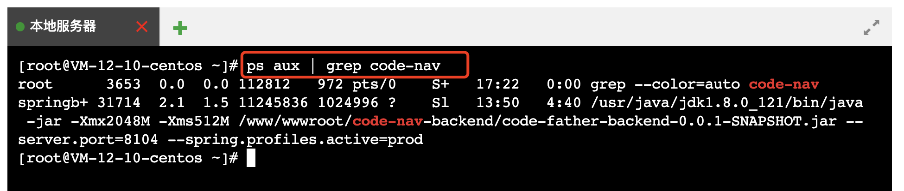
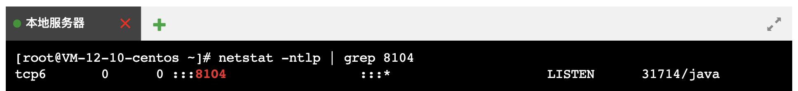
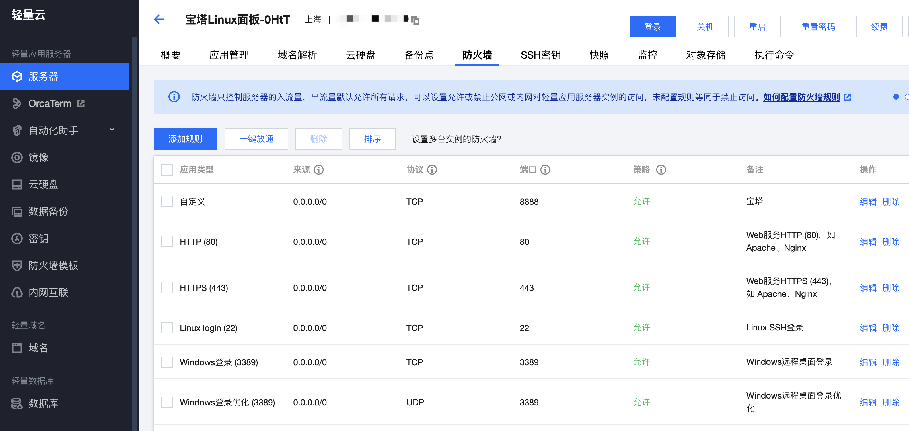
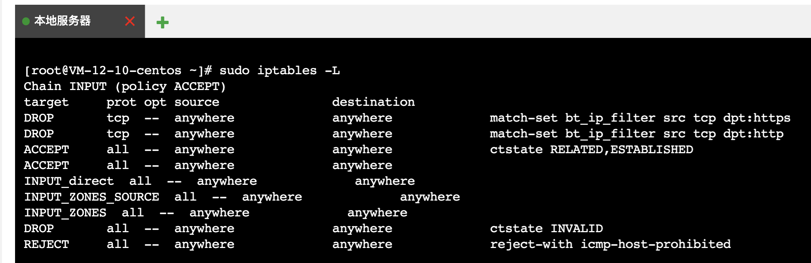
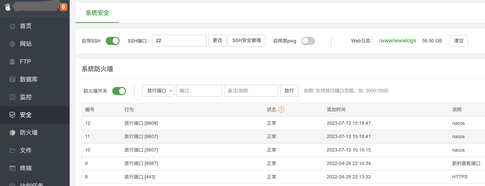

# 错误排查 03 - 无法访问线上服务

> 服务部署后无法访问，但服务器本身在线。从应用层到基础设施逐步排查。

## 1. 应用程序未启动

确认项目已成功启动。如果使用宝塔面板，注意项目可能短暂显示"运行中"后自动停止。

```bash
ps aux | grep <项目名>
```

若输出包含项目进程信息，表示已启动。



## 2. 端口监听错误

确认项目监听的端口是否正确：

```bash
netstat -ntlp | grep <端口号>
```

正常输出如 `:::8104` 和 `:::*`，表示程序监听在所有 IPv4 地址的 8104 端口。若输出其他值，需调整应用端口配置。端口被占用时需更换端口或终止占用进程。



## 3. 云服务商安全组

在云服务商控制台的安全组设置中，确保已放行对应端口的入方向流量。来源建议：

- 学习环境：设置为自家 IP
- 生产环境：`0.0.0.0/0`（全放通）但需谨慎



## 4. 服务器防火墙

检查 Linux 系统内置防火墙配置（不同发行版命令有差异）：

```shell
# 查看防火墙状态
sudo iptables -L
sudo systemctl status firewalld
```

临时关闭（仅用于排查）：

```shell
sudo systemctl stop firewalld
sudo systemctl disable firewalld
```



## 5. 应用层限制

除系统防火墙外，应用程序本身也可能有限制：

- **宝塔安全/防火墙面板**：检查是否误禁了 IP
- **Nginx 配置**：检查 IP 白名单/黑名单
- **业务代码**：检查是否在代码层做了 IP 限制



## 6. 服务器网络问题

检测服务器的网络连通性：

```shell
ping <服务器地址>
traceroute <服务器地址>
```

排查方向：服务器断网、网络配置错误、DNS 解析异常。

## 7. 用户自身问题

一些意外但真实存在的场景：

- 用户本地网络中断
- 服务器禁用了海外 IP（部分用户能访问、部分不能）
- 用户 DNS 缓存问题

确认方法：让其他网络环境的用户尝试访问，或用户切换网络后重试。

> 来源：鱼皮·编程导航 / codefather
