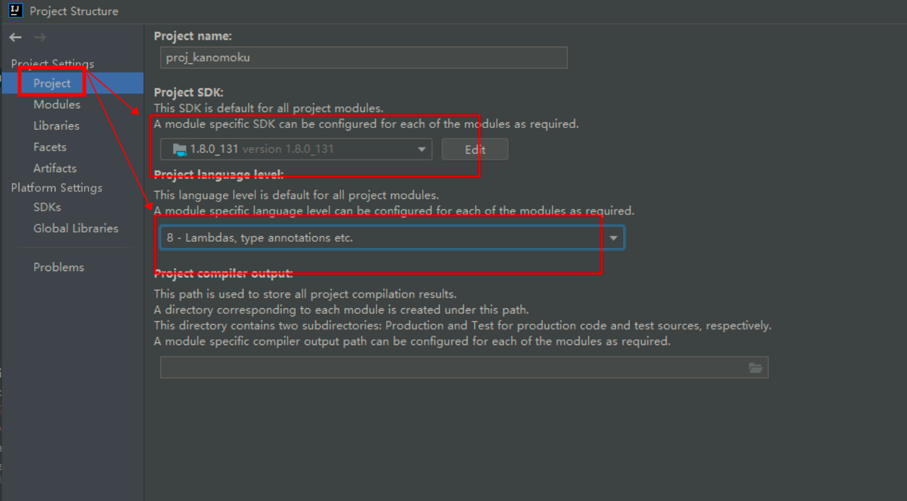
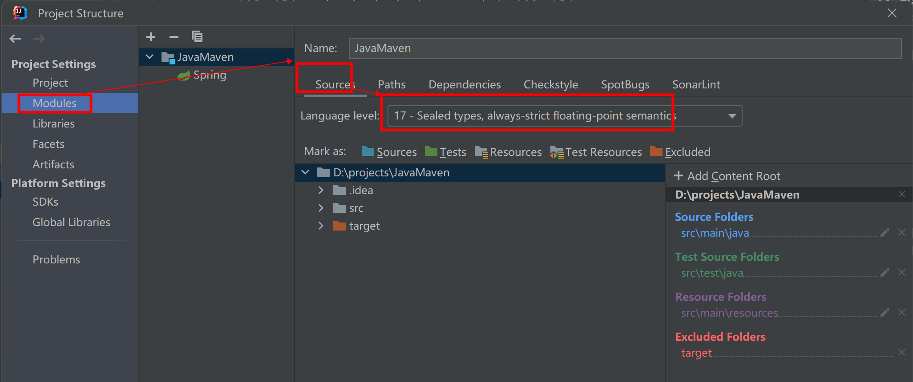
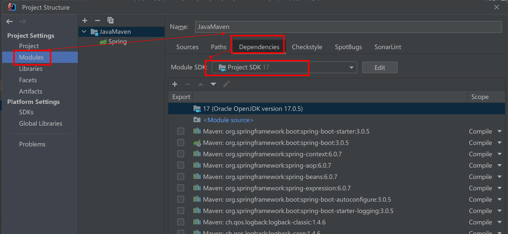
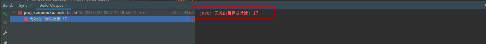
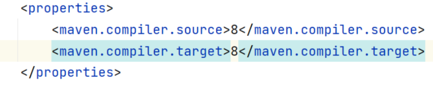
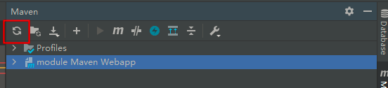

# Java 错误排查 04 - 项目启动与依赖服务排错

> Java 后端项目启动失败或依赖服务连接异常的常见原因与解决方案。

## 版本问题

### JDK 版本不匹配

项目要求 JDK 8，但使用 JDK 5 编译会导致 `java: -source 1.5` 中不支持 diamond 运算符 等错误。

使用更高版本也可能出现兼容问题，如 IDEA 默认 JDK 17 而项目为 JDK 8 时，报错 `无效的源发行版：17`。

**解决方案：修改 IDEA 编译版本**

1. 打开项目设置：`File` → `Project Structure`（或 `Ctrl + Alt + Shift + S`）
2. 选择左侧 `Project`，在 `Project SDK` 下拉菜单中选择正确的 JDK 版本
   
3. 在左侧 `Modules` → 选择模块 → `Sources` 标签页
   - `Language level` 下拉菜单中选择正确的 Java 版本
   - `Target bytecode version` 保持与目标 Java 版本一致
   
   



### Maven 版本不兼容

Maven install 时报 `无效的标记：--release`，通常是 Maven 版本与 Java 版本不兼容。对于 JDK 8，建议使用 Maven 3.6.x 系列。

修改 `pom.xml` 中的版本配置后，记得刷新 Maven 项目。

**POM 示例：**
```xml
<properties>
    <maven.compiler.source>8</maven.compiler.source>
    <maven.compiler.target>8</maven.compiler.target>
</properties>
```



**刷新 Maven**：点击 IDEA 右侧 Maven 面板的刷新按钮，或右键 `pom.xml` → `Maven` → `Reload project`。

如果右侧没有 Maven 菜单，右键 `pom.xml` → `Add as Maven Project`。



## 依赖项问题

除了 Java/Maven 配置外，项目依赖的中间件（Redis、MySQL）启动失败也会导致项目报错。

### Redis 连接失败

报错信息：`Unable to connect to Redis server: localhost/127.0.0.1:6379`

**排查方向：**
- Redis 服务是否已启动
- Redis 配置了密码 → 检查项目配置文件中 `spring.redis.password` 是否正确填写
- Redis 端口和主机名是否与项目配置一致

### MySQL 连接失败

报错信息：`CannotGetJdbcConnectionException: Failed to obtain JDBC Connection` / `Access denied for user 'root'@'localhost' (using password: YES)`

**排查方向：**
- 确认 MySQL 服务已启动
- 检查配置文件中的数据库用户名和密码是否正确
- 确认账号在对应主机是否有查询权限（`GRANT` 权限）
- 检查数据库地址和端口配置

> **要点**：项目启动失败时，先看报错堆栈顶部的关键信息，定位是版本问题、依赖服务连接问题还是配置问题，再逐一排查。

## 项目启动通用排查

### 代码一致性

确保使用 Git 版本控制工具正确拉取项目代码，避免文件缺失或损坏。

### 环境一致性

| 环境要素 | 排查要点 |
|---------|---------|
| **操作系统** | Java 项目因 JVM 跨平台特性基本无兼容问题；其他语言（如 C/C++）需注意 Win/Linux 差异 |
| **运行时版本** | JDK 版本必须匹配项目要求（建议 Java 8 + Spring Boot 2 组合），Node.js >= 16 |
| **平台工具** | Maven 版本与 JDK 兼容（JDK 8 建议 Maven 3.6.x），npm/yarn 版本正确 |

### 依赖一致性

- **前端项目**：使用 `package-lock.json` 锁定版本号，避免 `^` 范围符号导致版本偏差
- **Java 后端**：Maven/Gradle 指定明确版本，jar 包冲突时使用 Maven Helper 插件排查
- **网络问题**：依赖安装失败时检查网络环境（内网/代理），尝试切换镜像源

### 资源一致性

项目运行时对 CPU、内存、硬盘有最低要求。确保本地资源满足项目需求（如至少 8G 内存、10G 硬盘空间），避免运行中出错。

### 其他因素

1. **依赖服务**：后端项目启动前确保数据库、Redis 等中间件已启动，检查报错信息定位
2. **网络环境**：公司内网无法拉取外网依赖，或国内无法拉取国外镜像（npm/Maven），切换镜像源解决
3. **系统权限**：权限不足时使用管理员权限或 `sudo` 执行；项目路径避免包含中文字符
4. **文档先行**：启动项目前先阅读官方文档，明确环境要求、依赖版本、运行条件

## 部署问题：本地正常但上线后出错

### 本地代码误发线上

预防措施：
- **Code Review**：代码发布前由同事或上级检查
- **无环境特殊逻辑**：不写仅本地可用的代码，保证每行代码均可发布上线

### 环境差异

本地与线上环境（操作系统、网络连通、依赖版本、防火墙等）不一致。推荐使用 Docker 容器化技术模拟线上环境，或通过测试/预发布环境验证部署。

### 配置差异

本地配置文件不适用于线上。解决方案：
- 区分环境配置：`application-dev.yml` / `application-prod.yml`
- 使用配置管理工具（Apollo、Nacos）统一管理不同环境的配置

### 资源路径差异

避免使用绝对路径引用本地文件。推荐使用相对路径，或采用分布式文件系统/对象存储（如 OSS）统一管理资源。

### API 接口差异

前端本地调试请求后端开发服务，上线请求线上服务，路径和跨域配置均不同。保持接口路径规范一致，跨域问题通过 Nginx 反向代理统一解决。

### 用量差异（最高级）

本地/测试环境数据量和负载远小于线上，导致并发问题、数据不一致、服务满载等在线上才暴露。自测阶段应使用 JMeter 等压力测试工具验证性能。大流量项目还需结合业务分析，采用流量削峰填谷等策略优化。

> 来源：鱼皮·编程导航 / codefather
