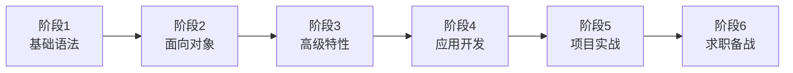

# 移动端 - Swift 学习路线

> Swift 是苹果公司 2014 年推出的现代编程语言，目标是取代 Objective-C 成为苹果平台开发的主要语言。语法简洁优雅、性能优秀、安全性高，核心特性包括类型安全、自动内存管理（ARC）、可选类型、协议导向编程、泛型等。Swift 已开源，还可运行在 Linux 上用于服务器端开发。

## 学习前提

- **编程基础**：掌握任意一门编程语言（变量、控制流、函数）
- **面向对象编程**：理解类、对象、继承、多态
- **开发环境**：可选，可在 Swift Playground 在线编辑器先行练习，无需安装 Xcode

## 学习路线图



## 就业方向

| 岗位 | 说明 |
|------|------|
| iOS 开发工程师 | 使用 Swift 开发 iOS 应用 |
| macOS 开发工程师 | 使用 Swift 开发 macOS 应用 |
| 移动端开发工程师 | 同时开发 iOS 和其他平台应用 |
| Swift 后端开发工程师 | 使用 Swift 开发服务器端应用（Vapor 等） |
| 全栈工程师 | Swift 移动端 + Swift 后端 |

## 整体学习建议

1. **Swift 是语言，iOS 开发是领域**：两者不要混淆。学完 Swift 后继续学习 iOS 开发体系（UIKit / SwiftUI）。
2. **协议导向编程（POP）**：Swift 推崇 POP 而非纯面向对象，要理解协议的作用与用法，这是 Swift 区别于其他语言的重要特征。
3. **多写多练**：可在 [Swift Playground](https://online.swiftplayground.run/) 在线编辑器练习代码，无需安装开发环境即可快速上手。

## 阶段 1：Swift 基础语法（7-30 天，仅供参考）

### 学习目标

掌握 Swift 基础语法，能够编写简单的 Swift 程序。

### 知识点

**基础语法【必学】：**
- 常量和变量（`let`、`var`）、数据类型（Int、Double、String、Bool）
- 类型推断和类型注解、运算符和表达式
- 控制流（if、switch、for、while）
- **可选类型（Optional）【重点】**：编译期即可避免空指针异常，掌握强制解包 `!`、可选绑定 `if let` / `guard let`、可选链 `?.`、空合并 `??`

```swift
var name: String? = "Swift"
if let name = name {
    print(name)  // Swift
}
let count = name?.count ?? 0  // 可选链 + 空合并
```

**集合类型【必学】：**
- 数组（Array）、字典（Dictionary）、集合（Set）

**函数和闭包【必学】：**
- 函数定义与调用、参数和返回值
- 闭包（Closure）、尾随闭包（Trailing Closure）、逃逸闭包与非逃逸闭包

**字符串【必学】：**
- 字符串创建与操作、字符串插值（`\( )`）、字符串索引

### 学习建议

1. 可选类型是 Swift 最重要的特性之一，务必深入理解各种解包方式的适用场景。
2. 闭包类似其他语言的匿名函数 / Lambda，在集合操作和异步编程中非常常用。
3. 类型推断很强大，多数场景无需显式声明类型；但显式声明可提高代码可读性。

### 学习资源

- [Swift 官方文档（中文版）](https://swiftgg.gitbook.io/swift/)：最权威的学习资料
- [Swift 入门指南](https://developer.apple.com/cn/swift/get-started/)：苹果官方入门
- [《Swift 编程语言》](https://docs.swift.org/swift-book/)：苹果官方书籍
- [Swift Playground](https://online.swiftplayground.run/)：在线练习编辑器

## 阶段 2：面向对象编程（10-20 天，仅供参考）

### 学习目标

掌握 Swift 面向对象编程，理解类、结构体、枚举、协议等概念。

### 知识点

**类和结构体【必学】：**
- 类的定义、**引用类型 vs 值类型** 的区别与使用场景
- 属性（存储属性、计算属性）、方法、构造器（Initializer）、析构器（Deinitializer）

**继承和多态【必学】：**
- 继承、重写（override）、final 关键字

**协议【必学，Swift 特色】：**
- 协议（Protocol）的定义与使用、协议继承、协议扩展（Protocol Extension）
- 协议导向编程（POP）

```swift
protocol Greetable {
    var name: String { get }
    func greet()
}
extension Greetable {
    func greet() { print("Hello, \(name)!") }
}
```

**枚举【必学】：**
- 枚举定义与使用、关联值（Associated Values）、原始值（Raw Values）

**扩展【必学，Swift 特色】：**
- 扩展（Extension）为已有类型添加新功能，无需继承或修改原类型

### 学习重点

1. 类是引用类型、结构体是值类型，要理解两者的区别与使用场景。
2. 协议定义方法与属性的规范，类型遵循协议即可实现，是 Swift 的核心设计理念。
3. 扩展可以为已有类型（包括系统类型）添加功能，是 Swift 的强大特性。
4. Swift 枚举不仅可定义枚举值，还能携带关联值和方法，非常灵活。

### 学习资源

- [Swift 官方文档](https://swiftgg.gitbook.io/swift/)：面向对象与协议章节

## 阶段 3：Swift 高级特性（15-20 天，仅供参考）

### 学习目标

掌握泛型、错误处理、内存管理等高级特性。

### 知识点

**泛型【必学】：**
- 泛型函数和泛型类型、泛型约束、关联类型（Associated Types）

**错误处理【必学】：**
- Error 协议、throw / throws、do-catch、try / try? / try!

**内存管理【必学】：**
- ARC（自动引用计数）、强引用 / 弱引用（weak）/ 无主引用（unowned）
- 循环引用与内存泄漏

**并发编程【建议学】：**
- async/await（Swift 5.5+）、Task 和 TaskGroup、Actor

```swift
func fetchUser() async throws -> User {
    let (data, _) = try await URLSession.shared.data(from: url)
    return try JSONDecoder().decode(User.self, from: data)
}
```

**属性包装器【建议学】：**
- @State、@Binding（SwiftUI 中使用）、自定义属性包装器

### 学习重点

1. ARC 是自动内存管理机制，理解强 / 弱 / 无主引用的区别，避免循环引用导致内存泄漏。
2. async/await 是 Swift 5.5 引入的新特性，极大简化异步编程，是 Swift 异步编程的未来方向。
3. Actor 同样来自 Swift 5.5，用于保证并发安全，是 Swift 并发编程的重要组成部分。

### 学习资源

- [Swift 并发编程](https://docs.swift.org/swift-book/LanguageGuide/Concurrency.html)：官方文档

## 阶段 4：应用开发（可选）

学完 Swift 后，选择一个应用方向深入学习。

### iOS 开发

目标 iOS 开发则继续学习 UIKit / SwiftUI、Core Data、网络请求、App 上架等 iOS 开发体系。

### 服务器端开发

**Vapor 框架【建议学】：**
- Vapor 是 Swift 最流行的服务器端框架
- 路由和控制器、数据库操作（Fluent ORM）、RESTful API 开发

**学习资源：**
- [Vapor 官方文档](https://vapor.codes/)

## 阶段 5：项目实战（15-30 天，仅供参考）

### 学习目标

通过实际项目巩固所学知识，积累 Swift 项目经验。

### 学习建议

1. 从简单项目开始：待办事项、天气查询等小应用，熟悉 Swift 开发流程。
2. 学习优秀开源项目：阅读 GitHub 优质 Swift 项目的代码与架构设计。
3. 结合 SwiftUI：现代 Swift 开发推荐用 SwiftUI 构建界面，可大幅提高开发效率。
4. 关注架构设计：学习 Clean Architecture、MVVM 等模式，提升项目质量。

### 优质开源项目

**入门级：**
- [Swift-30-Projects](https://github.com/soapyigu/Swift-30-Projects)：30 个 Swift 迷你应用，涵盖 UIKit、动画、网络请求、Core Data 等（8.3k+ stars）
- [clean-architecture-swiftui](https://github.com/nalexn/clean-architecture-swiftui)：SwiftUI + Clean Architecture 示例，含网络请求、数据持久化、依赖注入、单元测试（6.4k+ stars）

**进阶：**
- 参考 [awesome-swift](https://github.com/matteocrippa/awesome-swift) 中的优秀项目，选择感兴趣的方向深入学习。

## 阶段 6：求职备战

### 学习目标

熟练掌握 Swift 常见面试题，准备好简历和项目经历。

### 学习建议

1. 准备项目作品：简历上要有 Swift 项目经历，最好附 App Store 上架链接或 TestFlight 测试链接，展示实际开发能力。
2. 多刷面试题：覆盖语法特性、可选类型、协议、内存管理、并发编程等方向。
3. 关注 Swift 新特性：Swift 每年发布新版本，关注 WWDC 视频了解最新特性，面试是加分项。

### 经典面试题

**基础语法：**
- Swift 有什么特点？let 和 var 有什么区别？
- Swift 的数据类型有哪些？可选类型是什么？如何解包？

**面向对象：**
- 类和结构体有什么区别？协议是什么？扩展是什么？
- 值类型和引用类型有什么区别？

**高级特性：**
- ARC 是什么？如何工作？如何避免循环引用？weak 和 unowned 有什么区别？
- 泛型是什么？async/await 如何使用？

## 更多学习资源

### 官方文档

- [Swift.org](https://swift.org/)：Swift 官方网站
- [Swift 官方文档](https://swift.org/documentation/)：最权威的学习资料
- [Swift GitHub](https://github.com/apple/swift)：Swift 源码仓库

### 技术博客与社区

- [Swift 官方博客](https://www.swift.org/blog/)：语言官方博客
- [Apple Developer News](https://developer.apple.com/news/)：苹果开发者资讯
- [Swift by Sundell](https://www.swiftbysundell.com/)：Swift 开发实践博客
- [Ray Wenderlich / Kodeco](https://www.kodeco.com/)：iOS Swift 教程

### WWDC 视频

- [WWDC 官方视频](https://developer.apple.com/videos/)：每年的 WWDC 大会视频

## 写在最后

Swift 是一门现代、安全、高效的编程语言，是苹果平台开发的首选。语法简洁优雅、性能优秀、学习曲线相对平缓，适合新手学习。学好 Swift 不仅能开发苹果生态应用（iPhone、iPad、Mac、Watch、Vision Pro），还能拓展到服务器端开发等领域。

> 来源：鱼皮·编程导航 / codefather
