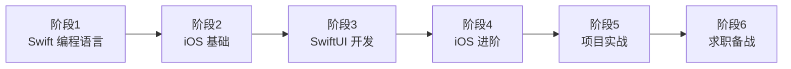

# 移动端 - iOS 开发学习路线

> iOS 是苹果公司开发的移动操作系统，运行在 iPhone、iPad 等设备上，使用 Swift 语言与 UIKit / SwiftUI 框架开发应用。iOS 技术栈统一、用户付费意愿高、商业价值大，开发工程师薪资普遍高于 Android，是移动开发中门槛较高但回报较好的方向。

## 学习前提

- **硬件要求**：必须有一台 Mac 电脑（MacBook、iMac、Mac Mini 等）；iOS 开发只能在 macOS 上进行，无法在 Windows 或 Linux 上开发
- **软件要求**：安装 Xcode（苹果官方 IDE，免费），建议使用最新版本的 macOS 和 Xcode
- **知识储备**：
  - 掌握至少一门编程语言（建议 Swift 或 Java）
  - 了解面向对象编程的基本概念
  - 了解 Git 版本控制（建议）

## 学习路线图

## 就业方向

| 岗位 | 说明 |
|------|------|
| iOS 开发工程师 | 开发和维护 iOS 应用，最主流的就业方向 |
| 移动端开发工程师 | 同时负责 iOS 和 Android 开发 |
| 全栈工程师 | 前端 + 后端 + 移动端全栈开发 |
| 跨平台开发工程师 | 使用 Flutter、React Native 开发跨平台应用 |
| iOS 架构师 | 负责 iOS 应用的架构设计和技术选型 |
| AI 应用开发工程师 | 开发移动端 AI 应用 |

## 整体学习建议

1. **必须有 Mac 电脑**：几乎是硬性要求，没有 Mac 就无法学习 iOS 开发。暂时买不起 Mac 可以先学 Swift 语言（可在 Linux 上运行），或先学 Android 开发。
2. **直接学 Swift**：Objective-C 虽是 iOS 传统语言，但 Swift 是苹果官方推荐的首选语言，语法更现代、更安全，近年几乎所有新项目都使用 Swift，不要在 Objective-C 上花太多时间。
3. **紧跟 SwiftUI**：SwiftUI 是 iOS 现代 UI 开发的标准与未来趋势。老项目多使用 UIKit，但新项目越来越多采用 SwiftUI，建议学完 iOS 基础后即学习 SwiftUI。
4. **结合项目实践**：从简单 App（计算器、待办事项）起步，逐步开发更复杂的应用（社交、电商）。AI 时代可借助 AI 工具辅助开发。
5. **善用官方资源**：苹果提供了官方文档、WWDC 视频、示例代码等丰富资源，多看 WWDC 视频了解最新技术和最佳实践。

## 阶段 1：Swift 编程语言（15-30 天，仅供参考）

Swift 是苹果 2014 年推出的现代编程语言，语法简洁优雅、性能优秀、安全性高。可选类型（Optional）是其核心特性，能够在编译期避免空指针异常。本阶段语言细节可与同目录《Swift 01 - 学习路线》对照学习。

### 学习目标

掌握 Swift 编程语言，能够使用 Swift 进行基本的编程开发。

### 知识点

**Swift 基础语法【必学】：**
- 常量和变量（`let`、`var`）
- 基本数据类型（Int、Double、String、Bool）
- 运算符和表达式
- 控制流（if、switch、for、while）
- **可选类型（Optional）【重点】**
- 元组（Tuple）

**函数和闭包【必学】：**
- 函数定义和调用、参数和返回值
- 闭包（Closure）、尾随闭包（Trailing Closure）

**面向对象编程【必学】：**
- 类和结构体
- 属性（存储属性、计算属性）、方法
- 继承、构造器（Initializer）、析构器（Deinitializer）

**集合类型【必学】：**
- 数组（Array）、字典（Dictionary）、集合（Set）

**高级特性【建议学】：**
- 协议（Protocol）、扩展（Extension）
- 泛型（Generics）、枚举（Enum）
- 错误处理（Error Handling）
- ARC（自动引用计数）

### 学习重点

1. 可选类型是 Swift 的核心特性，用于处理值可能为空的情况，要深入理解解包方式（`!`、`?`、`if let`、`guard let`）。
2. 协议（Protocol）类似 Java 的接口但功能更强大，是 Swift 编程的重要组成部分，要重点学习。
3. ARC 是 Swift 的内存管理机制，要理解强引用、弱引用、无主引用的区别，避免循环引用导致的内存泄漏。
4. 了解 Swift 与 Objective-C 的区别即可，老教程里的 Objective-C 内容可以跳过，重点学 Swift。
5. 多写代码熟悉语法，可在 Xcode 的 Playground 中练习。

### 学习资源

- [Swift 官方文档（中文版）](https://swiftgg.gitbook.io/swift/)：最权威的学习资料
- [《Swift 编程语言》](https://docs.swift.org/swift-book/)：苹果官方书籍（英文）

## 阶段 2：iOS 基础（10-30 天，仅供参考）

### 学习目标

掌握 iOS 开发的基础知识，能够开发简单的 iOS 应用。

### 知识点

**Xcode 开发环境【必学】：**
- Xcode 的安装和使用、项目的创建和运行
- 模拟器的使用、真机调试【建议学】
- Interface Builder（可选，SwiftUI 时代可以跳过）

**iOS 应用结构【必学】：**
- App 的生命周期、UIApplication 和 AppDelegate
- SceneDelegate（iOS 13+）
- MVC 设计模式

**视图和控制器（UIKit）【必学】：**
- UIView（视图基类）、UIViewController（视图控制器）
- UILabel、UIButton、UIImageView 等基础控件
- UITableView 和 UICollectionView
- Auto Layout：自动布局

**导航和页面跳转【必学】：**
- UINavigationController（导航控制器）、UITabBarController（标签栏控制器）
- Segue、模态视图（Modal）

**数据存储【必学】：**
- UserDefaults：轻量级存储
- FileManager：文件系统
- Core Data【建议学】、SQLite【建议学】

**网络请求【必学】：**
- URLSession：网络请求
- JSON 解析（Codable）
- 图片加载和缓存
- 第三方库（Alamofire、Kingfisher）【建议学】

### 学习建议

1. Xcode 功能强大但学习难度较大，先熟悉基本操作：创建项目、运行模拟器、调试代码。
2. SceneDelegate 用于管理多窗口场景（iOS 13+），新手可先重点学习 AppDelegate。
3. UITableView 是 iOS 最常用的列表控件，务必熟练掌握，包括自定义 Cell、数据刷新等。
4. Auto Layout 可适配不同尺寸设备，学习曲线较陡但非常重要。
5. 网络请求是 App 开发的核心功能，重点掌握 URLSession 的使用与 JSON 数据解析。

### 学习资源

- [苹果官方 iOS 开发教程](https://developer.apple.com/tutorials/app-dev-training)：官方教程

## 阶段 3：SwiftUI 开发（10-30 天，仅供参考）

SwiftUI 是苹果 2019 年推出的声明式 UI 框架，是 iOS 现代 UI 开发的标准和未来趋势。相比 UIKit，声明式语法代码更简洁、开发效率更高。

### 学习目标

掌握 SwiftUI 框架，能够使用 SwiftUI 快速开发 iOS 应用。

### 知识点

**SwiftUI 基础【必学】：**
- 声明式 UI 的概念、View 和 ViewBuilder
- 基础控件（Text、Image、Button、TextField 等）
- 布局（VStack、HStack、ZStack、Spacer）
- 修饰符（Modifier）

**状态管理【必学】：**
- @State：视图的私有状态
- @Binding：状态的绑定
- @ObservedObject：观察对象
- @StateObject：状态对象
- @EnvironmentObject：环境对象

**列表和导航【必学】：**
- List：列表视图
- NavigationView 和 NavigationStack
- TabView：标签栏

**数据流【建议学】：**
- Combine 框架
- async/await：异步编程

**动画和手势【建议学】：**
- 动画（Animation）、转场（Transition）、手势（Gesture）

### 学习建议

1. SwiftUI 是声明式 UI 框架，与 UIKit 的命令式思维完全不同，要转变思维方式，理解声明式编程理念。
2. 状态管理是 SwiftUI 的核心，深入理解 @State、@Binding、@ObservedObject 等属性包装器的区别与使用场景。
3. SwiftUI 学习曲线相对平缓，API 简洁优雅，多看官方示例、多写代码练习。
4. SwiftUI 仍在快速发展，每年 iOS 新版本都会引入新特性，关注 WWDC 视频了解最新动态。

### 学习资源

- [SwiftUI 官方教程](https://developer.apple.com/tutorials/swiftui)：苹果官方教程（英文）

## 阶段 4：iOS 进阶（20-45 天，仅供参考）

GCD（Grand Central Dispatch）是苹果提供的多线程编程框架，用于处理并发任务；Combine 是苹果的响应式编程框架，用于处理异步事件流。掌握这些技术，才能开发出高性能、响应迅速的 iOS 应用。

### 学习目标

掌握 iOS 的进阶知识，能够开发复杂的 iOS 应用。

### 知识点

**多线程【必学】：**
- GCD（Grand Central Dispatch）
- DispatchQueue：主队列和后台队列
- async/await：异步编程（Swift 5.5+）
- Operation 和 OperationQueue【建议学】

**网络和数据【必学】：**
- URLSession 高级用法
- Combine 框架
- JSON 解析（Codable、JSONDecoder）
- 第三方网络库（Alamofire）【建议学】

**持久化【必学】：**
- UserDefaults、FileManager
- Core Data【建议学】、Realm【可不学】

**系统框架【建议学】：**
- Core Location：定位服务
- MapKit：地图
- Core Animation：动画
- AVFoundation：音视频
- PhotoKit：相册

**第三方库【建议学】：**
- Swift Package Manager：苹果官方依赖管理（推荐）
- CocoaPods：依赖管理工具
- 常用第三方库（Alamofire、Kingfisher、SnapKit 等）

**性能优化【建议学】：**
- 内存优化、启动优化、卡顿优化、网络优化
- Instruments 性能分析工具

### 学习建议

1. GCD 是 iOS 多线程编程的基础：UI 操作必须在主线程进行，耗时操作放在后台线程。
2. async/await（Swift 5.5+）大大简化了异步编程，优先学习它而不是传统回调方式。
3. 简单应用可用 UserDefaults 或 SQLite；复杂应用再学习 Core Data。
4. Swift Package Manager 正在逐渐取代 CocoaPods，优先学习。
5. 学会使用 Instruments 分析应用的性能瓶颈。

### 学习资源

- [WWDC 视频](https://developer.apple.com/videos/)：iOS 性能优化等官方视频
- [Combine 框架文档](https://developer.apple.com/documentation/combine)：官方文档

## 阶段 5：项目实战（30-60 天，仅供参考）

### 学习目标

通过实际项目巩固所学知识，积累项目经验。

### 学习建议

1. 从简单项目开始：计算器、待办事项、天气查询等，熟悉 iOS 开发流程。
2. 逐步增加复杂度：尝试社交 App、电商 App、音乐播放器等更复杂的应用。
3. 在项目中应用 SwiftUI、Combine、Core Data 等技术，检验学习成果。
4. 完成项目后尝试发布到 App Store，体验完整的应用发布流程。
5. 参与开源项目：GitHub 上有大量优秀的 iOS 开源项目，可以学习和贡献代码。

### 项目推荐

**入门级：**
- 计算器 App、待办事项 App、笔记 App、天气查询 App

**进阶级：**
- 社交 App（类似微信、微博）
- 电商 App（类似淘宝、京东）
- 音乐播放器（类似网易云音乐）
- 新闻资讯 App、视频播放器

**优质开源项目：**
- [SwifterSwift](https://github.com/SwifterSwift/SwifterSwift)：500+ 个原生 Swift 扩展集合（14k+ stars）
- [Awesome Swift](https://github.com/matteocrippa/awesome-swift)：Swift 优质库和资源大全（25k+ stars）
- [apple/swift](https://github.com/apple/swift)：Apple 官方 Swift 源码与示例
- [awesome-ios](https://github.com/vsouza/awesome-ios)：iOS 资源大全
- [SwiftUI 示例项目](https://github.com/topics/swiftui)：SwiftUI 开源项目集合

### 学习资源

- [App Store 上架教程](https://developer.apple.com/app-store/submissions/)：官方文档

## 阶段 6：求职备战（面试前 1 个月突击）

### 学习目标

熟练掌握 iOS 开发常见面试题，准备好简历和项目经历，顺利通过面试。

### 学习建议

1. 简历上准备 1-2 个完整的 iOS 项目，包含项目介绍、使用的技术栈、实现的功能、遇到的问题和解决方案等；面试可能要求演示项目，提前准备好演示视频或真机安装。
2. 准备简历：突出项目经历与技术栈，量化成果；每个项目都要能讲清楚技术选型与难点。
3. 多刷面试题：iOS 面试题主要包括 Swift 语言、UIKit/SwiftUI、多线程、网络、数据存储、性能优化等方向。
4. 关注 iOS 最新技术（SwiftUI、Combine、async/await 等），多看 WWDC 视频了解技术趋势，面试是加分项。

### 经典面试题

**Swift 语言：**
- Swift 有什么特点？可选类型是什么？如何使用？
- Swift 的协议（Protocol）是什么？闭包是什么？如何避免循环引用？
- Swift 的 ARC 是什么？如何工作的？

**iOS 基础：**
- iOS 应用的生命周期是怎样的？UIViewController 的生命周期方法有哪些？
- MVC 设计模式是什么？UITableView 如何优化性能？

**SwiftUI：**
- SwiftUI 和 UIKit 有什么区别？状态管理如何实现？
- @State、@Binding、@ObservedObject 有什么区别？

**多线程和网络：**
- GCD 是什么？如何使用？主线程和后台线程有什么区别？
- 如何进行网络请求？URLSession 如何使用？如何解析 JSON 数据？

**性能优化：**
- iOS 应用的启动优化如何做？如何避免内存泄漏？
- 如何优化 TableView 的滚动性能？

## 更多学习资源

### 官方文档

- [苹果开发者文档](https://developer.apple.com/documentation/)：最权威的学习资料
- [Swift 官方文档](https://swift.org/documentation/)：Swift 语言官方文档
- [Swift.org](https://swift.org/)：Swift 官方网站

### iOS 开发社区

- [iOS Dev Weekly](https://iosdevweekly.com/)：iOS 开发周刊
- [Ray Wenderlich](https://www.raywenderlich.com/)：iOS 开发教程网站

### 技术博客

- [Swift 官方博客](https://www.swift.org/blog/)：Swift 语言官方博客
- [Apple Developer News](https://developer.apple.com/news/)：苹果开发者资讯
- [Airbnb Tech Blog](https://medium.com/airbnb-engineering)：Airbnb iOS 开发实践
- [Uber Engineering Blog](https://www.uber.com/blog/engineering/)：Uber iOS 架构

### WWDC 视频

- [WWDC 官方视频](https://developer.apple.com/videos/)：每年的 WWDC 大会视频，了解最新技术

## 写在最后

iOS 开发是技术门槛相对较高、但薪资待遇也相对较好的技术方向，一旦入门会发现开发体验很好：技术栈统一、官方学习资源完善、主流应用几乎都有 iOS 版本，用户付费意愿高、商业价值可观。学习建议优先掌握 Swift 和 SwiftUI 这一未来方向；在 AI 时代，苹果的 Core ML、Create ML 等框架支持在设备端运行 AI 模型，移动端 AI 应用开发同样值得关注。

> 来源：鱼皮·编程导航 / codefather
