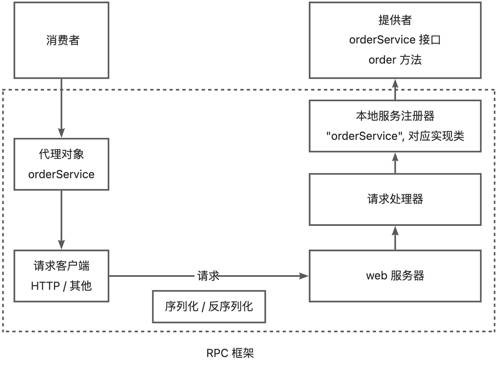
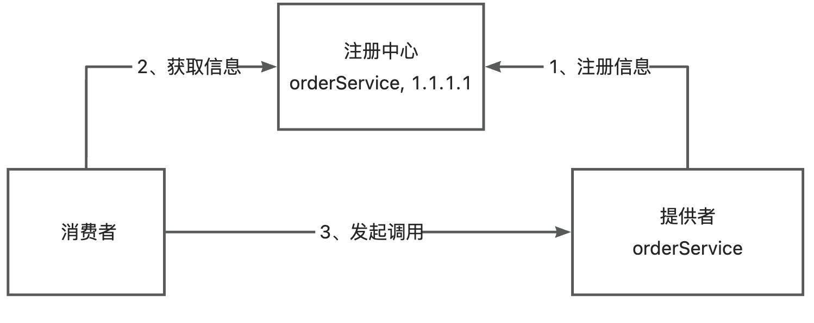
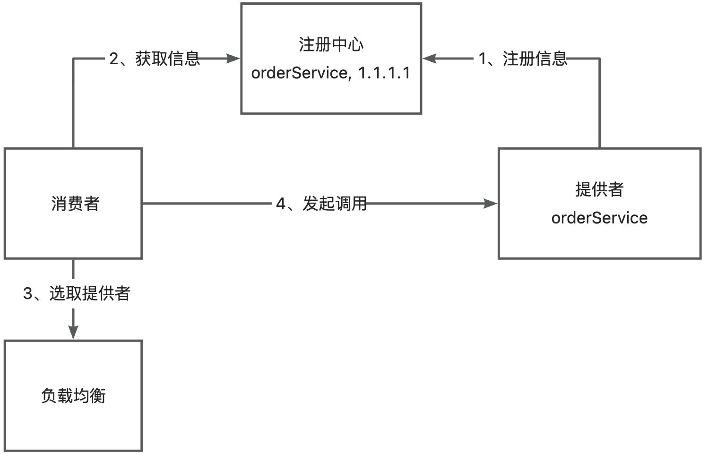
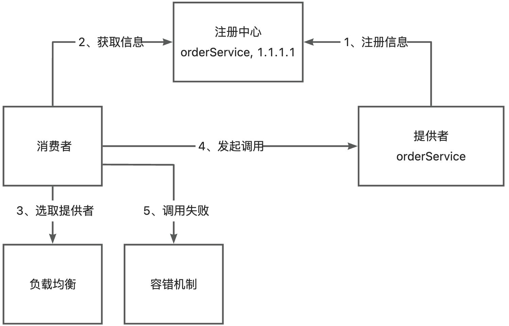

# RPC 02 - 从 0 实现简易 RPC 框架

> 本文基于开源项目 yu-rpc 教程第一节，从 0 实现一个简易版 RPC 框架：先建立基本概念，再逐步搭建服务提供者、服务消费者、本地服务注册器、序列化器、请求处理器与动态代理，最终像调用本地方法一样完成远程调用，并展望注册中心、负载均衡、容错等扩展方向。完整代码开源在 [github.com/liyupi/yu-rpc](https://github.com/liyupi/yu-rpc)。

## 一、基本概念

### 什么是 RPC

RPC（Remote Procedure Call）即**远程过程调用**，是一种计算机通信协议，它允许程序在不同的计算机之间进行通信和交互，就像本地调用一样。

简单类比：以前买鱼皮只能自己跑腿去线下店铺，耗时耗力；现在有了手机、网络、外卖平台，在家动动手指就能让骑手配送到家，完全不用关心网络怎么传输、平台怎么调度、骑手怎么配送。RPC 框架就是程序世界里的"外卖平台"。

### 为什么需要 RPC

RPC 允许一个程序（**服务消费者**）像调用自己程序的方法一样，调用另一个程序（**服务提供者**）的接口，而不需要了解数据的传输处理过程、底层网络通信的细节。这些都由 RPC 框架代劳，让开发者可以轻松调用远程服务，快速开发分布式系统。

举例：项目 A 提供点餐服务，项目 B 需要调用它完成下单。

```java
interface OrderService {
    // 点餐，返回 orderId
    long order(参数1, 参数2, 参数3);
}
```

- **没有 RPC 框架**：A、B 是独立系统，不能像 SDK 一样作为依赖引入。A 必须提供 web 服务暴露点餐接口；B 作为消费者要自己构造请求、用 HttpClient 调用。每多一个服务/方法就要多写一段 HTTP 请求代码，非常麻烦。
- **有了 RPC 框架**：B 只需一行代码完成调用，看起来跟调用自己项目的方法没有区别。

```java
orderId = orderService.order(参数1, 参数2, 参数3);   // 有 RPC
// 对比无 RPC：
url = "http://order-service"
req = new Req(参数1, 参数2, 参数3)
res = httpClient.post(url).body(req).execute()
orderId = res.data.orderId
```

### RPC 与 HTTP 调用的对比

| 维度 | 手写 HTTP 调用（无 RPC） | RPC 调用 |
| --- | --- | --- |
| 调用方式 | 每个接口手动构造 HTTP 请求（地址 + 参数 + HttpClient） | 一行代码，像调用本地方法 |
| 关注点 | 需要关心网络传输、序列化、地址等细节 | 只关注接口参数与返回值 |
| 服务地址 | 写死或手动维护 | 注册中心统一管理、动态发现 |
| 适用场景 | 简单的接口对接 | 分布式系统内部大量服务间调用 |

## 二、RPC 框架实现思路

### 基本设计

开局一张图：RPC 框架只有**服务消费者**和**服务提供者**两个角色。消费者要调用提供者，需要提供者启动一个 web 服务，消费者通过请求客户端发送 HTTP（或其他协议）请求来调用。

设计演进的关键几步：

1. **统一服务调用接口 + 请求处理器**：提供者提供多个服务和方法时，不可能每个接口都单独写一个。可以提供一个统一的服务调用接口，由**请求处理器**根据客户端请求参数分发到不同服务和方法。例如消费者发请求 `service=orderService, method=order`，处理器据此找到对应实现类并调用。
2. **本地服务注册器**：在服务提供者程序内维护一个注册器，记录**服务名 → 实现类**的映射。请求处理器根据 service 参数找到实现类，再通过 Java 的**反射机制**调用 method 指定的方法。
3. **序列化与反序列化**：Java 对象无法直接在网络中传输，传输的参数必须经过序列化（对象 → 字节）和反序列化（字节 → 对象）。
4. **动态代理**：为消费者要调用的接口生成代理对象，由代理对象完成请求和响应的全过程，实现"像本地调用一样"的体验。

至此，最简易的 RPC 框架架构图诞生了（下图虚线框内就是 RPC 框架需要提供的模块和能力）：



### 扩展设计

基本设计已能跑通调用流程，但离完备的 RPC 框架还有差距，带着问题继续完善架构。

#### 1、服务注册发现

**问题：消费者如何知道提供者的调用地址？**

类比点外卖：外卖小哥怎么知道买家和店铺的地址？是买卖双方分别填写地址、由平台保存。因此需要引入**注册中心**来保存服务提供者的地址，消费者要调用服务时，只需从注册中心获取对应服务的提供者地址即可。一般直接使用现成的第三方注册中心，比如 Redis、Zookeeper 等。



#### 2、负载均衡

**问题：如果有多个服务提供者，消费者该调用哪一个？**

给服务调用方增加**负载均衡**能力，通过指定不同算法来决定调用哪个提供者，比如轮询、随机、根据性能动态调用等。



#### 3、容错机制

**问题：如果服务调用失败，应该如何处理？**

为了保证分布式系统的高可用，通常给服务调用增加容错机制，比如失败重试、降级调用其他接口等。



#### 4、其他优化方向

做一个优秀的 RPC 框架还要考虑很多问题：

- **失效节点剔除**：服务提供者下线了怎么办？需要一个失效节点剔除机制。
- **缓存优化**：消费者每次都从注册中心拉取信息性能差，可以用缓存优化。
- **传输性能优化**：选择合适的网络框架、自定义协议头、节约传输体积等。
- **可扩展设计**：使用 Java 的 SPI 机制、配置化等，让框架更利于扩展。

做一个 RPC 项目并不难，但做一个完美的 RPC 项目却很难。通过这个项目可以学习到网络、序列化、代理、服务注册发现、负载均衡、容错、可扩展设计等知识。

## 三、开发简易版 RPC 框架

### 项目准备

#### 1、项目初始化

创建项目根目录 `yu-rpc`，用 IDEA 依次创建几个 Maven 模块：

| 模块 | 职责 |
| --- | --- |
| example-common | 示例代码的公共依赖，包括接口、Model 等 |
| example-consumer | 示例服务消费者代码 |
| example-provider | 示例服务提供者代码 |
| yu-rpc-easy | 简易版 RPC 框架本体 |

示例项目以一个最简单的用户服务为例，演示整个服务调用过程。

#### 2、公共模块（example-common）

公共模块同时被消费者和提供者引入，主要编写服务相关的接口和数据模型。

- **User 实体**：实现 `Serializable` 接口（为后续网络传输序列化提供支持），含 name 字段及 getter/setter。
- **UserService 接口**：提供一个获取用户的方法。

```java
public interface UserService {
    User getUser(User user);
}
```

#### 3、服务提供者（example-provider）

依赖 `yu-rpc-easy`、`example-common`、`hutool-all 5.8.16`、`lombok 1.18.30（provided）`。

- **UserServiceImpl**：实现 UserService 接口，打印用户名并返回传入的用户对象。
- **EasyProviderExample**：启动类，之后在 main 方法中编写提供服务、启动 web 服务的代码。

#### 4、服务消费者（example-consumer）

依赖与提供者一致。创建 EasyConsumerExample，编写调用接口的代码：

```java
public class EasyConsumerExample {
    public static void main(String[] args) {
        // todo 需要获取 UserService 的实现类对象
        UserService userService = null;
        User user = new User();
        user.setName("yupi");
        User newUser = userService.getUser(user);
        ...
    }
}
```

目前无法获取 userService 实例，先预留为 null。之后的目标是：通过 RPC 框架快速得到一个支持远程调用服务提供者的**代理对象**，像调用本地方法一样调用 UserService。

### Web 服务器（Vert.x）

要让服务提供者提供可远程访问的服务，需要一个能接受请求、处理并返回响应的 web 服务器。可选 Spring Boot 内嵌 Tomcat、NIO 框架 Netty、Vert.x 等，本教程选用高性能 NIO 框架 **Vert.x**（vertx-core 4.5.1）。

1. **HttpServer 接口**：定义统一的启动服务器方法 `doStart(int port)`，便于后续扩展多种不同的 web 服务器实现。

```java
public interface HttpServer {
    void doStart(int port);
}
```

2. **VertxHttpServer 实现**：创建 Vert.x 实例 → 创建 HTTP 服务器 → 通过 `requestHandler` 绑定请求处理器 → `listen` 监听端口。

```java
public class VertxHttpServer implements HttpServer {
    public void doStart(int port) {
        Vertx vertx = Vertx.vertx();
        io.vertx.core.http.HttpServer server = vertx.createHttpServer();
        server.requestHandler(new HttpServerHandler());   // 绑定请求处理器
        server.listen(port, result -> {
            if (result.succeeded()) {
                System.out.println("Server is now listening on port " + port);
            } else {
                System.err.println("Failed to start server: " + result.cause());
            }
        });
    }
}
```

3. **验证**：在 EasyProviderExample 中启动 web 服务（`new VertxHttpServer().doStart(8080)`），浏览器访问 `localhost:8080` 应能看到输出文字。

### 本地服务注册器（LocalRegistry）

简易版先跑通流程，暂不用第三方注册中心，直接把服务注册到提供者本地。在 RPC 模块中创建 LocalRegistry：

```java
public class LocalRegistry {
    // 线程安全：key 为服务名称，value 为服务实现类
    private static final Map<String, Class<?>> map = new ConcurrentHashMap<>();

    public static void register(String serviceName, Class<?> implClass) { map.put(serviceName, implClass); }
    public static Class<?> get(String serviceName) { return map.get(serviceName); }
    public static void remove(String serviceName) { map.remove(serviceName); }
}
```

注意区分：**注册中心**侧重管理注册的服务、把服务信息提供给消费者；**本地服务注册器**侧重根据服务名获取到对应的实现类，是完成调用必不可少的模块。

服务提供者启动时注册服务：

```java
LocalRegistry.register(UserService.class.getName(), UserServiceImpl.class);
```

### 序列化器

Java 对象存活在 JVM 中，要在网络中传输或存储，必须序列化：

- **序列化**：将 Java 对象转为可传输的字节数组。
- **反序列化**：将字节数组转换为 Java 对象。

序列化方式很多：Java 原生序列化、JSON、Hessian、Kryo、protobuf 等。简易版选择实现最方便的 **Java 原生序列化**。

```java
public interface Serializer {
    <T> byte[] serialize(T object) throws IOException;        // 序列化
    <T> T deserialize(byte[] bytes, Class<T> type) throws IOException;  // 反序列化
}
```

JdkSerializer 基于 Java 自带的流实现：`ObjectOutputStream.writeObject` 完成序列化，`ObjectInputStream.readObject` 完成反序列化。这段代码无需记忆，关键是要理解序列化和反序列化的区别。

### 提供者处理调用 —— 请求处理器

请求处理器是 RPC 框架的实现关键：处理接收到的请求，根据请求参数找到对应的服务和方法，通过反射实现调用，最后封装返回结果并响应。

**1）请求/响应封装类**：

- **RpcRequest**：封装调用所需信息——服务名称 serviceName、方法名称 methodName、参数类型列表 parameterTypes、参数列表 args。这些正是 Java 反射机制所需的参数。
- **RpcResponse**：封装调用结果——响应数据 data、响应数据类型 dataType（预留）、响应信息 message、异常信息 exception。

**2）HttpServerHandler**：Vert.x 中通过实现 `Handler<HttpServerRequest>` 接口来自定义请求处理器，可用 `request.bodyHandler` 异步处理请求。业务流程：

1. 反序列化请求为对象，从请求对象中获取参数；
2. 根据服务名称从本地注册器中获取对应的服务实现类；
3. 通过反射机制调用方法，得到返回结果；
4. 对返回结果进行封装和序列化，写入响应。

```java
public class HttpServerHandler implements Handler<HttpServerRequest> {
    @Override
    public void handle(HttpServerRequest request) {
        request.bodyHandler(body -> {
            // 1. 反序列化请求
            RpcRequest rpcRequest = serializer.deserialize(body.getBytes(), RpcRequest.class);
            RpcResponse rpcResponse = new RpcResponse();
            if (rpcRequest == null) {  // 请求为 null 直接返回
                rpcResponse.setMessage("rpcRequest is null");
                doResponse(request, rpcResponse, serializer);
                return;
            }
            try {
                // 2. 根据服务名获取实现类
                Class<?> implClass = LocalRegistry.get(rpcRequest.getServiceName());
                // 3. 反射调用方法
                Method method = implClass.getMethod(rpcRequest.getMethodName(), rpcRequest.getParameterTypes());
                Object result = method.invoke(implClass.newInstance(), rpcRequest.getArgs());
                // 4. 封装结果
                rpcResponse.setData(result);
                rpcResponse.setDataType(method.getReturnType());
                rpcResponse.setMessage("ok");
            } catch (Exception e) {
                rpcResponse.setMessage(e.getMessage());
                rpcResponse.setException(e);
            }
            doResponse(request, rpcResponse, serializer);
        });
    }
    // doResponse：序列化 rpcResponse 并写入 HTTP 响应
}
```

不同的 web 服务器对应的请求处理器实现方式不同，Vert.x 就是实现 `Handler<HttpServerRequest>` 接口。最后在 VertxHttpServer 中通过 `server.requestHandler(new HttpServerHandler())` 绑定请求处理器。至此，引入了 RPC 框架的服务提供者模块已能接受请求并完成服务调用。

### 消费方发起调用 —— 代理

UserService 的实现类从哪来？总不能把提供者的 UserServiceImpl 复制到消费者模块——分布式系统中调用其他项目的接口，只关注请求参数和响应结果，不关注具体实现。答案是生成**代理对象**。代理实现方式分两类：静态代理和动态代理。

#### 静态代理

为每一个特定类型的接口或对象编写一个代理类。在 example-consumer 中创建 UserServiceProxy 实现 UserService 接口——不是复制粘贴提供者的实现代码，而是构造 HTTP 请求去调用服务提供者（发送前要序列化参数）：

```java
public class UserServiceProxy implements UserService {
    public User getUser(User user) {
        RpcRequest rpcRequest = RpcRequest.builder()
                .serviceName(UserService.class.getName())
                .methodName("getUser")
                .parameterTypes(new Class[]{User.class})
                .args(new Object[]{user})
                .build();
        // 序列化 → hutool HttpRequest.post("http://localhost:8080") → 反序列化响应 → 返回 data
        ...
    }
}
```

消费者直接 `new UserServiceProxy()` 赋值给 userService 即可完成调用。静态代理很好理解，但缺点明显：**每个服务接口都要写一个实现类，灵活性很差**。所以 RPC 框架中使用动态代理。

#### 动态代理

根据要生成的对象的类型，自动生成代理对象。常用实现方式：

- **JDK 动态代理**：简单易用、无需引入额外库，缺点是只能对接口进行代理；
- **CGLIB（字节码生成）**：更灵活、可对任何类代理，性能略低于 JDK 动态代理。

本框架使用 JDK 动态代理。

**1）ServiceProxy**（实现 `InvocationHandler` 接口的 invoke 方法）：当用户调用接口的某个方法时，会改为调用 invoke 方法。在 invoke 中能拿到方法信息、参数列表——这正是服务提供者需要的参数，用来构造请求对象即可完成调用：

```java
public class ServiceProxy implements InvocationHandler {
    @Override
    public Object invoke(Object proxy, Method method, Object[] args) throws Throwable {
        // 用反射得到的方法信息构造请求
        RpcRequest rpcRequest = RpcRequest.builder()
                .serviceName(method.getDeclaringClass().getName())
                .methodName(method.getName())
                .parameterTypes(method.getParameterTypes())
                .args(args)
                .build();
        // 序列化 → HTTP POST 发送 → 反序列化响应 → 返回 data
        byte[] bodyBytes = serializer.serialize(rpcRequest);
        try (HttpResponse httpResponse = HttpRequest.post("http://localhost:8080")
                .body(bodyBytes).execute()) {
            RpcResponse rpcResponse = serializer.deserialize(httpResponse.bodyBytes(), RpcResponse.class);
            return rpcResponse.getData();
        }
    }
}
```

注意：请求的服务提供者地址目前被**硬编码**了，需要后续用注册中心和服务发现机制解决。

**2）ServiceProxyFactory**（工厂设计模式）：根据指定类创建动态代理对象，核心是 `Proxy.newProxyInstance`：

```java
public class ServiceProxyFactory {
    public static <T> T getProxy(Class<T> serviceClass) {
        return (T) Proxy.newProxyInstance(
                serviceClass.getClassLoader(),
                new Class[]{serviceClass},
                new ServiceProxy());
    }
}
```

**3）消费者调用**：通过工厂为 UserService 获取动态代理对象，一行代码完成调用：

```java
UserService userService = ServiceProxyFactory.getProxy(UserService.class);
User newUser = userService.getUser(user);   // 像调用本地方法一样
```

至此，简易版 RPC 框架开发完成。

## 四、测试验证

1. 以 debug 模式启动服务提供者 main 方法；
2. 以 debug 模式启动服务消费者 main 方法，在 ServiceProxy 代理类加断点，可以看到调用 userService 时实际调用的是代理对象的 invoke 方法，且能获取到 serviceName、methodName、参数类型和参数列表等信息；
3. 继续 debug，可看到序列化后的请求对象结构是字节数组；
4. 在提供者模块的请求处理器中打断点，看到接收并反序列化后的请求与发送时内容一致；
5. 继续 debug，看到请求处理器中通过反射成功调用了方法，并得到返回的 User 对象；
6. 最后服务提供者和消费者模块都输出了用户名称，说明整个调用过程成功。

## 总结与扩展方向

麻雀虽小，五脏俱全。这个简易版框架已经跑通了"消费者 → 代理 → 序列化 → HTTP 传输 → 请求处理器 → 反射调用 → 响应返回"的完整链路，通过它学到了网络、序列化、代理、服务注册发现、负载均衡、容错、可扩展设计等知识。后续的扩展方向包括：引入注册中心与服务发现（Etcd）、负载均衡、容错机制、失效节点剔除、缓存、自定义协议优化传输、基于 SPI 的可扩展设计、更多序列化器（Kryo 等）、基于 Vert.x 的异步网络通信等。

相关笔记：[[RPC 01 - 学习路线]]

> 来源：鱼皮·编程导航 / codefather
