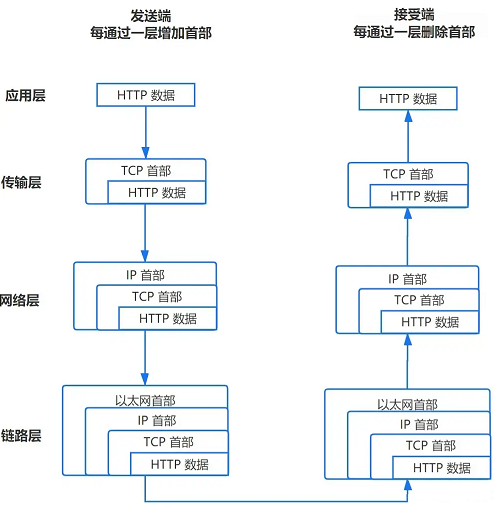

# 网络 - IO多路复用

> 一句话摘要：I/O 多路复用是操作系统提供的一种机制，让一个线程通过 select / poll / epoll 等系统调用同时监听并服务多个文件描述符（fd）上的 I/O 事件，从而避免"一个连接一个线程"带来的巨大开销。

## I/O 多路复用是什么？

- I/O 多路复用是用户程序**通过复用一个线程来服务多个 I/O 事件**的机制，也可以说是一个线程服务多个文件描述符（fd）。
- 它在操作系统层面实现：Linux 平台下常见的实现有 select、poll、epoll。

## 文件描述符 fd 是什么？

- fd（file descriptor，文件描述符）用来表示一个文件，通过 fd 可以找到对应的文件并对其进行读写操作。
- 可以把 fd 理解为一个索引值，用来索引到对应的 socket 文件或已打开的磁盘文件。

## socket 又是什么？

- socket 文件代表操作系统内核中的一段 buffer。数据从客户端传输过来，经过网络协议栈处理后，保存在 socket 文件中；读取 socket 文件即可获取客户端传来的数据。
- 形象地说，socket 就像一根**可双向传输数据的管道**：客户端和服务端建立通信后，双方各持有一个 socket 文件，socket 在内核 buffer 与用户程序之间建立通道完成数据传输。

## 数据从网卡到用户程序的完整过程

- 数据在客户端层层封装后传输到服务器。
- 网卡通过 **DMA 技术**将收到的 frame（以太帧）直接写入操作系统内核。
- 随后触发 **CPU 中断**，操作系统不断从 buffer 中取出数据交给协议栈处理。
- 数据经协议栈处理后进入 socket 文件，此时 socket 文件中就存有客户端数据，用户程序即可对其进行读写。

### 什么是 DMA 技术？

- DMA（Direct Memory Access，直接内存访问）用于在外设与存储器之间、存储器与存储器之间提供高速数据传输。
- 它可以在**无需 CPU 参与**的情况下快速移动数据，节省下来的 CPU 资源可供其他操作使用。

### 什么是 frame？

- 一个 HTTP 报文最终会传输到数据链路层，而链路层（以太网）最基本的传输单位是 frame，也叫**以太帧**。

## 为什么需要 I/O 多路复用？

- 客户端数据进入 socket 文件后，当 fd 上有事件发生时，用户程序需要创建线程来处理。
- fd 一般对应两种事件：
  - **是否可写**：缓冲区满了可能写不下，注册事件，等缓冲区可写时通知。
  - **是否可读**：缓冲区有数据时就可以读。
- 网卡能感知 fd 是否有事件发生并通知操作系统，但**用户程序不知道**。
- I/O 多路复用正是为了解决这个问题：让线程快速得知 fd 是否有事件发生（可读 / 可写），一个线程即可并发服务多个 I/O 事件。

### 不用多路复用的代价

- 不使用 I/O 多路复用时，服务端并发处理多个客户端的 I/O 事件，只能通过创建子进程或线程，为每个连接的 I/O 事件分配一个线程。
- 客户端越多，需要创建的线程越多，系统开销巨大、效率低下。

### 多路复用的解决思路

- 操作系统提供 select、poll、epoll 等多路复用机制：线程通过这些系统调用从内核（经网卡）获取**有事件发生的 socket 集合**，然后遍历该集合逐个处理 I/O 事件。
- 这样就用一个线程并发处理了多个 I/O 事件，大幅提高效率——这就是 I/O 多路复用技术的意义。
