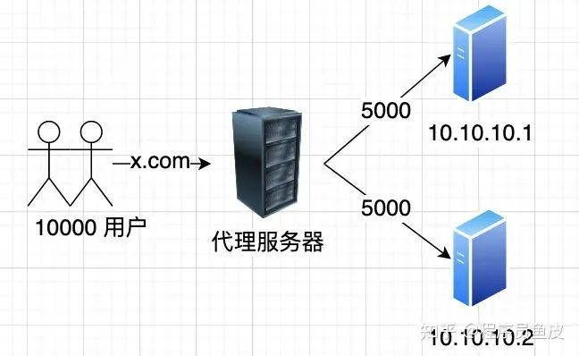

# 网络 13 - 负载均衡

> 负载均衡（Load Balancing，简称 LB）是企业中最重要的高并发解决方案之一：通过代理服务器统一接收请求，再依据算法转发到内部服务器集群。

## 为什么需要负载均衡？

**单机部署**时，一台服务器的 CPU、内存、带宽等资源有限，无法支撑上万用户同时访问。因此需要多台服务器组成**集群部署**分摊请求，但每台服务器 IP 不同，总不能让用户手动切换 IP 访问。

于是引入**代理服务器**：对外提供唯一入口、统一接收用户请求，再根据请求（流量）的特征，依据一定算法转发到集群中的目标服务器：

这样用户始终通过一个域名访问网站，完全感知不到后端部署了多少台服务器。

## 作用

- **提高并发度**：允许更多人同时访问
- **提高可用性**：集群中某台服务器挂掉后，代理不再向其转发请求，其余服务器照常处理
- **减少响应等待**：请求并行分发，提高系统整体处理能力

## 分类（按网络层次）

无论哪层负载均衡，都需要代理服务器对外提供唯一 IP（或 VIP），再按算法将请求转发到目标服务器；区别仅在于转发原理与逻辑。分层概念参考 [[网络 04 - OSI与TCPIP协议]]。

### 二层负载均衡（数据链路层）

- 数据以数据帧形式通过交换机传输，无 IP 概念，用 MAC 地址区分机器
- 负载均衡服务器通过虚拟 MAC 地址接收请求，改写报文目标 MAC 地址转发到目标机器
- 最原始、性能极高，但只能通过硬件设备实现（F5、Array 等），价格昂贵
- 底层实现为 PPP 捆绑、链路聚合技术；开发同学一般接触不到

### 三层负载均衡（网络层）

- 这一层开始有 IP 地址概念，可根据 IP 地址路由网络
- 负载均衡设备对外提供虚拟 IP（VIP）接收请求，按算法转发到 IP 不同的目标机器
- 同样通过硬件设备实现，成本较高

### 四层负载均衡（传输层）

- 除 IP 外还含源目端口号，可区分同一机器上的不同应用
- 对外提供虚拟 IP + 端口号接收请求，转发到不同目标机器的不同端口
- 可通过软件实现，如 LVS（Linux Virtual Server），底层可选 NAT（网络地址转换）、DR（直接路由）、TUN（隧道）等模式
- 性能高、稳定，支撑十几万到几十万并发没问题；纯软件实现成本低，企业应用广泛

### 七层负载均衡（应用层）

- 应用层是网络模型最上层，能得到最详细的请求信息（如 HTTP 请求头）
- 可根据域名或主机 IP + 端口接收请求，依据应用层信息（请求头、Cookie 等）灵活转发，如手机端用户转服务器 A、桌面端用户转服务器 B
- 实现成本最低、最灵活，是应用开发人员最常用的；主流实现有 Nginx、HAProxy，写配置即可转发（见 [[Nginx 02 - 反向代理与负载均衡]]）
- 同层还有 **DNS 负载均衡**：基于 DNS 域名解析，将同一域名解析为不同 IP，让用户访问不同服务器。实现简单，但转发逻辑不够灵活，且 DNS 存在缓存、不利于修改

## 延伸

- **负载均衡算法**：静态轮询、加权轮询、动态连接数、一致性哈希等，具体场景具体分析（Nginx 实现见 [[Nginx 02 - 反向代理与负载均衡]]）
- **代理服务器自身局限**：代理服务器资源也有限（如 Nginx 几万并发即到上限），且存在宕机可能，需要关注负载均衡器自身的高可用
- 负载均衡器自身的高可用：多台负载均衡器 + 故障转移机制

> 来源：鱼皮·编程导航 / codefather
