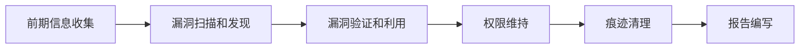

# 安全 - 渗透测试学习路线

> 渗透测试（Penetration Testing，PT）是在获得授权的前提下，使用与攻击者相同的思维方式和技术手段，对目标系统进行全方位的安全评估，发现潜在漏洞并提供修复建议。本篇路线从零基础到精通，涵盖网络安全基础、渗透测试基础、系统渗透与提权、内网渗透、综合实战、求职备战 6 个阶段。

## 开篇介绍

渗透测试不仅包括 Web 应用测试，还涵盖网络渗透、系统渗透、内网渗透、无线渗透等多个方面，目的是在真实攻击发生之前主动发现并修复安全漏洞。只有站在攻击者的角度思考，才能真正理解系统的安全风险。

**核心价值**：提前发现安全风险，避免数据泄露、业务中断等严重后果。广泛应用于企业信息系统安全评估、金融系统安全审计、政府机构网络安全检测、云服务平台安全测试、物联网设备安全评估等场景。

### 就业方向

1. **渗透测试工程师** — 对企业信息系统进行全方位安全测试，发现并报告漏洞，是核心岗位
2. **红队工程师** — 在攻防演练中担任攻击方，模拟真实 APT 攻击，考验企业防御能力
3. **安全服务工程师** — 提供安全咨询和渗透测试服务，参与护网行动等安全项目
4. **漏洞研究员** — 深入研究系统和应用的漏洞，发现 0day，为安全产品提供支撑
5. **安全顾问** — 提供安全架构设计、安全策略制定等高级咨询服务

### 学习路线图

## 整体学习建议

1. **先打基础，不要跳过** — 深入理解 TCP/IP 协议（三次握手、四次挥手、端口扫描原理），这些在后续渗透中会经常用到
2. **思路比工具重要** — 渗透测试不是简单的工具使用，要培养攻击者思维，看到系统能快速判断可能存在的安全风险
3. **动手实践贯穿始终** — 搭建靶场（DVWA、VulnHub、HackTheBox 等）、参加 CTF 和护网行动
4. **合法合规是底线** — 渗透测试必须在获得授权下进行，未经授权的攻击行为违法；做有道德、有底线的白帽子

## 阶段 1：网络安全基础（15-25 天，仅供参考）

### 学习目标

掌握网络安全的基本概念和技术基础，为后续渗透测试学习打下坚实基础。

### 知识点

**网络安全基础【必学】**

- 信息安全基础概念
- CIA 三要素（机密性 Confidentiality、完整性 Integrity、可用性 Availability）
- 常见攻击类型和防御思路
- 网络安全法律法规

**计算机网络【必学】**

- TCP/IP 协议栈
- HTTP/HTTPS 协议详解
- DNS 解析原理
- 常见端口和服务

**操作系统基础【必学】**

- Windows：用户和权限管理、注册表和服务、常用命令
- Linux：文件系统和权限、Shell 基础、常用命令和工具

**编程基础【必学】**

- Python 编程基础（语法、文件操作、网络编程、正则表达式）
- Shell 脚本编程
- 正则表达式

### 学习建议

1. 网络安全基础是渗透测试的根基，要深入理解 TCP/IP 协议，特别是三次握手、四次挥手、端口扫描原理
2. Linux 是渗透测试的主要工作环境，必须熟练掌握；建议安装 Kali Linux 虚拟机，Kali 预装大量安全工具；熟悉 ls、cd、chmod、grep、awk、sed 等常用命令
3. Python 是渗透测试中最常用的编程语言，用于编写自动化脚本和工具；不需要学得很深，能看懂和编写简单脚本即可
4. 建立正确的安全意识和法律意识，未经授权的攻击行为是违法的，守住道德和法律底线

### 学习资源

- [黑马程序员 Linux 教程](https://www.bilibili.com/video/BV1n84y1i7td)：Linux 基础入门

## 阶段 2：渗透测试基础（10-30 天，仅供参考）

### 学习目标

掌握渗透测试的基本流程和常用工具，能够进行基础的渗透测试工作。

### 知识点

**渗透测试流程【必学】**

- 前期信息收集（主动信息收集、被动信息收集、社会工程学）
- 漏洞扫描和发现
- 漏洞验证和利用
- 权限维持
- 痕迹清理
- 报告编写

**信息收集技术【必学】**

- 域名和 IP 信息收集
- 子域名枚举
- 端口扫描
- 服务识别和指纹识别
- 目录扫描
- Google Hacking
- 社会工程学信息收集

**常用渗透工具【必学】**

| 工具 | 用途 |
|---|---|
| Nmap | 端口扫描 |
| Masscan | 快速端口扫描 |
| Dirsearch | 目录扫描 |
| Subfinder | 子域名枚举 |
| Whatweb | 指纹识别 |
| Burp Suite | Web 渗透 |
| SQLMap | SQL 注入 |

**Web 渗透基础【必学】**

- OWASP Top 10 漏洞
- SQL 注入
- XSS 攻击
- 文件上传漏洞
- 命令执行漏洞

### 学习建议

1. 信息收集是渗透测试的第一步，也是最重要的一步，其广度和深度直接决定后续渗透的成功率
2. Nmap 是最重要的工具之一，要理解各种扫描技术原理（TCP SYN 扫描、TCP Connect 扫描、UDP 扫描等），掌握常用参数 -sS、-sV、-O、-A
3. Burp Suite 是 Web 渗透测试的核心工具，深入学习各个模块，结合 Web 安全知识理解工具背后的原理（Professional 版本功能更强）
4. 培养攻击者思维方式，学会从安全的角度审视系统

### 学习资源

- [Kali 渗透入门教程](https://www.bilibili.com/video/BV1EkKpeNE8R)
- [Nmap 官方文档](https://nmap.org/book/man.html)：最权威的 Nmap 使用指南

## 阶段 3：系统渗透和提权（15-35 天，仅供参考）

系统渗透和提权是针对操作系统的攻击技术，包括漏洞利用、权限提升等，是渗透测试的核心技能。

### 学习目标

掌握 Windows 和 Linux 系统的渗透技术，能够进行权限提升和权限维持。

### 知识点

**Windows 渗透【必学】**

- Windows 系统漏洞利用
- Windows 权限提升：本地提权漏洞、配置错误提权、第三方软件提权
- Windows 权限维持：后门技术、启动项维持、服务维持
- Windows 痕迹清理

**Linux 渗透【必学】**

- Linux 系统漏洞利用
- Linux 权限提升：SUID 提权、内核漏洞提权、配置错误提权
- Linux 权限维持
- Linux 痕迹清理

**Metasploit 框架【必学】**

- Metasploit 基础、MSFconsole 使用
- Exploit 模块、Payload 生成
- Meterpreter 使用、后渗透模块

**密码攻击【必学】**

- 密码破解技术、哈希破解
- Hashcat、John the Ripper 使用
- 字典生成

### 学习建议

1. 权限提升是关键环节：拿到初始权限后往往需要提升到管理员权限才能继续操作；熟练掌握漏洞提权、配置错误提权、第三方软件提权等方法
2. Metasploit 是渗透测试中最强大的框架（"渗透测试的瑞士军刀"），深入学习各模块，特别是 Exploit 和 Payload 的使用；Meterpreter 是核心 Payload，要熟练掌握
3. 搭建靶场练习非常重要：使用 VulnHub、HackTheBox 等平台靶机，或自己搭建漏洞环境，在实践中学习
4. 权限维持和痕迹清理是红队演练中的高级技巧；实际渗透测试工作一般不需要做权限维持，发现漏洞并报告即可，痕迹清理要谨慎避免破坏系统

### 学习资源

- [Metasploit 教程](https://www.bilibili.com/video/BV1Gr421H7Dj)
- [Metasploit Unleashed](https://www.offensive-security.com/metasploit-unleashed/)：官方免费教程
- [VulnHub](https://www.vulnhub.com/)：靶机下载平台

## 阶段 4：内网渗透（15-45 天，仅供参考）

内网渗透是在获得初步权限后，进一步渗透内网环境、横向移动获取更多资源的过程。

### 学习目标

掌握内网渗透技术，能够在内网环境中进行横向移动和域渗透。

### 知识点

**内网基础【必学】**

- 内网架构
- 域环境基础：Active Directory、域控制器、域用户和组
- 内网协议：SMB 协议、LDAP 协议、Kerberos 认证

**内网信息收集【必学】**

- 主机发现、端口扫描、服务识别
- 域信息收集、凭证获取

**横向移动【必学】**

- Pass The Hash（哈希传递）
- Pass The Ticket（票据传递）
- IPC$ 连接、WMI 利用、DCOM 利用、PsExec 利用、WinRM 利用

**域渗透【必学】**

- 域内信息收集
- Kerberos 攻击：AS-REP Roasting、Kerberoasting、Golden Ticket、Silver Ticket
- 域控提权、域委派攻击

**内网渗透工具【必学】**

| 工具 | 用途 |
|---|---|
| Cobalt Strike | 红队 C2 平台（商业软件，需授权使用） |
| Impacket | 内网渗透工具集（SMB/LDAP/Kerberos 利用脚本） |
| BloodHound | 可视化域内信任关系与攻击路径 |
| Mimikatz | 凭证抓取与 Kerberos 攻击 |
| PowerShell Empire | 后渗透攻击框架 |

### 学习建议

1. 内网渗透是高级阶段，要先理解域环境基础知识：Active Directory 架构、Kerberos 认证流程等，这些理论对理解攻击技术非常重要
2. 横向移动是核心：拿到一台内网主机权限后，以此为跳板横向移动，最终控制更多主机；熟练掌握 Pass The Hash、IPC$ 连接、WMI 利用等技术
3. Cobalt Strike 功能强大但为商业软件，学习时可用试用版或搭建测试环境；使用必须获得授权
4. BloodHound 是域渗透利器，能可视化域内信任关系和攻击路径，快速发现安全风险和提权路径
5. 内网渗透需要大量实战：自己搭建域环境练习，或参加红蓝对抗演练，在实战中积累经验

### 经典面试题

1. 什么是横向移动？常见的横向移动方法有哪些？
2. Pass The Hash 攻击的原理是什么？如何防御？
3. 什么是 Kerberoasting 攻击？如何利用？
4. Golden Ticket 和 Silver Ticket 有什么区别？
5. 如何进行域内信息收集？

### 学习资源

- [内网渗透之横向移动](https://www.cnblogs.com/iruan/p/18214394)：实战指南
- [AD Pentest Notes](https://github.com/chriskaliX/AD-Pentest-Notes)：内网渗透学习笔记
- [Impacket](https://github.com/fortra/impacket)：内网渗透工具集

## 阶段 5：综合实战（30-45 天，仅供参考）

### 学习目标

通过实际项目和靶场练习，综合运用所学知识，提升实战能力。

### 学习建议

1. **搭建完整渗透测试环境** — 包括 Web 应用、操作系统、内网环境等，模拟真实场景，从信息收集到权限提升、从横向移动到域控制完整走一遍流程
2. **参加 CTF 和靶场练习** — 推荐 HackTheBox、TryHackMe、VulnHub 等平台，难度从入门到高级都有，通过通关快速提升实战能力
3. **参加护网行动或红蓝对抗演练** — 护网行动是国内最大规模的攻防演练活动，可在真实环境中锻炼能力、积累实战经验
4. **编写自己的工具和脚本** — 用 Python 编写信息收集、漏洞扫描、批量检测等自动化脚本，提升编程能力并加深对技术的理解
5. **学习编写渗透测试报告** — 报告是交付客户的最终成果，应包含测试范围、测试方法、发现的漏洞、风险评估、修复建议等内容

### 项目推荐

- HackTheBox 靶机（至少完成 50 台）
- TryHackMe 学习路径
- VulnHub 综合靶机
- 搭建企业级内网环境
- 参加 SRC 漏洞挖掘
- 参加护网行动

### 学习资源

- [HackTheBox](https://www.hackthebox.com/)：全球最大的渗透测试平台
- [TryHackMe](https://tryhackme.com/)：新手友好的学习平台
- [VulnHub](https://www.vulnhub.com/)：靶机下载平台
- [LabEx 在线 Kali 环境](https://labex.io/zh/tutorials/kali-online-kali-linux-terminal-and-playground-592935)：在线练习环境

## 阶段 6：求职备战（面试前 1 个月突击）

### 学习目标

熟练掌握渗透测试常见面试题，准备好简历和项目经历，顺利通过面试。

### 学习建议

1. **打磨简历和项目** — 简历上要有渗透测试相关的项目经历：靶机通关记录、SRC 提交记录、CTF 比赛成绩、护网参加经历等
2. **准备实战演示** — 有些公司会要求现场演示渗透测试能力，提前准备靶场环境，能快速演示信息收集、漏洞发现、权限提升等过程；演示时讲清思路和方法
3. **准备项目经历讲解** — 能清楚介绍做过的渗透测试项目、发现的漏洞、使用的技术、遇到的问题和解决方案，提前准备并反复练习
4. **了解目标公司** — 不同公司侧重不同（有的侧重 Web 渗透，有的侧重内网渗透），面试前了解目标公司的业务和安全团队情况，有针对性地准备

### 经典面试题

**基础概念**

1. 什么是渗透测试？和漏洞扫描有什么区别？
2. 渗透测试的流程是什么？
3. 什么是信息收集？有哪些方法？
4. 什么是社会工程学？
5. 如何编写渗透测试报告？

**工具使用**

1. Nmap 有哪些常用参数？各有什么作用？
2. Burp Suite 有哪些模块？如何使用 Intruder 进行爆破？
3. Metasploit 的架构是怎样的？Exploit 和 Payload 有什么区别？
4. SQLMap 有哪些常用参数？如何绕过 WAF？
5. Cobalt Strike 有哪些功能？如何使用 Beacon？

**漏洞利用**

1. SQL 注入有哪些类型？如何利用？
2. 如何进行 Windows 系统提权？
3. 如何进行 Linux 系统提权？
4. 什么是 Pass The Hash 攻击？如何利用？
5. 什么是 Kerberoasting 攻击？如何防御？

**内网渗透**

1. 内网渗透的流程是什么？
2. 如何进行域内信息收集？
3. 横向移动有哪些方法？
4. Golden Ticket 和 Silver Ticket 有什么区别？
5. 如何定位域控制器？

**实战经验**

1. 你做过哪些渗透测试项目？详细说说。
2. 你在 HackTheBox 上通关了多少台靶机？
3. 你参加过护网行动吗？做了哪些工作？
4. 遇到 WAF 拦截时，你会怎么绕过？
5. 你编写过哪些渗透测试工具？

### 学习资源

- [2025 护网 HVV 面试通关笔记](https://zhuanlan.zhihu.com/p/1895076259005964982)：高频面试题

## 持续学习资源

### 安全社区

- [FreeBuf](https://www.freebuf.com/)：国内知名安全社区
- [先知社区](https://xz.aliyun.com/)：阿里云安全社区
- [Seebug](https://www.seebug.org/)：漏洞平台

### 靶场平台

- [HackTheBox](https://www.hackthebox.com/)：全球最大的渗透测试平台
- [TryHackMe](https://tryhackme.com/)：新手友好的学习平台
- [VulnHub](https://www.vulnhub.com/)：靶机下载平台
- [攻防世界](https://adworld.xctf.org.cn/)：CTF 练习平台

### 技术博客

- [Google Project Zero](https://googleprojectzero.blogspot.com/)：谷歌漏洞研究团队
- [Microsoft Security Response Center](https://msrc.microsoft.com/blog/)：微软安全响应中心
- [Krebs on Security](https://krebsonsecurity.com/)：安全研究博客

## 写在最后

渗透测试从信息收集到漏洞利用、从权限提升到横向移动、从域渗透到报告编写，技术体系完整且深入。学习路径：先打好基础（网络、系统、编程），再重点掌握渗透测试流程和核心工具（Nmap、Burp Suite、Metasploit），深入内网渗透（高级阶段），最后通过靶场、CTF 和护网行动在实战中提升能力。

**务必牢记**：渗透测试必须在获得授权的情况下进行，未经授权的攻击行为是违法的。做一个有道德、有底线的白帽子，用自己的技术为网络安全做出贡献。
