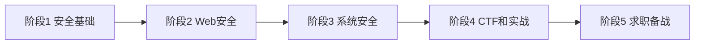

# 安全 - 网络安全学习路线

> 网络安全是保护计算机系统、网络和数据免受攻击、破坏和未经授权访问的实践。本篇路线从零基础到精通，涵盖安全基础、Web 安全、系统安全、CTF 实战、求职备战 5 个阶段，强调靶场实践与合法合规。

## 开篇介绍

网络安全领域非常广泛，包括 Web 安全、系统安全、网络安全、移动安全、云安全、应用安全等方向。安全工程师的主要工作：发现和修复安全漏洞、进行渗透测试、设计安全架构、响应安全事件、开发安全工具。需要具备扎实的计算机基础、编程能力、网络知识，以及对攻击手法的深入理解。

**为什么要学网络安全？** 高薪且稀缺的技术方向，一线城市安全工程师平均薪资 20-40K，高级安全专家可达 40-100K；就业面广，互联网公司、金融机构、政府部门、军工企业都需要安全人才。

在 AI 时代，AI 既能用于攻击（自动化漏洞挖掘、智能钓鱼），也能用于防御（智能入侵检测、自动化安全分析）。**掌握 AI + 网络安全，将是未来安全领域的重要方向。**

### 学习前提

1. 计算机基础：操作系统、计算机网络、数据结构
2. Linux 基础：Linux 命令、Shell 脚本
3. 编程基础：至少一门编程语言（推荐 Python）
4. 网络基础：TCP/IP、HTTP 等协议

### 学习路线图

### 就业方向

1. **安全工程师** — 负责企业的安全防护和安全建设
2. **渗透测试工程师** — 模拟黑客攻击，发现系统漏洞
3. **安全研究员** — 研究安全技术和攻击手法
4. **安全开发工程师** — 开发安全产品和安全工具
5. **安全架构师** — 设计企业的安全架构
6. **应急响应工程师** — 处理安全事件和应急响应

## 整体学习建议

1. **学习必须结合实践**，在靶场环境中练习攻击和防御；切记不要在真实环境中进行未授权的渗透测试，这是违法的
2. 搭建实验环境：使用虚拟机安装 Kali Linux（渗透测试专用系统）进行练习
3. CTF（Capture The Flag）是网络安全竞赛，是学习和检验安全技术的好方式，多参加积累实战经验
4. 安全技术发展很快，要关注最新漏洞、攻击手法、安全工具，订阅安全资讯、关注安全社区
5. AI 时代多用 AI 辅助安全分析、漏洞挖掘、代码审计，面试官可能通过 AI 趋势问题考察自主性
6. 安全技术要合法使用，不要用于违法犯罪。**未经授权的渗透测试是违法的，切记！**

## 阶段 1：安全基础（15-20 天，仅供参考）

### 学习目标

掌握网络安全的基础知识，理解常见的安全概念。

### 知识点

**安全基础概念【必学】**

- 信息安全三要素（CIA）：机密性、完整性、可用性
- 常见攻击类型（SQL 注入、XSS、CSRF、文件上传等）
- 安全防御思想
- 攻防对抗流程

**计算机网络【必学】**

- TCP/IP 协议栈
- HTTP/HTTPS 协议
- DNS 协议
- 网络抓包（Wireshark）

**操作系统【必学】**

- Linux 基础命令
- 文件权限和用户管理
- 进程和服务管理

**编程基础【必学】**

- Python：安全脚本开发
- Shell：自动化脚本
- C 语言：理解底层原理【建议学】

### 学习建议

1. 计算机基础非常重要，特别是计算机网络和操作系统
2. Linux 是网络安全的基础，大部分安全工具和靶机基于 Linux，建议熟练掌握 Linux 命令
3. Python 是安全领域最流行的编程语言，大量安全工具用 Python 编写，建议重点学习
4. 这个阶段要打好基础，不要急着学攻击技术。**基础不牢，后面的学习会很困难**

## 阶段 2：Web 安全（20-30 天，仅供参考）

Web 安全是网络安全的重要领域，包括常见的 Web 漏洞、攻击手段和防御措施。

### 学习目标

掌握 Web 安全的常见漏洞和攻击手法。

### 知识点

**常见 Web 漏洞【必学】**

- SQL 注入（SQL Injection）
- XSS（跨站脚本攻击）
- CSRF（跨站请求伪造）
- 文件上传漏洞
- 文件包含漏洞
- SSRF（服务器端请求伪造）
- XXE（XML 外部实体注入）
- 反序列化漏洞
- 命令注入

**Web 安全工具【必学】**

- Burp Suite：Web 漏洞扫描和测试
- AWVS：自动化漏洞扫描
- SQLMap：SQL 注入工具
- XSStrike：XSS 检测工具

**渗透测试流程【必学】**

- 信息收集 → 漏洞扫描 → 漏洞利用 → 权限提升 → 内网渗透 → 清理痕迹

### 学习建议

1. Web 安全是网络安全的重点，也是最容易入门的方向
2. Burp Suite 是 Web 安全测试的必备工具，可拦截和修改 HTTP 请求，要熟练掌握
3. 学习 Web 安全要建立在理解 Web 技术的基础上：HTTP 协议、前后端交互、数据库操作等
4. 实践环境推荐在线靶场（DVWA、Pikachu、WebGoat）或本地搭建靶场
5. 多动手实践，在靶场中练习各种攻击手法，理解漏洞的原理和利用方式

### 学习资源

- [2025 Web 安全入门课程（B 站）](https://www.bilibili.com/video/BV1UKPseSEVe/)：零基础到精通
- [网络安全 Web 渗透测试教程（B 站）](https://www.bilibili.com/video/BV1twhRzbEH3)

### 练习平台

- [DVWA](https://github.com/digininja/DVWA)：Web 漏洞靶场
- [Pikachu](https://github.com/zhuifengshaonianhanlu/pikachu)：中文 Web 漏洞靶场
- [HackTheBox](https://www.hackthebox.com/)：在线渗透测试平台

## 阶段 3：系统安全（15-20 天，仅供参考）

系统安全涉及操作系统层面的安全防护，包括权限管理、漏洞利用、安全加固等内容。

### 学习目标

掌握系统安全的知识，理解系统层面的攻击和防御。

### 知识点

**系统提权【必学】**

- Windows 提权
- Linux 提权
- 漏洞利用

**内网渗透【建议学】**

- 内网信息收集
- 横向移动
- 域渗透

**逆向工程【建议学】**

- 反汇编和反编译
- 调试工具（OllyDbg、IDA Pro、GDB）
- 二进制漏洞（缓冲区溢出、格式化字符串漏洞）

**恶意代码分析【建议学】**

- 恶意软件的类型（病毒、木马、勒索软件）
- 动态分析和静态分析

### 学习建议

1. 系统安全比 Web 安全更难，需要更深的计算机基础，建议先学好 Web 安全再学系统安全
2. 内网渗透是企业级渗透测试的重点，要理解内网的网络结构和攻击路径
3. 逆向工程需要了解汇编语言和二进制文件结构，学习难度较大，不要急、慢慢来

### 学习资源

- [系统安全教程（B 站）](https://www.bilibili.com/video/BV1M5411z7V3/)：零基础教程

## 阶段 4：CTF 和实战

CTF（Capture The Flag）是网络安全竞赛，通过实战演练提升攻防技能和解决问题的能力。

### 学习目标

通过 CTF 比赛和实战演练巩固所学知识，积累实战经验。

### 学习建议

1. 参加 CTF 比赛：分为 Web、Pwn、Reverse、Crypto、Misc 等方向，建议从 Web 方向开始，逐步扩展
2. 刷 CTF 题目：在线平台如 CTFHub、攻防世界、BUUCTF 等，建议每天刷题积累经验
3. 参加漏洞挖掘：可参与 SRC（安全应急响应中心）漏洞提交，如补天、CNVD 等平台，挖洞可得奖金和荣誉
4. 编写安全工具：用 Python 编写端口扫描器、密码破解工具、漏洞利用脚本等
5. 合法合规：所有练习都要在授权环境中进行，不要进行未授权的渗透测试

### CTF 方向

**Web【入门推荐】**：SQL 注入、XSS、文件上传、代码审计等

**Pwn（二进制漏洞利用）【高级】**：缓冲区溢出、ROP、Shellcode 等

**Reverse（逆向工程）【高级】**：反汇编、反编译、脱壳、破解等

**Crypto（密码学）【专业】**：古典密码、现代密码、RSA、AES 等

**Misc（杂项）【入门】**：隐写术、取证、编码解码等

### 学习资源

- [CTF 零基础入门到精通教程（B 站）](https://www.bilibili.com/video/BV1eq4y1x71H)
- [CTF 夺旗赛教程（B 站）](https://www.bilibili.com/video/BV1NXa9zbEGt/)：12 小时快速入门
- [CTF 工具安装教程（B 站）](https://www.bilibili.com/video/BV1BFs6eaE2E/)：Kali + Burp Suite 等

### CTF 平台

- [CTFHub](https://www.ctfhub.com/)：国内 CTF 练习平台
- [攻防世界](https://adworld.xctf.org.cn/)：XCTF 官方平台
- [BUUCTF](https://buuoj.cn/)：北邮 CTF 平台
- [PicoCTF](https://picoctf.org/)：适合新手的 CTF 平台

## 阶段 5：求职备战

### 学习目标

熟练掌握网络安全常见面试题，准备好简历和项目经历，顺利通过面试。

### 学习建议

1. 打磨简历和项目：突出实战经验，比如参加过哪些 CTF 比赛、挖过哪些漏洞、开发过哪些安全工具
2. 面试时可能要求现场演示漏洞利用或使用安全工具，要提前准备好
3. 提前了解目标公司的安全业务和技术栈，针对性地准备

### 经典面试题

**安全基础**

1. 信息安全三要素是什么？
2. 常见的 Web 漏洞有哪些？
3. OWASP Top 10 是什么？

**Web 安全**

1. SQL 注入的原理是什么？如何防御？
2. XSS 攻击的原理是什么？有哪些类型？
3. CSRF 攻击的原理是什么？如何防御？
4. 文件上传漏洞如何利用？如何防御？

**系统安全**

1. 常见的提权方法有哪些？
2. 如何进行内网渗透？
3. 缓冲区溢出的原理是什么？

**安全工具**

1. Burp Suite 如何使用？
2. Metasploit 是什么？如何使用？
3. Nmap 如何使用？

## 更多学习资源

### 安全社区

- [FreeBuf](https://www.freebuf.com/)：国内知名安全社区
- [先知社区](https://xz.aliyun.com/)：阿里云安全社区
- [安全客](https://www.anquanke.com/)：安全资讯平台
- [Seebug](https://www.seebug.org/)：漏洞平台

### 技术博客

- [Google Security Blog](https://security.googleblog.com/)：谷歌安全团队博客
- [Microsoft Security Blog](https://www.microsoft.com/en-us/security/blog/)：微软安全博客
- [Cloudflare Blog](https://blog.cloudflare.com/)：Cloudflare 安全技术
- [Akamai Blog](https://www.akamai.com/zh/blog/security-research)：Akamai 安全研究

## 尾声

网络安全是一个充满挑战和成就感的技术方向，学习曲线较陡峭，需要扎实的计算机基础和大量实践经验，但只要坚持下来，会发现网络安全的魅力。

学习要理论结合实践：多参加 CTF 比赛，多在靶场环境中练习。**切记要合法合规，不要用于违法犯罪。** 在 AI 时代，掌握 AI + 网络安全，将是未来安全领域的重要方向。
