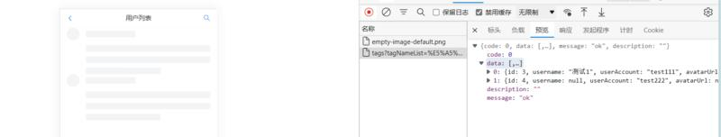
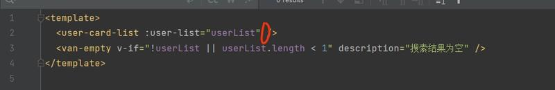
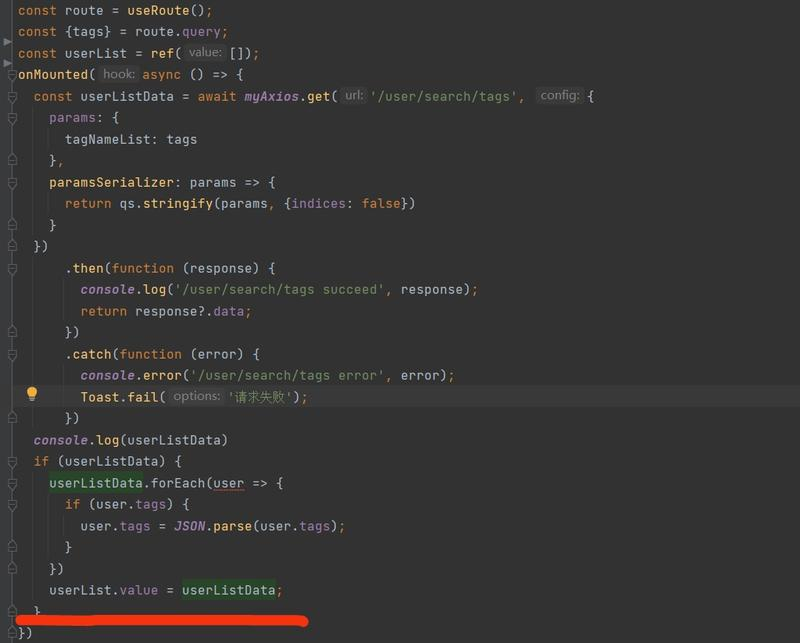

# 工具 01 - 前端问题排错指南

> 前端开发中常见问题的排查思路与解决方案汇总。

## 前端框架初始化错误

遇到报错时，先认真阅读完整的报错信息，然后去搜索引擎或 AI 查询错误信息。

### 环境与依赖问题

前端项目初始化报错或无法启动，通常是本地环境、依赖版本与教程不一致，或文件权限问题。

- **Node.js 版本**：尽量与项目要求的版本保持一致。可使用 NVM（Node 版本管理工具）来切换多个 Node.js 版本。
- **权限问题**：使用管理员权限运行，或 Mac 用户使用 `sudo` 命令。

### 解决思路

#### 1. 查阅官方文档

框架持续更新，官方文档上的初始化命令是最新最准确的。如果跟着教程报错了，先去查阅最新官方文档，或切换到与教程一致的文档版本。

例如 Ant Design Pro，2024 年 2 月后官方脚手架不再提供 umi@3 选项，这是正常的，不影响后续学习。

#### 2. 自主搜索

- 将错误信息贴到百度/Google 搜索
- 去框架的 GitHub Issues 区搜索（`Issues · ant-design/ant-design-pro · GitHub`），99% 的问题别人已遇到过并有解决方案

#### 3. 使用老版本框架

如果想与教程保持一致，可安装特定版本的脚手架工具。例如使用 Ant Design Pro 的 umi@3 和 umi ui：

```shell
npm i @ant-design/pro-cli@3.1.0 -g
```

查看版本确保是 3.1.0。

```shell
pro -v
```

选择框架版本时**选 v3**，v4 不支持 umi ui 悬浮按钮。

> **要点**：任何教程都有保质期，学会阅读官方文档、通过各种渠道自主解决问题，才是长期有效的技能。遇到问题记录解决过程，长期积累后面对各类 Bug 都能从容应对。

## 前端请求后端接口异常

前端请求后端接口时响应不对，或 F12 看到后端返回正常但前端无法正常展示。

### 配置问题

| 问题类型 | 说明 |
|---------|------|
| **跨域问题** | 导致请求不正确，检查 CORS 配置 |
| **SSL/HTTPS 配置** | 使用 HTTPS 时配置错误可能导致请求失败，确保 SSL 证书正确 |
| **权限问题** | 确认当前账号是否有权限访问该接口 |

### 代码问题

1. **接口地址错误**：检查请求的后端接口地址（主机名、端口、路径）

2. **前端渲染时序问题**：前端没有等待后端数据返回就结束页面渲染。例如搜索标签后后端数据正常返回但页面一直处于加载状态：

   - 添加 `:loading="loading"` 绑定
   - 定义 `const loading = ref(true);`
   - 在数据返回后设置 `loading.value = false;`

   
   
   

3. **数据格式不匹配**：前后端约定的数据格式不一致，确保请求/响应的数据格式统一

4. **请求方法不正确**：确保使用的请求方法（GET、POST、PUT、DELETE）与后端接口要求匹配

### 网络问题

可能是网络问题导致前端无法连接到后端服务器。尝试切换网络、检查代理设置等。

## 前端问题快速定位索引

| 问题场景 | 排查方向 |
|---------|---------|
| 项目启动报错 | 环境变量、依赖版本、Node.js 版本、文件权限 |
| 前端框架初始化错误 | 查看官方文档 → 搜索错误信息 → 使用匹配的框架版本 |
| 依赖安装失败 | 检查 npm 源、Node 版本、网络代理 |
## 前端依赖安装失败

安装依赖时（`npm install` / `yarn`）报错，无法正确下载依赖包。

### 网络问题

网络超时或无法连接。可尝试切换网络环境（移动热点、VPN），检查防火墙和代理设置。

Npm 默认从国外镜像下载，国内可能访问缓慢。切换为淘宝镜像源：

```shell
npm config set registry https://registry.npmmirror.com
```

有条件可切换外网环境。

### 权限问题

提示权限不足或拒绝访问。以管理员权限运行安装命令（Linux/Mac 加 `sudo`），或检查目录/文件的读写权限。

### 版本冲突

提示依赖版本冲突或不兼容。修改冲突的依赖版本或手动指定正确版本：

```shell
npm install 包名@版本号
```

也可使用通配符升级主版本或次版本：

```shell
npm install 包名@^x.y.z
npm install 包名@~x.y.z
```

### 缓存问题

清除 npm 缓存后重试：

```shell
npm cache clean --force
```

### 依赖配置错误

检查 `package.json` 中是否有拼写错误、语法错误等，确保依赖配置正确。

### 系统环境问题

确保 Npm 命令的环境变量、Npm 版本、包管理工具配置正确。

## 前端页面运行错误与告警排查

项目能运行，但浏览器 F12 或编辑器中显示大量错误和告警。这些提示通常不影响运行，但反映出潜在风险或优化机会。

### 常见原因

| 原因 | 说明 |
|------|------|
| **浏览器兼容性问题** | 不同浏览器对代码解析方式存在差异，某些浏览器下报错而其他正常 |
| **代码质量问题** | 未使用的变量、不规范或过时的语法触发 IDE/浏览器警告，根据提示定位修复 |
| **第三方库或框架问题** | 使用的库/框架自身存在缺陷导致浏览器输出警告 |
| **版本冲突** | 项目中使用了多个不同版本的库或框架 |
| **安全策略限制** | 浏览器出于安全考虑对某些操作给出警告 |
| **TypeScript 类型错误** | 编辑器显示类型错误但不影响运行，按提示修改即可或忽略 |

> TypeScript 项目中的类型校验错误最常见，通常不影响项目正常运行，按编辑器提示修正即可。

| 页面 404 或无法访问 | 路由配置、构建产物路径、服务端配置 |
| 请求后端接口异常 | 跨域配置、SSL/HTTPS、接口地址、请求方法、数据格式、网络 |
| 数据查询为空或错误 | API 返回值、前端渲染逻辑、数据类型匹配 |
| 组件库报错或样式丢失 | 依赖版本冲突、按需加载配置、CSS 变量覆盖 |
| 无法登录/获取用户信息 | Token 存储、跨域 Cookie、认证拦截器 |
| 页面有错误提示但能运行 | 类型错误、非关键依赖缺失、控制台 warning 排查 |

## 组件库报错或样式丢失

组件库升级后，旧代码与新版本不兼容是常见问题。遇到组件库报错或样式丢失，先确认版本是否匹配，再对照官方文档排查。

### 升级回归排查：版本边界 + 代码边界

**案例**：Ant Design 升级版本后，导航条 Menu 子菜单项悬停变色样式丢失（鼠标悬停不再变色）。同类问题（升级后某个样式/功能消失）可按「两边界」系统定位：

- **版本边界**：升级跨度（如 v4 → v5）即排查范围，Bug 只可能出现在中间版本；更细可把每次 release 提交看作一个版本
- **代码边界**：现象出现在哪个组件/模块，就只看该组件相关改动（如 Menu 菜单组件），不用通读整个组件库 changelog

**定位步骤**：
1. 新旧版本页面分别开 F12 对比，确认缺失的样式/代码（案例中缺失 `.ant-menu-item-active { color: #1890ff }` 悬停样式）
2. 上 GitHub 仓库 Releases 列表，找组件相关版本行（如「修复 Menu 暗色模式样式污染」），点进改动详情（commit diff）确认是否移除了该样式——往往能看到「改一个 Bug 引入新 Bug」的回归改动
3. 处理：不急着升级就回退到上一正常版本；确认是官方 Bug 则提 issue（描述中附上分析过程更易被解答），知名组件库用户多，官方修复比自己打补丁靠谱（自己补样式可能与其他样式冲突，且下版本升级会再次丢失）

**教训**：升级依赖前先看中间版本的改动点（Breaking Changes），升级后逐页检查关键交互，防被回归 Bug 所伤。

### 版本问题

#### VantUI Toast 组件报错

Vant4 改变了 API 命名：
- **Vant3**: `Toast()` 函数直接调用
- **Vant4**: 使用 `showSuccessToast()` / `showFailToast()` 等具名函数

#### VantUI 样式丢失

Vant4 需修改两处配置：

1. `main.ts` 中引入全局样式：
   ```ts
   import 'vant/lib/index.css'
   ```
   删除或注释原有的 `import './style.css'`。

2. `vite.config.ts` 中设置按需加载样式为 false：
   ```ts
   Components({
     resolvers: [VantResolver({
       importStyle: false,
     })],
   }),
   ```

#### VantUI DateTimePicker 组件变更

Vant4 用 `date-picker` + `time-picker` 替代了 Vant3 的 `datetime-picker`，需配合 `picker-group` 使用：

```vue
<van-picker-group
  title="请选择过期时间"
  :tabs="['选择日期', '选择时间']"
  next-step-text="下一步"
  @confirm="showPicker = false"
  @cancel="onCancel">
  <van-date-picker v-model="currentDate" :min-date="minDate" />
  <van-time-picker v-model="currentTime" />
</van-picker-group>
```

#### Ant Design Vue 样式文件缺失

Ant Design Vue 将样式文件名从 `antd.css` 改为 `reset.css`：
```ts
import "ant-design-vue/dist/reset.css";
```

#### VantUI Tabs 组件报错

升级 `ant-design-vue` 到与文档对应版本：
```bash
npm i --save ant-design-vue@next
```

#### VantUI Dialog 组件调用方式

在 `<script setup>` 中导入并注册：
```ts
import { Dialog } from 'vant';
const VanDialog = Dialog.Component;
```

### 代码问题

#### Toast 显示白色（Popup 样式覆盖）

引入 Popup 后，Toast 背景被 Popup 的 `background` 覆盖。手动引入 Toast 样式：
```ts
import 'vant/es/toast/style';
```

#### 页面布局配置不生效

Ant Design Pro 中调整完样式后，复制配置粘贴到 `defaultSettings.ts`，并将 `app.tsx` 中的 `initialState?.settings` 替换为 `defaultSetting`。

#### 页面纯文本或格式乱码

Vant4 引入 `vant/lib/index.css` 后，删除其他样式文件，并注释 `main.ts` 中的 `import './style.css'`。

#### Markdown 编辑器全屏时被其他组件遮挡

设置 z-index：
```scss
:deep(.bytemd-fullscreen.bytemd) {
  z-index: 100;
}
```

### 其他问题

#### 浏览器密码框双「眼睛」图标

IE/Edge 浏览器自带密码显示按钮与组件库的按钮重叠。通过 CSS 隐藏：
```css
input[type="password"]::-ms-reveal,
input[type="password"]::-ms-clear,
input[type="password"]::-o-clear {
  display: none;
}
```

#### Umi UI 组件空白

Umi 框架持续升级导致 umi ui 兼容性变差，建议直接忽略该功能。

> 来源：鱼皮·编程导航 / codefather

## 页面 404 错误排查

404 是常见的 HTTP 错误码，通常出现于前端/后端项目部署上线后访问不存在的页面或接口时。

### 排查步骤

1. **检查 URL**：确认浏览器输入的 URL 是否正确，对比部署 URL 与本地开发 URL 的差异
2. **确认本地可访问**：保证项目在本地运行时可正常访问该页面或接口。本地无法访问则检查前端路由配置、后端 context-path 配置等
3. **检查部署文件**：确保前端页面文件放在正确位置，文件名和大小写正确
4. **Nginx 配置（SPA 应用）**：Vue/React 单页面应用需在 Nginx 配置中添加：
   ```nginx
   try_files $uri $uri/ /index.html;
   ```
   使用户访问任何路径或刷新时都能定位到入口 HTML 文件，再由前端路由动态切换页面
5. **反向代理路径**：配置 Nginx 反向代理到后端时，若接口 404，先直接访问后端服务确认正常，再检查代理路径配置

### 其他排查方向

- **权限问题**：确认服务器有权限访问和执行页面文件
- **查看日志**：检查 Nginx 等服务器日志，定位 404 响应的具体位置
- **回调地址**：使用第三方回调服务（如公众号开发）时，检查是否忘记修改回调地址

> 来源：鱼皮·编程导航 / codefather
