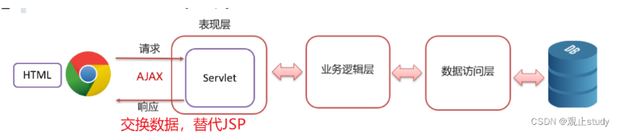

# 工具 - Ajax 异步通信

> AJAX（Asynchronous JavaScript And XML）：在不重新加载整个页面的情况下，与服务器交换数据并更新部分网页的技术。

## 核心要点

### 作用与价值

1. **与服务器进行数据交换** — 替代 JSP 页面，推动前后端分离开发
2. **实现异步交互** — 搜索联想、用户名校验等局部刷新场景

### Ajax vs 传统请求



| 特性 | Ajax | 传统同步请求 |
|------|------|-------------|
| 页面刷新 | 局部刷新 | 整页刷新 |
| 用户体验 | 流畅，无白屏 | 页面闪动 |
| 服务器负载 | 减少不必要的数据传输 | 需重复传输页面结构 |

### GET 请求

```javascript
// 1. 创建 XMLHttpRequest 对象
let xhr = new XMLHttpRequest();
// 2. 发起 GET 请求（参数拼在 URL 后）
xhr.open("GET", "http://example.com/api?searchText=" + searchText.value);
xhr.send();
// 3. 监听响应
xhr.onreadystatechange = function () {
    if (xhr.readyState == 4 && xhr.status == 200) {
        console.log(xhr.responseText);
    }
};
```

### POST 请求

```javascript
let xhr = new XMLHttpRequest();
xhr.open("POST", "http://example.com/api/login");
// 设置请求头（表单格式）
xhr.setRequestHeader("Content-type", "application/x-www-form-urlencoded");
// 发送数据
xhr.send(`username=${username.value}&password=${password.value}`);

xhr.onreadystatechange = function () {
    if (xhr.readyState == 4 && xhr.status == 200) {
        console.log(xhr.responseText);
    }
};
```

### XMLHttpRequest 属性

| 属性 | 描述 |
|------|------|
| `onreadystatechange` | readyState 变化时的回调函数 |
| `readyState` | 0=未初始化 1=连接已建立 2=请求已收到 3=处理中 4=完成 |
| `responseText` | 字符串格式的响应数据 |
| `status` | HTTP 状态码（200, 403, 404 等） |

### JSON 格式处理

```javascript
// 发送 JSON
const requestData = JSON.stringify(formData);
xhr.send(requestData);

// 接收 JSON（方式一：手动解析）
const responseData = JSON.parse(xhr.responseText);
// 接收 JSON（方式二：自动解析）
xhr.responseType = 'json';
```

### 同步请求（不推荐）

```javascript
xhr.open("GET", "url", false);  // 第三个参数 false = 同步
xhr.send();
// 直接使用结果，无需监听
alert(xhr.responseText);
```

同步请求会导致页面挂起直到请求完成，仅适用于快速测试。

> 来源：鱼皮·编程导航 / codefather
