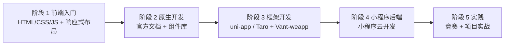

# 工具 20 - 小程序开发学习路线

> 小程序是运行在宿主 APP 中随用随开的轻量应用，是前端开发领域的重要应用形态。本路线从前端基础出发，依次覆盖原生开发、框架开发、小程序后端（云开发）与项目实践 5 个阶段，适合已有前端基础、想拓展小程序开发能力的开发者。

## 开篇介绍

小程序是运行在 APP 中的一种随用随开的程序，是前端开发领域的应用形态之一，就像 PC 网站、H5 网站和 APP 一样。小程序开发其实非常简单：**只要你会前端，就会开发小程序**——它的核心语法与前端三件套（HTML + CSS + JavaScript）几乎一致，学习成本低、上手快。

**建议先观看：**
- 鱼皮《小程序入门》视频教程：https://www.bilibili.com/video/BV1WA411N75W
- 鱼皮《利用 AI 开发学习英雄小程序》：https://www.bilibili.com/video/BV1yMn3zuE7L/
- 鱼皮《使用跨端框架开发小程序》：https://www.bilibili.com/video/BV1vM4m1R7K3/

### 为什么要做小程序？

从不同角度来说明：

1. **用户角度：使用方便** — 不用安装、随用随开、可通过分享链接打开，这点完胜 APP；但受宿主 APP（如微信）限制，用户体验一般不如 APP
2. **开发角度：开发成本低** — 开发小程序和开发网页的语法、流程几乎完全一致，且开发工具和生态都比较完善
3. **产品角度：上线成本低** — 无需在应用商店提交审核即可快速上线，平台审核也比应用商店过审方便
4. **老板角度：省钱** — 前端运行在宿主 APP 里，不用单独购买服务器部署前端（后端仍需要服务器）
5. **运维角度：更安全** — 运行在宿主 APP 内，受严格安全限制，前端几乎不用担心被攻击
6. **运营角度：流量大、易裂变** — 借助宿主 APP 本身的流量，打开率高、易被搜索发现、容易被传播分享；火爆的"羊了个羊"就是最好的例子
7. **求职角度：前端加分项** — 大多数公司没有独立的"小程序开发"岗位，统一归为前端开发；做过 PC、H5 网站的前端同学，不妨再做一个小程序拓宽实践边界

### 小程序生态

小程序依赖 APP 环境作为宿主，国内互联网大厂基本都有自己的小程序，可谓百家争鸣：微信小程序、支付宝小程序、百度小程序、抖音小程序、爱奇艺小程序等。其中微信作为早期入局者，流量最大、小程序最多，**强烈推荐从微信小程序开始学起**，学会一个，别家都会了。本学习路线以微信小程序开发为主。

### 开发小程序的几种方式

每种方式各有优缺点，要根据实际情况选择：

#### 1、原生开发

"原生"即不加任何封装修饰，直接使用官方语法（WXML + WXSS + JavaScript），基本等同于前端三件套。

- 优点：最直接、上手容易，语法和 API 都能在文档中查到；不存在封装，出问题更容易定位解决
- 缺点：可用组件少、语法不灵活、很多东西要自己手写，代码量大、开发效率低；不同宿主 APP 语法有差异，跨 APP 开发成本更高

#### 2、框架开发

在原生开发基础上，使用现成的框架和组件库，如 mpvue 框架、Vant-weapp 组件库。

- 优点：代码更简洁，提高开发效率和可维护性；框架语法与前端框架极为相似，减少学习成本
- 缺点：封装太深时排查成本高；框架不一定覆盖所有需求，遇到不支持的语法会束手无策；框架迭代快，升级后可能出现新 Bug

#### 3、跨端开发

只编写一套代码，通过框架或工具自动生成支持多个平台的小程序，甚至 H5 页面、APP 等其他产品形态。代表框架是 **Uniapp** 和 **Taro**。

- 优点：只用编写和维护同一套代码，大幅节约开发成本
- 缺点：不能完美适配所有平台，仍需针对不同平台编写补丁代码；后期才发现某个功能不支持目标平台时，更换框架成本太大，**前期技术选型很重要**

#### 4、低代码开发

写最少甚至不写代码，通过可视化页面拖拉拽、编写配置来生成小程序，如腾讯 WeDa、钉钉宜搭等。

- 优点：开发成本极低
- 缺点：工具封装太好，学不到开发经验；和跨端开发一样，出了 Bug 可能无从下手

#### 5、找别人开发

最省事的开发方式。如果不为学习、只是希望拥有一个小程序，可去[微信服务市场](https://fuwu.weixin.qq.com/search?tab=1&category=1-10001-7-8-9-10-11&serviceType=1-10&industry=&scene=&type=) 或找[云服务商官方的小程序解决方案](https://cloud.tencent.com/solution/la)，花钱即可搞定。

#### 6、AI 开发

AI 时代已来，可用 Cursor、TRAE 等 AI 编程工具辅助开发小程序。核心思想是利用 AI 编程工具和 AI Vibe Coding 方式，通过提示词工程与 AI 对话快速生成代码、调试问题、优化代码。

- 优点：开发效率极高，适合快速原型开发和验证创意
- 缺点：需要一定的编程基础来审查和优化 AI 生成的代码，完全依赖 AI 可能导致代码质量不稳定

**推荐学习资源：**
- 鱼皮《利用 AI 开发学习英雄小程序》视频教程：https://www.bilibili.com/video/BV1yMn3zuE7L/
- AI Vibe Coding 的开发思路和 AI 协作方法完全适用于小程序开发，可先掌握用 AI 快速开发完整前后端项目的流程和技巧

### 就业方向

1. 前端开发工程师（小程序方向）— 大多数公司的小程序开发统一归入前端岗位，是主要就业方向
2. 跨端开发工程师 — 掌握 uni-app / Taro 等跨端框架，可覆盖小程序、H5、APP 多端业务
3. 全栈开发工程师 — 结合小程序云开发，独立完成前后端一体化的小程序产品
4. 小程序技术专家 / 架构师 — 深耕小程序性能优化、架构设计与前端工程化

小程序岗位需求通常依附于前端团队，**建议以前端学习为主、小程序作为实践方向**，求职时作为加分项而非主攻方向。

### 学习路线图

前端入门 → 原生开发 → 框架开发 → 小程序后端 → 实践。各阶段时长仅供参考，可根据基础灵活调整。

## 整体学习建议

1. **前端是基础**：如果还没学过前端，不要考虑去学习小程序，先学 HTML、CSS、JavaScript 三件套
2. **不要把小程序当主攻方向**：不是所有公司都有小程序开发岗位，真想从事小程序开发，应以它的父领域——前端学习为主
3. **官方文档最重要**：小程序和宿主 APP 绑定，各家规则不同、开发工具不断更新，开发时一定要多看[官方文档](https://developers.weixin.qq.com/miniprogram/dev/framework/)并以最新版为准
4. **遇到问题先看官方资源**：先查[官方文档](https://developers.weixin.qq.com/miniprogram/dev/framework/)和[官方交流社区](https://developers.weixin.qq.com/community/develop/mixflow)，其次才是搜索引擎
5. **善用 AI 辅助**：可以让 AI 帮你生成小程序代码、解释小程序 API、Debug 报错
6. **多用插件提升效率**：实现某个功能前，先在小程序后台搜索有没有对应插件，提高开发效率

## 阶段 1：前端入门

学小程序前，请先学习前端。小程序最基础的开发语法和前端三件套（HTML + CSS + JavaScript）几乎一致，会用前端开发网页，就会开发小程序。

### 学习目标

前端需要学到以下程度：

1. HTML + CSS + JavaScript 语法基础
2. 能够用三件套开发一个基本的网页
3. 学习 CSS 响应式布局（媒体查询）
4. 能够开发一个响应式网页（手机端看也很合适）

### 学习建议

前端学习以写代码为主，没什么复杂的理论知识，能写出在网页上能看到的东西就足够了。

### 学习资源

**快速入门：**
- ⭐ [freeCodeCamp 在线编程](https://www.freecodecamp.org/chinese/)：建议直接闯关实战

**稳定入门（巩固基础）：**
- [Pink 老师前端入门教程](https://www.bilibili.com/video/BV14J4114768)：零基础必看
- [MDN HTML 教程](https://developer.mozilla.org/zh-CN/docs/Learn/HTML)：官方文档
- [MDN CSS 教程](https://developer.mozilla.org/zh-CN/docs/Learn/CSS)：官方文档
- [MDN JavaScript 教程](https://developer.mozilla.org/zh-CN/docs/Web/JavaScript)：官方文档

## 阶段 2：原生开发

注意：实际项目中很少用原生开发，一般用框架加速开发，所以本阶段的目的是**入门**，而不是做出一个完整的项目。

### 小程序

原生开发就是使用小程序平台官方的语法（WXML + WXSS + JavaScript）进行开发，学完前端三件套之后就可以尝试。直接从[官方文档](https://developers.weixin.qq.com/miniprogram/dev/framework/quickstart/)开始，把「起步」章节的示例小程序跟着做完，先跑通一个从开发到上线的 Demo 流程，再考虑开发完整项目。

官方文档中需要重点学习的章节：

1. 起步
2. 目录结构
3. 配置小程序
4. 小程序框架
5. 基础能力
6. 开放能力
7. 调试

学完基本开发流程后，学习组件和组件库的使用，用别人写好的界面提高开发效率：

- [组件学习文档](https://developers.weixin.qq.com/miniprogram/dev/component/)
- [WeUI 组件库学习文档](https://developers.weixin.qq.com/miniprogram/dev/platform-capabilities/extended/weui/)

感兴趣的话还可以学习插件和其他开放能力，丰富小程序的功能：

- [插件](https://developers.weixin.qq.com/miniprogram/dev/framework/plugin/)
- [开放能力](https://developers.weixin.qq.com/miniprogram/dev/platform-capabilities/)

### 小游戏

开发小游戏的难度比小程序大，不仅需要前端基础，还要有一定的游戏开发经验。这方面的教学资源比较少，建议先把[微信小游戏官方文档](https://developers.weixin.qq.com/minigame/dev/guide/)通读一遍，了解完整的开发流程，再搭配 [B 站搜索微信小游戏视频](https://search.bilibili.com/all?keyword=%E5%BE%AE%E4%BF%A1%E5%B0%8F%E6%B8%B8%E6%88%8F) 补充知识。

### 学习资源

以下资源不必全看，如果看完官方文档仍不知道如何开发一个小程序 Demo，可以通过这些资源补充：

- ⭐ [黑马爆款微信小程序视频（2022）](https://www.bilibili.com/video/BV1834y1676P)：零基础入门
- [微信官方小程序开发实战（2022）](https://developers.weixin.qq.com/community/business/course/000c2a3a070c385dc59e58ec15700d)：官方教程
- [微信官方小程序课程](https://developers.weixin.qq.com/community/business/CategorySearch?query=%E5%B0%8F%E7%A8%8B%E5%BA%8F&page=1&cid=2)：各行业开发经验、高校大赛作品分享
- [小程序项目实战（2022）](https://www.bilibili.com/video/BV1sK411y7bg)：完整项目实战
- [B 站 UP 小程序系列视频](https://www.bilibili.com/video/BV1St4y1p72U)：讲得还挺清晰

## 阶段 3：框架开发

企业开发小程序一般都是用框架的。如果想高效开发小程序，建议先学习 Vue 或 React 其中一门前端框架，因为小程序开发框架的语法基本和这两者一致。

小程序开发框架有很多，建议根据自己熟悉的技术栈直接学习**跨平台开发框架**：

- 会 Vue → 用 [uni-app](https://uniapp.dcloud.io/)
- 会 React → 用 [Taro](https://taro.js.org/) 或阿里的 [Remax](https://remaxjs.github.io/remax/)

只用学会一门开发框架就足够了。

### 学习建议

1. 框架版本一直在更新迭代，不建议到处找教程，建议**跟着官方文档的入门教程**先把 Demo 做出来，再完整阅读一遍官方文档，通过写 Demo 的方式实践各种特性
2. 学习开发框架的过程中就可以开始做属于自己的小程序项目，建议搭配组件库学习。强烈推荐有赞的 [Vant-weapp](https://vant-ui.github.io/vant-weapp/#/home)，直接找到对应组件复制粘贴到自己的项目中看效果，学会这一个组件库后，其他组件库也都会用了

### 学习资源

- [uni-app 实战视频教程](https://www.bilibili.com/video/BV1eT411L7yj/)：完整的实战教程

## 阶段 4：小程序后端

前 3 个阶段只能开发出具有静态数据的小程序前端页面，但一般情况下，我们都希望用户能自己输入数据、让其他人看到这些动态数据，这就需要后端开发知识。

但对于以前端学习为主的同学来说，专门学习后端开发成本太高，**建议直接使用官方提供的「小程序云开发」技术**。

小程序云开发是一套技术栈，直接提供现成的数据库、后端接口 SDK、鉴权、文件存储、日志、监控告警等能力，是前端快速开发必备。因为云开发已经集成到微信开发者工具中，上手非常简单，阅读[微信官方云开发文档](https://developers.weixin.qq.com/minigame/dev/wxcloud/basis/getting-started.html)即可。

注意：微信小程序云开发和腾讯云开发有一定区别——两者能力相同，但微信小程序云开发对小程序的支持更友好（相当于集成到开发工具里）；腾讯云开发不止能用于小程序，网页也可以，应用范围更广。

### 学习资源

- [腾讯云开发官方文档](https://cloud.tencent.com/document/product/876)：详细的云开发文档
- [基于腾讯云开发部署的开源项目参考](https://mp.weixin.qq.com/s?__biz=MzI1NDczNTAwMA==&mid=2247492012&idx=1&sn=354f78f0d16545ba76f879251a112057&scene=21#wechat_redirect)

## 阶段 5：实践

### 竞赛与比赛

建议参加微信官方的高校小程序开发竞赛，可在[官方社区](https://developers.weixin.qq.com/community/minihome/mixflow/1255396892104638464)获取竞赛信息。此外，也可以用小程序的完整项目参加计算机应用能力大赛、计算机程序设计大赛、互联网+、挑战杯等比赛。

### 项目实战资源

除了自己从零开发小程序，也可以跟着完整的项目教程学习小程序开发的最佳实践：

**快速入门项目：**
- [从零做一个上万用户的小程序](https://www.bilibili.com/video/BV1uR4y1273T)：真实项目经验分享

**AI 辅助开发：**
- 鱼皮《利用 AI 开发学习英雄小程序》视频教程：https://www.bilibili.com/video/BV1yMn3zuE7L/
- 掌握 AI Vibe Coding 的开发思路，用 AI 快速生成代码、调试问题、优化代码，可大幅提升小程序开发效率

💡 学习项目时建议先从简单的入门项目开始，掌握基本流程后再尝试进阶项目。一定要学会利用 AI 工具提升开发效率，这是未来程序员必备的技能。
